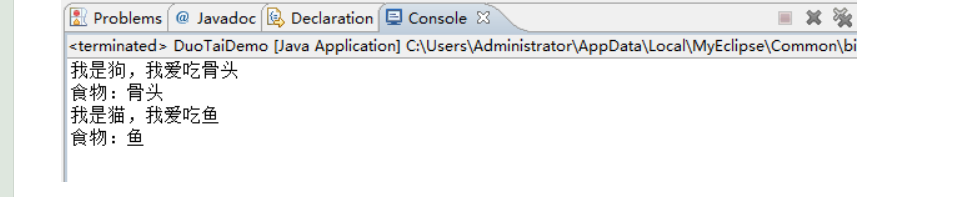
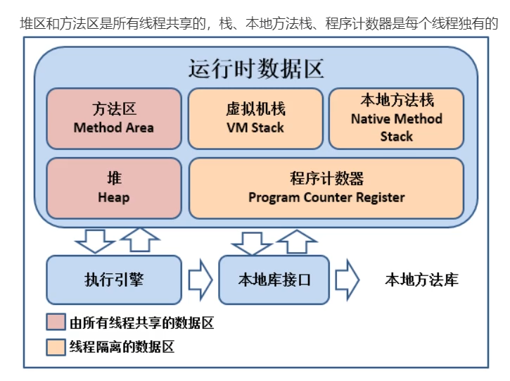
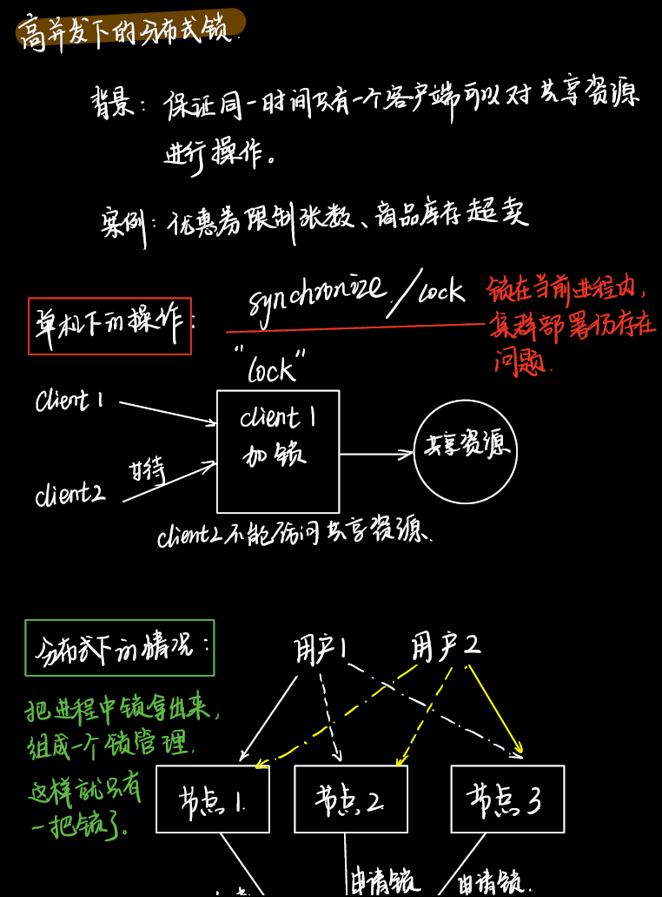
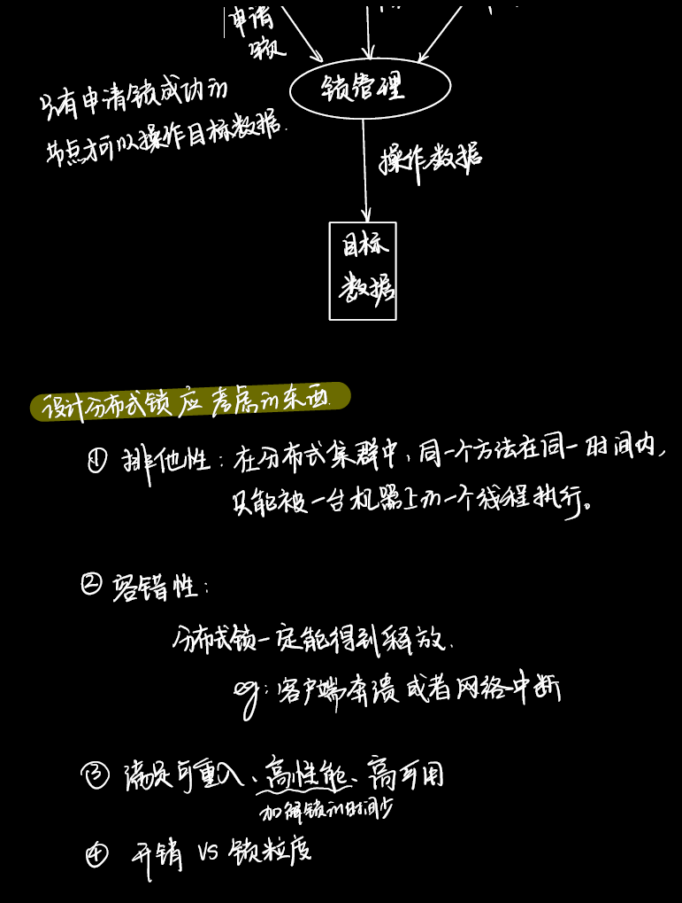
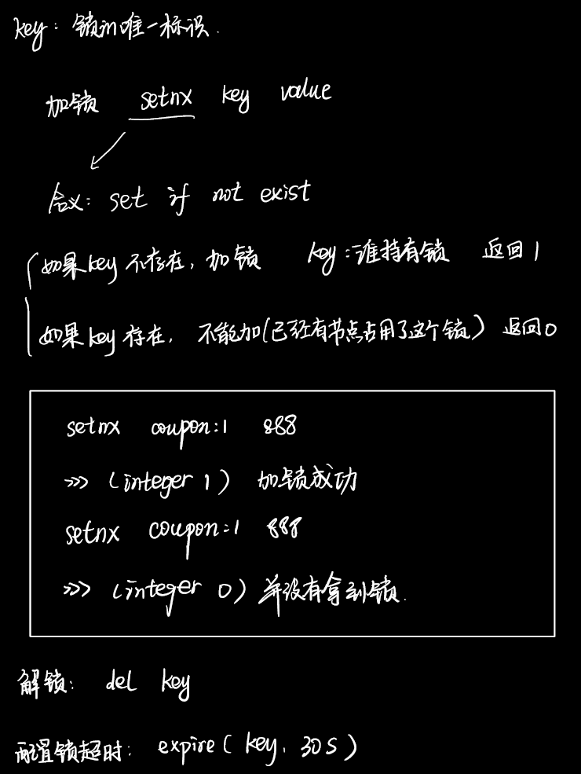
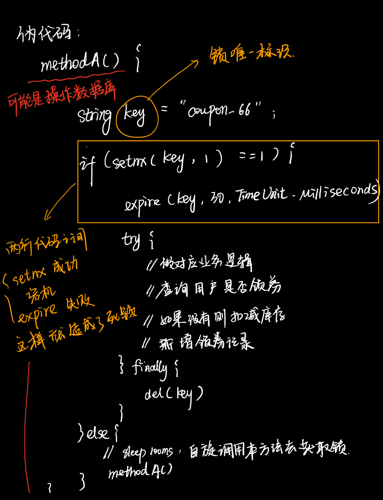
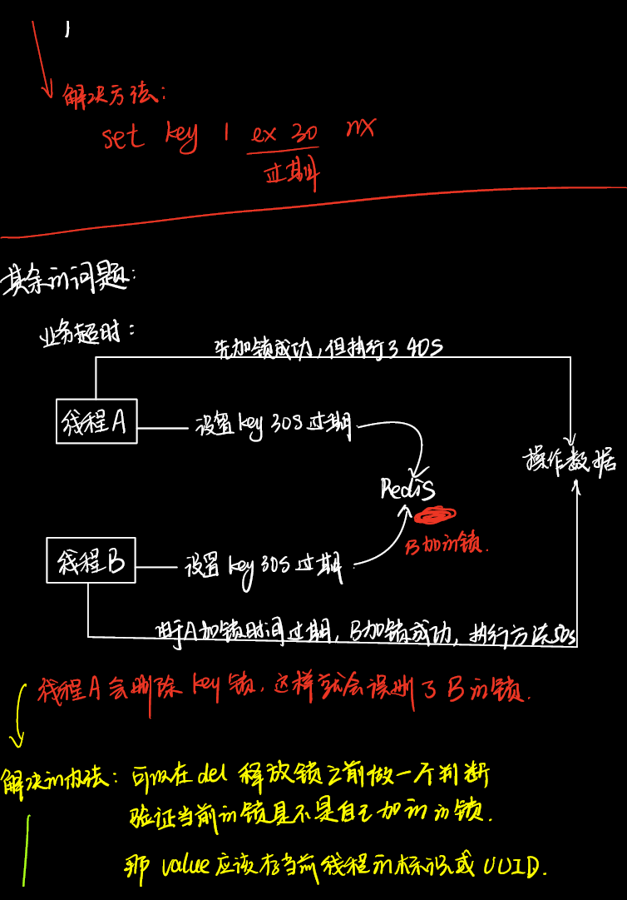
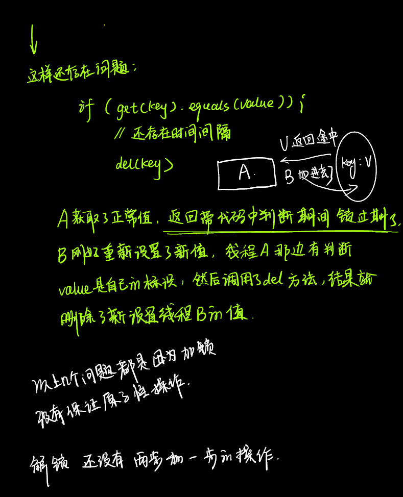

# 面试常问问题总结

## 一、JavaEE

### 1.1 HashMap遍历方式

#### 1.1.1 **通过ForEach循环进行遍历**

```java
mport java.io.IOException;
import java.util.HashMap;
import java.util.Map;
 
public class Test {
	public static void main(String[] args) throws IOException {
		Map<Integer, Integer> map = new HashMap<Integer, Integer>();
		map.put(1, 10);
		map.put(2, 20);
 
		// Iterating entries using a For Each loop
		for (Map.Entry<Integer, Integer> entry : map.entrySet()) {
			System.out.println("Key = " + entry.getKey() + ", Value = " + entry.getValue());
		}
 
	}
}
```

#### 1.1.2 **ForEach迭代键值对方式**

```java
import java.io.IOException;
import java.util.HashMap;
import java.util.Map;
 
public class Test {
	public static void main(String[] args) throws IOException {
		Map<Integer, Integer> map = new HashMap<Integer, Integer>();
		map.put(1, 10);
		map.put(2, 20);
 
		// 迭代键
		for (Integer key : map.keySet()) {
			System.out.println("Key = " + key);
		}
 
		// 迭代值
		for (Integer value : map.values()) {
			System.out.println("Value = " + value);
		}
	}
}
```


#### 1.1.3 **使用带泛型的迭代器进行遍历**

```java
import java.io.IOException;
import java.util.HashMap;
import java.util.Iterator;
import java.util.Map;
 
public class Test {
	public static void main(String[] args) throws IOException {
		Map<Integer, Integer> map = new HashMap<Integer, Integer>();
		map.put(1, 10);
		map.put(2, 20);
 
		Iterator<Map.Entry<Integer, Integer>> entries = map.entrySet().iterator();
		while (entries.hasNext()) {
			Map.Entry<Integer, Integer> entry = entries.next();
			System.out.println("Key = " + entry.getKey() + ", Value = " + entry.getValue());
		}
	}
}
```


#### 1.1.4 **使用不带泛型的迭代器进行遍历**

```java
import java.io.IOException;
import java.util.HashMap;
import java.util.Iterator;
import java.util.Map;
 
public class Test {
 
	public static void main(String[] args) throws IOException {
 
		Map map = new HashMap();
		map.put(1, 10);
		map.put(2, 20);
 
		Iterator<Map.Entry> entries = map.entrySet().iterator();
		while (entries.hasNext()) {
			Map.Entry entry = (Map.Entry) entries.next();
			Integer key = (Integer) entry.getKey();
			Integer value = (Integer) entry.getValue();
			System.out.println("Key = " + key + ", Value = " + value);
		}
	}
}
```

#### 1.1.5 **通过Java8 Lambda表达式遍历**

```java
import java.io.IOException;
import java.util.HashMap;
import java.util.Map;
 
public class Test {
 
	public static void main(String[] args) throws IOException {
 
		Map<Integer, Integer> map = new HashMap<Integer, Integer>();
		map.put(1, 10);
		map.put(2, 20);
		map.forEach((k, v) -> System.out.println("key: " + k + " value:" + v));
	}
}
```


### 1.2 Java三大特性 

**同花顺**

==**继承、多态、封装**==


#### 1.2.1 **多态的使用有什么例子？**

多态的概念：指一个引用（类型）在不同的情况下的多种状态。也可以理解为，多态是指 通过指向父类的指针，来调用在不同子类中实现的方法


**场景假设：**一个主人养了==猫==和==狗==，猫和狗都有自己喜欢吃的东西，主人在喂它们的时候，如果要判断时猫还是狗，在判断它们分别爱吃什么，就显得很麻烦。

如果主人养了很多种动物，这样的重复判断，就会浪费很多时间。多态的使用就可以让主人拿到一种食物就知道这是哪种动物的。

1. 首先，创造动物类

```java
// 动物类
class Animal {
    int age;
    String name;

    public int getAge() {return age;}

    public void setAge(int age) {this.age = age;}

    public String getName() {return name; }

    public void setName(String name) { this.name = name;}

    // 动物类里面有叫和吃两个方法
    public void cry() {System.out.println("我不知道叫什么");}

    public void eat() {System.out.println("我不知道吃什么");}
}
```

2. 其次，分别创建猫类和狗类（继承于动物类）

```java
// 狗类继承于动物类
class Dog extends Animal {
    // 覆盖（重写）方法
    public void cry() {System.out.println("旺旺");}

    public void eat() {System.out.println("我是狗，我爱吃骨头");}
}

// 猫类继承于动物类
class Cat extends Animal {
    // 覆盖（重写）方法
    public void cry() {System.out.println("喵喵");}

    public void eat() {System.out.println("我是猫，我爱吃鱼");}
}
```

3. 然后，创建食物类：

```java
// 食物类
class Food {

    String name;

    public String getName() {return name;}

    public void setName(String name) {this.name = name;}

    // 食物类里面让它有一个方法
    public void showName() {}
}
```

4. 猫和狗都有他们喜欢吃的食物（继承于食物类）

```java
// 鱼（食物的一种）继承于食物
class Fish extends Food {
    public void showName() {System.out.println("食物：鱼");}
}

// 骨头（食物的一种）继承于食物
class Bone extends Food {
    public void showName() {System.out.println("食物：骨头");}
}
```

5. 主人类，就可以将动物和对应的食物统一起来

```java
// 主人类 存在一種餵食方法
class Master {
    // 给动物喂食物，如果没有多态，他要写给猫喂食和给狗喂食两个方法
    // 有了多态，以后即使再来好多动物，用这一个函数就可以了
    public void feed(Animal an, Food f) {
        an.eat();
        f.showName();
    }
}
```

6. 方法测试

```java
public class DuoTaiDemo {

    public static void main(String args[]) {

        Master master = new Master();
        master.feed(new Dog(), new Bone());

        // hin方便，可以再试试
        master.feed(new Cat(), new Fish());

    }
}
```




==**具体开发中的应用：（可以用来举例子）**==

在实际的开发中，常常会遇到一个功能有很多种实现方式，比如：

支付方式包括：微信支付、支付宝支付、京东支付、银联支付等等。不同的支付方式的大概流程是相似的，实现细节有所区别。给每一种方式写一个类不便于管理和扩展。这个时候大多就是用到的java的多态机制。可以先定义一个公共接口，接口定义支付流程的各个方法，具体的支付方式实现该接口的方法。在控制controller层，利用spring的注入获取支付类型和支付方式实现类的引用映射，根据请求需要的支付类型，就可以调用对应的支付方式的方法，以此实现业务的解耦和扩展。后期需要增加支付方式，只需要实现共同接口即可。

```java
/**
 * 支付方式接口
 * @date: 2018年4月23日 下午2:20:09
 */
public interface PaymentTypeService {
 
	public String type();
	
	public void methodA();
	
	public void methodB();
}
```

```java
import org.springframework.stereotype.Service;
 
/**
 * 支付方式A实现类
 * @date: 2018年4月23日 下午2:20:27
 */
@Service
public class APaymentTypeServiceImpl implements PaymentTypeService {
 
	private final String type = "A";
	
	@Override
	public void methodA() {
		// TODO Auto-generated method stub
		System.out.println("PaymentType A invoke methodA");
	}
 
	@Override
	public void methodB() {
		// TODO Auto-generated method stub
		System.out.println("PaymentType A invoke methodB");
	}
 
	@Override
	public String type() {
		return type;
	}
 
}
```

```java
/**
 * 支付方式B实现类
 * @date: 2018年4月23日 下午2:20:27
 */
@Service
public class BPaymentTypeServiceImpl implements PaymentTypeService {
 
	private final String type = "B";
	
	@Override
	public void methodA() {
		// TODO Auto-generated method stub
		System.out.println("PaymentType B invoke methodA");
	}
 
	@Override
	public void methodB() {
		// TODO Auto-generated method stub
		System.out.println("PaymentType B invoke methodB");
	}
 
	@Override
	public String type() {
		return type;
	}
 
}
```

```java
import java.util.List;
import java.util.Map;
import java.util.stream.Collectors;
 
import org.springframework.beans.factory.annotation.Autowired;
import org.springframework.web.bind.annotation.GetMapping;
import org.springframework.web.bind.annotation.PathVariable;
import org.springframework.web.bind.annotation.RestController;
 
@RestController
public class DemoController {
	
	private Map<String, PaymentTypeService> paymentTypeServices;
	
	/**
	 * 构造函数初始化不同支付方式类型和实现类引用map
	 * @param services
	 */
	public DemoController(@Autowired List<PaymentTypeService> services){
		paymentTypeServices = services.stream().collect(Collectors.toMap(PaymentTypeService::type, i->i));
	}
 
	/**
	 * 请求某个支付方式
	 * @date: 2018年4月23日 下午2:21:28 
	 * @param type
	 */
	@GetMapping("/test/{type}")
	public void test(@PathVariable("type") String type){
		// 获取该支付方式实现类
		PaymentTypeService service = paymentTypeServices.get(type);
		service.methodA();
		service.methodB();
	}
}
```


### 1.3 单例模式

**同花顺**

懒汉式（线程不安全）改为线程安全的，饿汉式

#### 1.3.1饿汉式

```java
class Bank{
    //1.私有化类的构造器,为了避免在Bank的外面调用构造器
    private Bank(){}
    
    //2.内部创建类的对象 + //4.要求此对象也必须声明为静态的
    private static Bank instance = new Bank();

    //3.提供公共的静态方法，返回类的对象
    public static Bank getInstance(){
        return instance;
    }
}
```

#### 1.3.2 懒汉式

懒汉式会有线程安全问题：

假设线程A和线程B同时调用Order

都没有Order这个实例，那么就需要同时进行新建对象，

就在这个时候就很有可能会出现两个实例对象了，这就出现了

```java
class Order{
    //1.私有化类的构造器
    private Order(){}

    //2.声明当前类的对象，没有初始化
    //4.此对象也必须声明为static的
    private static Order instance = null;

    //3.声明public、static的返回当前类对象的方法
    public static Order getInstance(){
        if (instance == null){
            instance = new Order();
        }
        return instance;
    }
}
```


#### 1.3.3 懒汉式修改为安全的

方法一：

```java
package com.atguigu.java;
/*
* 使用  同步机制  将单例模式中的懒汉式改写为线程安全的
* */
public class BankTest {
}


class Bank{
    private static Bank instance = null;
    private Bank(){}
    //将getInstance方法使用synchronized，这样每次只能有一个线程可以访问
    public synchronized static Bank getInstance(){
        if (instance == null){
            instance = new Bank();
        }
        return instance;
    }
}
```

方式二：

```java
package com.atguigu.java;
/*
* 使用  同步机制  将单例模式中的懒汉式改写为线程安全的
* */
public class BankTest {
}

class Bank{
    private static Bank instance = null;
    private Bank(){}
    public static Bank getInstance(){
        synchronized (Bank.class){
            if (instance == null){
                instance = new Bank();
            }
            return instance;
        }
    }
}
```

以上的两种方式效率稍差

因为：一旦新建了一个对象之后，那么后面的就没有必要在等待判断，所以可以直接return instance就可以加快速度

```java
package com.atguigu.java;
/*
* 使用同步机制将单例模式中的懒汉式改写为线程安全的
* */
public class BankTest {
}
class Bank{
    private static Bank instance = null;
    private Bank(){}
    public static Bank getInstance() {
        if (instance == null){
            synchronized (Bank.class){
                if (instance == null){
                    instance = new Bank();
                }
            }
        }
        return instance;
    }
}
```


### 1.4 HashMap的数据结构是什么样子的？

**同花顺**

JDK1.7 数组、链表

JDK1.8 数组，链表+红黑树

### 1.5 HashMap的扩容过程是？

**同花顺**

==1.7 数组 + 链表  **头插法**==

**扩容都是针对的数组**，先将数组复制一份，数组的容量是原来的两倍，然后将原数组中的数据全部转移到新数组中

1. 先生成新数组
2. 遍历老数组中的每个位置上的链表上的每个元素
3. 取每个元素的Key，并基于新数组长度，计算出每个元素在新数组中的下标
4. 将元素添加到新数组中去
5. 所有元素转移完了之后，将新数组赋值给HashMap对象的table属性


==1.8 数字 + 链表 + 红黑树==

**扩容都是针对的数组**，先将数组复制一份，数组的容量是原来的两倍，然后将原数组中的数据全部转移到新数组中，但是因为jdk1.8中有红黑树的原因，新的树的相对位置可能和原始数组中的不一样，因为树的位置是根据数组的大小决定的。大于8是红黑树，小于8是链表

1. 先生成新数组

2. 遍历老数组中的每个位置上的链表或者红黑树

3. 如果是链表，则直接将链表中的每个元素重新计算下标，并添加到新数组中去

4. 如果是红黑树，则先遍历红黑树，先计算出红黑树中每个元素对应的新数组的下标位置
   1. 统计每个下标位置的元素个数
   2. 如果该位置下的元素个数超过了8，则生成一个新的红黑树，并将根节点添加到新数组的对应位置
   3. 如果该位置下的元素个数没有超过8，那么生成一个链表，并将链表的头结点添加到新书的对应位置
   
5. 所有元素转移完成之后，将新数组赋值给hashMap对象的table属性

   

### 1.6 集合遍历的方式有哪些？

**同花顺**

见1.1

使用Intertor()方法

foreach增强for循环


### 1.7 Java线程池的创建方式

**美团**、

1. Executors.**newSingleThreadExecutor**():只有一个线程的线程池
2. Executors.**newCachedThreadPool**:带有缓存的线程池，如果线程超过60秒没有被执行，那就终止并从池中删除
3. Executors.**FixedThreadPool**:拥有固定线程数的线程池
4. Executors.**newScheduledThreadPool**:用来调度即将执行的任务的线程池
5. Executors.**newSingleThreadScheduledExecutor**()：只有一个线程，用来调度将来的任务


#### 1.7.1 线程池的底层工作原理

内部是通过队列+线程池实现的，当我们利用线程池执行任务的时候：

1. 如果此时线程池中的线程数量小于corePoolSize，即使线程池中的线程都处于空闲状态，也要创建新的线程来处理被添加的任务
2. 如果此时线程池中的线程数量等于corePoolSize，但是缓冲队列workQueue未满，那么任务被放到缓冲队列
3. 如果此时线程池中的线程数量大于等于corePoolSize，缓冲队列workQueue满，并且线程池中的数量小于maximunPoolSize，那么新建线程来处理被添加的任务
4. 如果此时线程池中的线程数量大于corePoolSize，缓冲队列workQueue满，并且线程池中的数量等于maximunPoolSize，那么通过Handler所定的策略来处理此任务
5. 线程池中的线程数量大于corePoolSize，如果某线程空闲时间超过keepAliveTime，线程将被终止。这样，线程池可以动态的调整池中的线程数


### 1.8 多线程的实现方式

**美团**

1. 继承于Thread类
2. 实现Runnable接口
3. 实现Callable接口
4. 使用线程池


### 1.9 快排的时间的时间复杂度

平均复杂度 **nlongn**

最坏情况 **n^2**，划分两个子问题的时候分别是n-1和0


### 1.0 jdk和jre的区别

JRE Java Runtime Enviroment是Java的运行环境，是面向的Java程序的使用者，只有JRE只能运行Java程序

JDK Java Development kit 是Java开发工具包，他提供了Java的开发环境和运行环境。JDK中包含了JRE


### 1.11 一些加载顺序的比较

- 普通代码块{}
- 构造块

```java
  { 
     //code 
  } 
```

构造块在**创建对象时会被调用**，每次创建对象时都会被调用，**并且优先于类构造函数执行**。 构造块中定义的变量是局部变量。

- 静态代码块

```java
  static{  
     //code 
  } 
```

只会被**执行一次(**第一次加载此类时执行,比如说用`Class.forName("")`加载类时就会执行`static block`)，**静态块优先于构造块执行**。

- 同步代码块

```java
    synchronized(obj){ 
        //code 
    } 
```


```java
public class Test {                             //1.第一步，准备加载类
		       
	    public static void main(String[] args) 
	    {
	        new Test();                         //4.第四步，new一个类，但在new之前要处理匿名代码块
	        // 这里必须等待类加载完
	        System.out.println("done..");       
	        Test.run();
	    }

	    
	    static int num = 4;                     //2.第二步，静态变量和静态代码块的加载顺序由编写先后决定 
	    
	    static 
	    {   
	    	System.out.println("num:"+num);     // 3.第三步，静态块，然后执行静态代码块，因为有输出，故打印a
	        System.out.println("a");
	    }

	    
	    {
	        num += 3;
	        System.out.println("b:"+num);        //5.第五步，按照顺序加载匿名代码块，代码块中有打印
	    }

	    int a = 5;                               //6.第六步，按照顺序加载变量

	    { // 成员变量第三个
	        System.out.println("c:"+a);          //7.第七步，按照顺序打印c
	    }

	    Test() { // 类的构造函数，第四个加载
	        System.out.println("d");             //8.第八步，最后加载构造函数，完成对象的建立
	    }

	   
	    static void run()                       // 静态方法，调用的时候才加载 
	    {	
	        System.out.println("e");
	    }	    	
}
```


**一般顺序：静态块（静态变量）——>成员变量——>构造方法——>静态方法**

1、静态代码块（只加载一次）
2、构造方法（创建一个实例就加载一次）
3、静态方法需要调用才会执行


### 1.12 代码题

```java
import java.lang.reflect.Field;

/*
 * @description:
 * @author: Felix_XHF
 * @create:2021-08-04 20:51
 */
public class Demo1 {
    public static void main(String[] args) throws NoSuchFieldException, IllegalAccessException {
        String s = new String ("abc");

        //在这中间可以添加N行代码。但必须保证s引用的指向不变，最终将输出变成abcd

        //反射
        Field value = s.getClass().getDeclaredField("value");
        value.setAccessible(true);
        value.set(s,"abcd".toCharArray());

        System.out.println(s);
    }
}
```


```java
String s1 = new String("abc"); //创建了两个对象 "abc"常量对象，s1也是一个对象
        String s2 = "abc";  //创建了一个对象，就是s2
        //s1==s2 ? true or false
        System.out.println(s1==s2);   //false s1 和 s2的地址不一样


        String s3 = s1.intern();  //String对象的intern方法，首先会检查字符串常量池中是否存在“abc”，如果存在则返回该字符串引用，如果不存在，则把“abc”添加到常量池中，并返回该字符串的引用
        //s2==s3 ? true or false
        System.out.println(s2 == s3);  //true
```


```java
		Integer i1 = 100;
        Integer i2 = 100;
        //i1 == i2? true or false
        System.out.println(i1==i2); //true

        Integer i3 = 128;
        Integer i4 = 128;
        //i3 == i4? true or false
        System.out.println(i3 == i4); // false
```


### 1.13 String & StringBuilder & StringBuffer区别

String是不可以修改对象的。

StringBuilder和StringBuffer可以修改对象的。

1. String是不可变的，如果尝试去修改，会新生成一个字符串对象，StringBuffer和StringBuilder是可变的
2. StringBuffer是线程安全的，StringBuilder是线程不安全的，所有在单线程环境下StringBuilder的效率会高一点


### 1.14  ArrayList 和 LinkedList有哪些区别？

**==LinkedList==** ：

- 底层：**链表**，可以在分散的内存
- 不适合查询
- 适合查询

**==ArrayList==**：

- 底层：**动态数组**，连续内存存储
- 适合下标访问（随机访问）
- 适合数据插入及删除操作
- 添加慢（因为扩容的时候需要新建一个双倍大小的数组，在把旧元素放入到新数组中）


1. 首先，他们的底层数据结构不同，ArrayList底层是基于动态数组实现的，LinkedList底层是基于链表实现的
2. 由于底层数据结构不同，他们所适用的场地也不同，ArrayList更适合随机查找，LinkedList更适合删除和添加 。查询、添加、删除的时间复杂度不同
3. 另外ArrayList和LinkedList都实现了List接口，但是LinkedList还额外实现了Deque接口，所以LinkedLinked还可以当做队列来使用


### 1.15 CopyOnWriterArrayList底层原理是什么？

ArrayList是线程不安全的：并发add的时候，同时进入add，但是后线程覆盖了前线程添加的数据


1. 首先CopyOnWriterArrayList的内部也是用数组来实现的，在向CopyOnWriterArrayList添加元素时候，会复制一个数组，写操作在新数组上进行，读操作阿紫原数组上进行
2. 并且，写操作会加锁，防止出现并发写入丢失数据的问题
3. 写操作结束之后会把原数组指向新数组
4. CopyOnWriterArrayList允许在写操作时来读取数据，大大提高了读的性能，因此适用读多写好的应用场景，但是CopyOnWriterArrayList会比较占用内存，同时可能读到的数据不是实时最新的数据，所以不适合实时性要求很高的场景


### 1.16 数组为空和数组长度为0的区别

```java
int[] array = null; 数组为空，此时array不指向任何对象；
```

```java
int[] array = new array[0]; 定义一个长度为0的数组；
int[] array = new array[2]; 定义一个长度为2的数组，此时如果数组没有被初始化，默认的值为null；
```

两者如果在一句代码中，则要先判断是否为空，否则可能会出现空指针异常

```java
if(array == null || 0 == array.length) {...}   // 这种写法正确
```


### 1.17 ConcurrentHashMap的扩容原理

**远景智能**

ConcurrentHashMap一个并发容器，在多线程开发中很经常会使用到这个类，它与HashMap的区别是HashMap是线程不安全的，在高并发的情况下，使用HashMap进行大量变更操作容易出现问题，但是ConcurrentHashMap是线程安全的。

**JDK1.7** 


由很多个Segment对象组成ConcurrentHashMap，扩容是针对每个Segment内部而言的

1. 1.7版本的ConcurrentHashMap是基于Segment分段实现的
2. 每个Segment相对于一个小型的HashMap
3. 每个Segment内部会进行扩容，和HashMap的扩容逻辑类似
4. 先生成新的数组，然后转移元素到新数组中
5. 扩容的判断也是每个Segment内部单独判断的，判断时否超过阈值


JDK1.8

1. 1.8版本的ConcurrenthashMap不再基于Segment实现
2. 当某个线程进行put时，发现ConcurrentHashMap正在进行扩容那么该线程一起进行扩容
3. 当某个线程进行put时，发现没有正在进行扩容，则将key-value添加到COncurrentHashMap中，然后判断是否超过了阈值，超过阈值则进行扩容
4. ConcurrentHashMap支持多线程扩容，
5. 扩容之前也先生成一个新的数组
6. 在转移元素之前，先将原数组分组，将每组分给不同的线程进行元素的转移，每个线程负责一组或者多组的元素转移工作。每个线程之间互相不干扰


==ConcurrentHashMap原理==

HashTable是使用synchrozied锁整个Map

**JDK1.7**

- 数据结构：ReenTranLock分段锁+Segment+HashEntry，一个Segment中包含一个HashEntry数组，每个HashEntry又是一个链表的结构
- 元素查询：二次hash,第一个Hash定位到Segment，第二次Hash定位到元素所在的链表的头部
- 锁：Segment分段锁 Segment继承了ReentranLock，锁定操作的Segment，其他的Segment不受影响，并发度为segment个数，可以通过构造函数指定，数组扩容不会影响其他的Segment
- get方法无需加锁，volatile保证

**JDK1.8**

- 数据结构：synchronized+CAS+Node+红黑树，Node的val和next都用volatile修饰，保证可见性
- 查找、替换、赋值操作都使用CAS
- 锁：锁链表的head结点，不影响其他元素的读写，锁粒度更细，效率更高，扩容时，阻塞所有的读写操作、并发扩容

### 1.18 == 和equals

**==面试题：==和equals的区别==**


====：==

1. 可以使用在**基本数据类型**变量和**引用数据**类型变量中

2. 如果比较的是**基本数据类型**变量：比较两个变量**保存的数据是否相等**（不一定类型要相同）
3. 如果比较的是**引用数据类型**变量：比较两个对象的**地址值**是否相同，即**两个引用是否指向同一个对象实体**

```java
String s1 = new String("atguigu");
String s2 = new String("atguigu");
System.out.println(s1 == s2);  //false
```


```java
String s1 = "atguigu";
String s2 = "atguigu";
System.out.println(s1 == s2);  //true
```

==equals()方法==

1. 是一个方法，而非一个运算符
2. 基本数据类型没有方法调用，只能使用引用数据类型来调用
3. Object类中的equals()方法的定义：

```java
public boolean equals(Object obj){
  return (this == obj);
}
```

说明：Object类中的定义的equals() 和 == 定义是相同的，是比较两个对象的地址值是否相等

4. String、Data以及其他类型的equals()方法并不是像3中那样定义的，而是进行了重写Object中的equals()，比较的不是地址值了，而是比较的两个对象的“实体内容”是否相同
5. 通常情况下，我们自定义的类如果使用equals()的话，也通常是比较两个对象的“实体内容”是否相同。那么，我们就需要对Object中的euqals()方法进行重写，具体的重写方法如下：Customer是一个类

```java
@Override
public boolean equals(Object obj){
  if(this == obj){
    return true;
  }
  if(obj instanceof Customer){
    Customer cust = (Customer)obj;
    //比较两个对象的每个属性是否相同
    return this.age = cust.age && this.name.equals(cust.name);
  }
  return false;
}
```

其实就是比较对象里面的所有的属性是否一致，一致就返回true，不一致就返回false


### 1.19 简述final

最终的

- 修饰类：表示类不可被继承
- 修饰方法：表示方法不可被子类覆盖，但是可以重载
- 修饰变量：表示变量不可以被修改

**为什么局部内部类和匿名内部类只能访问局部final变量？**


## 二、SSM框架

### 2.1 Spring项目问题排查

- 看状态码
  - 如果是404：说明是url的错误，可以回去看一下url跳转路径是否正确
  - 如果是500说明是服务端出错了，查看自己的代码是哪里出错了，如果找不出来，可以依次打断点，然后查看每一行的输出结果查看

​			

### 2.2 AOP、IOC

**同花顺、兴业数金**

面向切面编程，**AOP**采用的是横向切面的方式，注入与主业务流程无关的功能，例如事务管理和日志管理。

作用：在不修改源代码的情况下，可以实现功能的增强

场景一：记录日志

场景二：监控方法运行时间（监控性能）

场景三：权限控制

场景四：缓存优化（第一次调用查询数据库，将查询结果放入内存对象，第二次调用，直接从内存对象返回，不需要查询数据库）

场景五：事务管理（调用方法前开启事务，调用方法后提交关闭事务）


**AOP实现的原理是什么？** ——**兴业数金**

`Spring`的`AOP`实现原理其实很简单，就是通过**动态代理**实现的。如果我们为`Spring`的某个`bean`配置了切面，那么`Spring`在创建这个`bean`的时候，实际上创建的是这个`bean`的一个代理对象，我们后续对`bean`中方法的调用，实际上调用的是代理类重写的代理方法。而`Spring`的`AOP`使用了两种动态代理，分别是**JDK的动态代理**，以及**CGLib的动态代理**。（不了解）


**IOC简单介绍下**

**兴业数金**


Spring的动态代理实现的原理是什么？

远景智能


### 2.3 如何在SpringBoot中开启事务

**兴业数金**

只需要做两步：

1. 在Application上添加 @EnableTransactionManagement

2. 在Service实现类的方法上添加@Transactional注解。


遇到过的实例是：

我开发了一个教育课堂的项目，里面有一个下单的操作，并且在下单操作的同时，要开始记录已经观看的视频记录有多少了。

所有在sava下单操作类中需要写两个步骤，第一个步骤是将下单的视频添加到视频订单数据表中，第二部是在视频播放记录表中添加一个数据。 如果不开启事务的话，在遭遇宕机的情况下可能会出现一个表中添加了记录，另一个表中没有添加记录。


**==SpringBoot中开启事务的底层原理是什么？==**

TODO


### 2.4 SpringBoot的常用注解有哪些

**兴业数金**

1、@SpringBootApplication

**@Repository**用于标注数据访问组件，即DAO组件。

**@Service**一般用于修饰service层的组件

**@RestController**用于标注控制层组件(如struts中的action)，表示这是个控制器bean,并且是将函数的返回值直 接填入HTTP响应体中,是REST风格的控制器；它是@Controller和@ResponseBody的合集。

**@ResponseBody**表示该方法的返回结果直接写入HTTP response body中

**@Component**泛指组件，当组件不好归类的时候，我们可以使用这个注解进行标注。

**@Bean**相当于XML中的<bean></bean>,放在方法的上面，而不是类，意思是产生一个bean,并交给spring管理。

**@AutoWired**把配置好的Bean拿来用，完成属性、方法的组装，它可以对类成员变量、方法及构造函数进行标注，完成自动装配的工作。

**@Qualifier**

当有多个同一类型的Bean时，可以用@Qualifier("name")来指定。与@Autowired配合使用
**@RequestMapping**RequestMapping是一个用来处理请求地址映射的注解；提供路由信息，负责URL到Controller中的具体函数的映射，可用于类或方法上。用于类上，表示类中的所有响应请求的方法都是以该地址作为父路径。


### 2.5 get和post方法的区别是什么？

**百度**

|          |   参数位置   | 被浏览器缓存 | 参数长度 | 参数安全性 | 浏览器访问 |
| :------: | :----------: | :----------: | :------: | ---------- | ---------- |
| ==Ge==t  |    url中     |      能      |   受限   | 较差       | 支持       |
| ==Post== | 请求体中body |     不能     |  不受限  | 较好       | 不支持     |


### 2.6 Tomcat怎么修改端口号

**百度**

**在conf文件夹下的配置文件中修改serve port端口号**

背景：在默认情况下，tomcat的端口是8080，使用了两个tomcat，那么就需要修改其中的一个的端口号才能使得两个同时工作。

<Connector port="8009" protocol="AJP/1.3" redirectPort="8443" />

<Server port="8005" shutdown="SHUTDOWN">


### 2.7 MyBatis中的#和$的区别

**兴业数金**

1.  前者是预编译处理，MyBatis处理#{}时，它会将sql中的#{}替换为？，然后调用PreparedStatement的set方法来赋值，传入字符后，会在值的两边加上单引号，
2. ${}是字符串替换，Mybatis在处理${}的时候，他会将sql中的${}替换为变量的值，传入的数据两边不会加上单引号

注意：

​	使用${}会导致sql注入，不利于系统的安全性，**为什么会导致sql注入？** 因为${}是拼接的意思，可以拼接任何的数，所以会有1=1 这样的操作，就会直接查询到数据库中的内容，


### 2.8 Spring中的Bean的创建的生命周期有哪些步骤？

1. 推断构造方法
2. 实例化
3. 填充属性，也就是依赖注入
4. 处理Aware回调
5. 初始化前，处理@PostConstruct注解
6. 初试化后，处理initializingBean接口
7. 初始化后，进行AOP

### 2.9 Spring中的Bean是线程安全的吗

Spring本身并没有针对Bean做线程安全的处理：

1.如果Bean是无状态的，那么Bean则是线程安全的

2.如果Bean是有状态的，那么Bean则是线程不安全的


另外，Bean是不是线程安全的，跟Bean的作用域没有关系，Bean的作用域只是表示Bean的生命周期，对于任何生命周期的Bean都是一个对象，这个对象是不是线程安全的，还是得看这个Bean对象本身


### 2.10 Spring中的事务是如何实现的

1. Spring事务底层是基于数据库事务和AOP机制的
2. 首先对于使用了@Transactional注解的Bean，Spring会创建一个代理对象作为Bean
3. 当调用代理对象的方法的时候，会先判断该方法上是否添加了@transactional注解
4. 如果加了，那么利用事务管理器擦行间一个数据库连接
5. 并且修改数库连接的autocommit属性为false，禁止此连接的自动提交，这是实现Spring事务非常重要的一步
6. 然后执行当前方法，方法中会执行sql
7. 执行完成之后，如果没有出现异常就直接提交事务
8. 如果出现了异常，并且这个异常时需要回滚的就会回滚事务，否则仍然要提交事务
9. Spring事务的隔离级别对应的就是数据库的隔离级别
10. Spring事务的传播机制是Spring事务自己实现的，也是Spring事务中最复杂的
11. Spring事务的传播机制是基于数据库连接来做的，一个数据库连接一个事务，如果传播机制配置为需要新开一个事务，那么实际上就是先建立一个数据库连接，在此新数据库连接上执行sql

### 2.11 Spring中什么时候@Transactional会失效


## 三、计算机网络

### 3.1 **session与cookie**的区别

- Session是在服务端保存的一个数据结构，用来跟踪用户的状态，这个数据可以保存在集群、数据库、文件中
- Cookie是客户端保存用户信息的一种机制，用来记录用户的一些信息，也是实现Session的一种方式。

Cookie：不安全、session占服务器资源、session保存数据更多，二者生命周期不同，

cookie的生命周期受到cookie 自身生命周期以及客户端是否保留cookie 文件的影响； 

 session的生命周期受到session 自身的存活周期以及客户端连接是否关闭的影响；


### 3.2 tcp/ip协议三次握手、四次挥手

**美团、兴业数金**


TCP/IP 协议是传输层的一个面向连接的安全可靠的一个传输协议.

**三次握手的机制是为了保证能建立一个安全可靠的连接:**

- 那么第一次握手是由客户端发起，客户端会向服务端发送一个报文，在报文里面：SYN标志位置为1，表示发起新的连接。

- 当服务端收到这个报文之后就知道客户端要和我建立一个新的连接，于是服务端就向客户端发送一个确认消息包，在这个消息包里面：ACK标志位置为1，表示确认客户端发起的第一次连接请求。

- 以上两次握手之后，对于客户端而言：已经明确了我既能给服务端成功发消息，也能成功收到服务端的响应。但是对于服务端而言：两次握手是不够的，因为到目前为止，服务端只知道一件事，客户端发给我的消息我能收到，但是我响应给客户端的消息，客户端能不能收到我是不知道的。
- 所以，还需要进行第三次握手，第三次握手就是当客户端收到服务端发送的确认响应报文之后，还要继续去给服务端进行回应，也是一个ACK标志位置1的确认消息。
- 通过以上三次连接，不管是客户端还是服务端，都知道我既能给对方发送消息，也能收到对方的响应。那么，这个连接就被安全的建了。


**四次挥手机制**

- 四次挥手机制也是由客户端去发起，客户端会发送一个报文，在报文里面FIN位标志为 1，
- 当服务端收到这个报文之后，我就知道了客户端想要和我断开连接，但是此时服务端不一定能做好准备，因为当客户端发起断开连接的这个消息的时候，对于服务端而言，他和还有可能有未发送完的消息，他还要继续发送，所以呢，此时对于服务端而言，我只能进行一个消息确认，就是我先告诉客户端，我知道你要给我断开连接了，但是我这里边还可能没有做好准备，你需要等我一下，等会儿我会告诉你，ACK=1
- 于是呢，发完这个消息确认包之后，可能稍过片刻它就会继续发送一个断开连接的一个报文啊，也是一个FIN位置1的报文也是由服务端发给客户端的啊，这个报文表示服务端已经做好了断开连接的准备，
- 那么当这个报文发给客户端的时候，客户端同样要给服务端继续发送一个消息确认的报文一共有四次，那么，通过这四次的相互沟通和连接，我就知道了，不管是服务端还是客户端都已经做好了断开连接的准备，于是连接就可以被断开啊，这是我对三次握手和四次挥手的一个理解。


**挥手的时候只有三次会怎么样？**

美团


**为什么不能用两次握手进行连接？**

如果采用两次握手，就建立连接，那会放大 DDOS 攻击的。

3次握手完成两个重要的功能，既要双方做好发送数据的准备工作(双方都知道彼此已准备好)，也要允许双方就初始序列号进行协商，这个序列号在握手过程中被发送和确认。

现在把三次握手改成仅需要两次握手，死锁是可能发生的。作为例子，考虑计算机S和C之间的通信，假定C给S发送一个连接请求分组，S收到了这个分组，并发 送了确认应答分组。按照两次握手的协定，S认为连接已经成功地建立了，可以开始发送数据分组。可是，C在S的应答分组在传输中被丢失的情况下，将不知道S 是否已准备好，不知道S建立什么样的序列号，C甚至怀疑S是否收到自己的连接请求分组。在这种情况下，C认为连接还未建立成功，将忽略S发来的任何数据分 组，只等待连接确认应答分组。而S在发出的分组超时后，重复发送同样的分组。这样就形成了死锁。


### 3.3 进程与线程的区别？

**美团**

**进程**：一个在内存中运行的应用程序。每个进程都有自己独立的一块内存空间，一个进程可以有多个线程，比如在Windows系统中，一个运行的xx.exe就是一个进程。

**线程**：进程中的一个执行任务（控制单元），负责当前进程中程序的执行。一个进程至少有一个线程，一个进程可以运行多个线程，多个线程可共享数据。与进程不同的是同类的多个线程共享进程的**堆**和**方法区**资源。


### 3.4 进程间的通信方式

1. 管道
2. 消息队列
3. 共享内存
4. 信号
5. 套接字（socket）


### 3.5 网络协议的七层模型

1. 物理层
2. 数据链路层
3. 网络层
4. 运输层
5. 会话层
6. 表示层
7. 应用层

### 3.6 http协议在那一层，常见的状态码？

http协议属于应用层，

2xx 请求成功

3xx 表示重定向

4xx 表示请求错误，常见的是404没有找到

5xx 服务器端的错误


### 3.7 TCP和UTP的区别？

- UDP 在传送数据之前不需要先建立连接，远地主机在收到 UDP 报文后，不需要给出任何确认。虽然 UDP 不提供可靠交付，但在某些情况下 UDP 却是一种最有效的工作方式（一般用于即时通信），比如： QQ 语音、 QQ 视频 、直播等等

- TCP 提供面向连接的服务。在传送数据之前必须先建立连接，数据传送结束后要释放连接。


### ☆3.8 浏览器输入url后的过程

```
0.浏览器解析用户输入的URL，生成一个HTTP格式的请求
1. DNS解析（网址→IP地址） DNS缓存：浏览器之前是否访问过这个地址，如果有，就接着访问这个IP
如果没有访问过这个地址：查找操作系统是否访问过，分级查询：本地DNS服务器，根域名服务器，COM顶级域名服务器，google.com域名服务器
2. 浏览器通过操作系统将请求通过四层网络协议发送出去TCP连接（三次握手） → 为什么两次不可以？
3. 发送HTTP请求
4. 服务端处理请求，
	4.1 服务器在收到请求后，根据请求所指定的端口，将请求传递给绑定了改端口的应用程序，比如8080被Tomcat占用了
	4.2 tomcat接受到请求数据之后，按照http协议的格式进行解析，解析得到所要访问的servlet
	4.3然后servlet来处理这个请求，如果是SpringMVC的DispatcherServlet，那么则会找到对应的Controller中的方法，并执行		该方法的到结果
	4.4Tomcat得到响应结果后封装成HTTP响应的格式，并再次通过网络发送给浏览器所在的服务器，服务器给浏览器
5. 浏览器解析和渲染页面
6. 连接结束，四次挥手
```


==**三次握手**==

```sequence
	客户端 -> 服务端: SYN=1(请求建立连接),seq=n(序列号)
	服务端 -> 客户端: SYN=1、ACK=1(同意建立连接),ack=n+1(确认收到信息),seq=x(服务端序列号)
	客户端 -> 服务端: SYN=0、ACK=1(开始发送信息),ack=x+1(确认收到)，seq=n+1
```

> 1. 第一次 客户端具有发送信息的能力
> 2. 第二次具有接受信息和发送信息的能力
> 3. 第三次表示客户具有接受信息的能力


==**四次挥手**==

```sequence
客户端 -> 服务端:
服务端 -> 客户端:
服务端 -> 客户端:
客户端 -> 服务端:
```

> 发完了，知道发完了，收完了，知道收完了


> 自上而下   下载||渲染   css并行，图片是异步请求
>
> js挂起，
>
> html -> dom   + css->cssom  = render渲染树
>
> 布局
>
> 绘制

### 3.9 Http中的 请求头 Header的字段

1. Accept :表示客户端期望服务器返回的**媒体格式**
2. Accept-Charset:表示客户端期望服务器返回的内容的**编码格式**
3. Content-type:代表内容的媒体类型和编码格式，是对以上两个内容的统一回答
4. Accept-Language：表示客户端期望服务器返回的内容的语言
5. Content-Language：表示对Accept-Language的应答
6. Age：表示资源缓存的年龄
7. Host


### 3.10 常用的Linux命令，和常问问题

1. cd 切换目录
2. ls 查看文件与目录的命令
3. ls -l  列出长数据串，包含文件的属性与权限数据等
4. ls -a 列出全部的文件，连同隐藏文件
5. mkdir 创建指定的名称的目录
6. cp：复制文件
7. mv：移动文件
8. rm：删除文件或者目录
9. kill终止指定的进程


为了停止正在运行的进程，让其在后台运行，我们可以使用组合键 Ctrl+Z


### 3.11 应用程序在访问内存的时候是直接访问物理地址么？

不是，首先要先找到逻辑地址，然后经过一系列的地址转换，获得物理地址。


### 3.12 跨域请求是什么？ 有什么问题？怎么解决

**远景智能**

跨域是指浏览器在发起网络请求的时候，会检查该请求所对应的协议、域名、端口和当前网页是否一致，如果不一致则浏览器会进行限制。

比如登录了www.baidu.com并且登陆了自己的信息，然后使用ajax去访问www.jd.com是不行的，可以会将百度的登录信息泄露给京东，如果京东网站换成是一个黑客的网站，就会泄露自己的安全信息。

我是使用的JWT技术来实现的  Json Web Token

## 四、多线程

### **4.1 volatile是什么？**

**远景智能**

在并发领域，存在三大特性：==原子性、有序性、可见性== 。volatile用来修饰对象的属性，在并发环境下可以保证这个属性的可见性，对于加了volatile关键字的属性，在对这个属性进行修改时，会直接将CPU高级缓存中的数据写会到主内存，对这个变量的读取也会直接从内存中读取，从而保证了可见性，底层通过操作系统的内存屏障来实现的，由于使用内存屏障，所有会禁止指令重排，所以同时也就是保证了有序性，在很多并发的场景下，如果用好了volatile关键字可以很好的提高执行效率。

java编程语言`允许线程访问共享变量，为了确保共享变量能被准确和一致的更新，线程应确保通过排他锁单独获得这个变量`。


### 4.2 volatile的原子特性

**远景智能**

不可分割，完整性。某一个线程正在做某个具体业务的时候，中间不可以被加塞或者被分割。需要整体完成要么同时成功、要么同时失败

volatile不保证原子性

我们前面说到使用volatile 可以让其他线程第一时间看到最新情况


### 4.3 产生死锁的四个必要条件

1. 互斥条件：一个资源每次只能被一个进程使用。
2. 请求与保持**条件**：一个进程因请求资源而阻塞时，对已获得的资源保持不放。
3. 不剥夺**条件**:进程已获得的资源，在末使用完之前，不能强行剥夺。
4. 循环等待**条件**:若干进程之间形成一种头尾相接的循环等待资源关系。


### 4.4 多线程的关键字有哪些？

**同花顺**

**synchronized** 同步。简单说可以理解为共享的意思，如果资源不是共享的，就没必要进行同步。设置共享资源为同步的话，可以避免一些脏读情况。

**asynchronized**异步。理解为独立不受到其他任何制约。

**volatile**作用是：使变量在多个线程间可见（具有可见性），但是仅靠volatile是不能保证线程的安全性，volatile关键字不具备synchronized关键字的原子性。


## 五、MySQL数据库

### 5.1 什么是事务，有什么特性

**美团**

定义：**事务是指是程序中一系列严密的逻辑操作**，而且所有操作必须**全部成功完成**，否则在每个操作中所作的所有更改都会被撤消。可以通俗理解为：就是把多件事情当做一件事情来处理，好比大家同在一条船上，要活一起活，要完一起完 。

**事物的四个特性（ACID）**：

A：原子性：操作这些指令时，要么全部执行成功，要么全部不执行。只要其中一个指令执行失败，所有的指令都执行失败，数据进行回滚，回到执行指令前的数据状态。

C： **一致性**（Consistency）**：**事务的执行使数据从一个状态转换为另一个状态，但是对于整个数据的完整性保持稳定。

I：**隔离性**（Isolation）**：**隔离性是当多个用户并发访问数据库时，比如操作同一张表时，数据库为每一个用户开启的事务，不能被其他事务的操作所干扰，多个并发事务之间要相互隔离。

 D：**持久性**（Durability）**：**当事务正确完成后，它对于数据的改变是永久性的。


### 5.2 并发事务会导致的问题？

1. **脏读：脏读是指在一个事务处理过程里读取了另一个未提交的事务中的数据。**  解决办法：**Read committed**：就是一个事务要等另一个事务提交后才能读取数据。

 **eg：**小明的银行卡余额里有100元。现在他打算用手机点一个外卖饮料，需要付款10元。但是这个时候，他的女朋友看中了一件衣服95元，她正在使用小明的银行卡付款。于是小明在付款的时候，程序后台读取到他的余额只有5块钱了，根本不够10元，所以系统拒绝了他的交易，告诉余额不足。但是小明的女朋友最后因为密码错误，无法进行交易。小明非常郁闷，明明银行卡里还有100元，怎么会余额不足呢？（他女朋友更郁闷。。。）

2. **幻读也叫虚读：一个事务执行两次查询，第二次结果集包含第一次中没有或某些行已经被删除的数据，造成两次结果不一致，只是另一个事务在这两次查询中间插入或删除了数据造成的。**  

   解决方法：**Repeatable read（可避免脏读、不可重复读的发生。）**就是在开始读取数据（事务开启）时，不再允许修改操作


MySQL的默认隔离级别是不可重复读

3. **不可重复读：**一个事务两次读取同一行的数据，结果得到不同状态的结果，中间正好另一个事务更新了该数据，两次结果相异，不可被信任。

4. 第二类丢失更新：是不可重复读的特殊情况。如果两个事物都读取同一行，然后两个都进行写操作，并提交，第一个事物所做的改变就会丢失。


### 5.3 事务的隔离级别

**同花顺、兴业数金**、**远景智能**

**Read uncommitted**

- 读未提交，顾名思义，就是一个事务可以读取另一个未提交事务的数据。

**Read committed**

- 读提交，顾名思义，就是一个事务要等另一个事务提交后才能读取数据。

**Repeatable read**

- 重复读，就是在开始读取数据（事务开启）时，不再允许修改操作

**Serializable 序列化**

- Serializable 是最高的事务隔离级别，在该级别下，事务串行化顺序执行，可以避免脏读、不可重复读与幻读


==**MySQL的默认隔离级别是哪个？**==

**兴业数金**、远景智能

值得一提的是：大多数数据库默认的事务隔离级别是Read committed，比如Sql Server , Oracle。 Mysql的默认隔离级别是Repeatable read


### 5.4 MySQL行级锁

**同花顺、远景智能**（行锁的实现方法）

#### 5.4.1 概述

相对其他数据库而言，MySQL的锁机制比较简单，其最显著的特点是不同的存储引擎支持不同的锁机制

- 比如，MyISAM和MEMORY存储引擎采用的是表级锁（table-level locking）
- InnoDB存储引擎既支持行级锁（ row-level locking）也支持表级锁，但默认情况下是采用行级锁。

表级锁： 开销小，加锁快；不会出现死锁(因为MyISAM会一次性获得SQL所需的全部锁)；锁定粒度大，发生锁冲突的概率最高,并发度最低。

​				以查询为主，少量更新的应用，比如小型的web应用

行级锁： 开销大，加锁慢；会出现死锁；锁定粒度最小，发生锁冲突的概率最低,并发度也最高。

​				行级锁适用于高并发环境下，对事务完整性要求较高的系统，如在线事务处理系统。

​				

**宏观**

数据库锁

- 粒度小，方便与集群环境

代码锁

- 粒度大，需要封装


微观

分类：行级锁 & 表级锁

只有明确指定主键，才会执行行锁，否则执行表锁

- 无锁

```sql
select * from user where id = -1 for update;
```

- 行锁

```sql
select * from user where id = 1 for update;
select * from user where id = 1 and name = 'kkk' for update;
```

- 表锁

  ```sql
  # 主键不明确
  select * from user where name = 'kkk' for update;
  select * from user where id <> 3 for update;
  ```

​	

锁算法

**行锁算法：**

Record Lock（普通行锁）

- 键值在条件范围内
- 记录存在

Gap Lock（间隙锁）

- 对于键值不存在条件范围内，叫做“间隙”（Gap），引擎就会对整个间隙加锁，这种机制就是Gap机制

Next-Key Lock（行&间隙），

- 在键值范围条件范围内，同时键值又不存在条件范围内

```sql
# id只有1-50
select * from user id > 49 for update; #  id 在范围内，会使用简单的行锁，大于50的全部锁上，用间隙锁
```


**表锁算法：**

意向锁：（升级机制）

- 当一个实务带着表锁去访问一个被加了行锁的资源，那么此时行锁就会升级成意向锁，将表锁住

```sql
# 事务A 升级表锁
select * from user where id = 10 for update;  # 行锁

# 事务B 锁表
select * from user where name like 'kkk%' for update;
```


自增锁：

- 事务插入自增类型的列时，获取自增锁

```sql
如果一个事务正在往表中插入自增记录，其他事务都必须等待
```


实现

共享锁&排他锁

行锁和表锁其实是粒度的概念，共享锁和排他锁是他们的具体实现

共享锁（S）

- 允许一个事务去读一行，阻止其他事务去获取该行的排他锁
- 一般理解：能读，不能写

排他锁（X）：写锁

- 允许持有排他锁的事务读写数据，阻止其他事务获取该资源的共享锁和排他锁
- 不能获取任何锁，不代表不能读

注意点：

- 某个事务获取数据的排他锁，其他事务不能获取该数据的任何锁，并不代表其他事务不能无锁读取该数据

  - 无锁

    ```sql
    select * from ....
    ```

  - 共享锁

  ```sql
  select  .....  lock in share mode
  ```

  在MySQL8.0 以上，for share 代替了lock in share mode，但是任然支持，但是，8.0 有mowait，skip locked操作

  - 排他锁

  ```sql
  update....
  delete....
  insert.....
  select.... for update
  ```


#### 5.4.2 乐观锁 & 悲观锁 实现

- 乐观锁：一般通过版本号进行更新操作

```sql
update user set name = 'ww' where id = 1 and version = 1;
```

- 悲观锁：

原理

牵扯到索引

### 5.5 一个事务中其中有一个操作失败了会怎么样？

**美团**

所有的都完成了会有commit操作，如果失败了就会回滚rollback

​	

### **5.6 什么是慢查询**

**百度**

### 5.7 什么是SQL注入

**百度**

SQL注入即是指[web应用程序](https://baike.baidu.com/item/web应用程序/2498090)对用户输入数据的合法性没有判断或过滤不严，攻击者可以在web应用程序中事先定义好的查询语句的结尾上添加额外的[SQL语句](https://baike.baidu.com/item/SQL语句/5714895)，在管理员不知情的情况下实现非法操作，以此来实现欺骗[数据库服务器](https://baike.baidu.com/item/数据库服务器/613818)执行非授权的任意查询，从而进一步得到相应的数据信息。

select * from table where 1==1


### **5.8 怎么防止SQL注入**

**百度**

使用#{}

### **5.9 模糊查询**

**百度**


### 5.10 联合查询用过吗？

**兴业数金**

就是左连接、右连接等一系列的查询


5.11 MySQL索引介绍一下

5.12 B+Tree结构介绍

5.13 索引的实现原理是什么？

## 六、其他

### 6.1 如何理解测试开发？

- 业务测试工程师，只是多具备了开发能力和质量改进思维。他们需要扎进业务中，主动去挖掘业务过程各个环节质量的薄弱点并想法设想解决，并且通过流程改进、开发出得心趁手的工具，让自己测试工作能持续高效。（现在大部分一线互联网大厂的测试开发工程师都是属于这个类型：50%测业务、50%进行效率改进）

- 另一类，是基于框架平台型的测试开发，这类型测试开发，需要站点更高的维度来看待产品质量，他们会针对研发整体过程或某个大的专项去开发设计出一些测试平台、框架，并将其这些能力以服务的形态提供给各个业务线使用，以此来保障全局内建质量。


volatile是轻量级的同步机制主要有三大特性：==保证可见性、不保证原子性、禁止指令重排==


### 6.2 JMM是什么？

**java内存模型**

是一种抽象的概念并不真实存在，它描述的是一组规则或规范。


### 6.3 JMM关于同步的规定

1.线程`解锁前`，必须把`共享变量的值刷新回主内存`

2.线程`加锁前`，必须`读取主内存的最新值`到自己的`工作内存`

3.加锁与解锁`要同一把锁`


### **6.4 为什么要投测试开发岗位**

百度

### 6.5 和有大厂经验的竞争者相比，你的优势在哪？

百度


## 七、测试理论

### 7.1 白盒测试 & 黑盒测试

**百度**

- 黑盒测试：也称为功能测试，主要检测软件的每一个功能是否能够正常使用。程序员的编程经验、对编程软件的掌握程度、工作状态等因素都会影响到编程质量，导致代码错误。
  - 等价类划分法：它将程序所有可能的输入数据划分为若干个等价类。然后从每个部分中选取具有代表性的数据当做测试用例
  - 边界值分析法：程序输入或输出的边界值进行测试的一种黑盒测试方法
  - 因果图法：因果图法也是较常用的一种黑盒测试方法，是一种简化了的逻辑图，因果图能直观地表明输入条件和输出动作之间的因果关系，能帮助测试人员把注意力集中到与程序功能有关的输入组合上。
  - 错误推测法：错误推测法是基于以往的经验和直觉，参照以往的软件系统出现的错误，推测当前被测程序中可能存在的缺陷和错误，有针对性地设计测试用例。
- 白盒测试：也称为结构测试，主要用于检测软件编码过程中的错误。在测试过程中，将程序看成不能打开的黑盒子，不考虑程序内部结构和特性的基础上通过程序接口进行测试，检查程序功能是否按照设计需求以及说明书的规定能够正常打开使用。
  - 程序结构分析
  - 逻辑覆盖方测试
  - 基本路径测试


## 八、JVM总结

### 8.1 简单介绍一下JVM的内存模型

**兴业数金**



### 8.2 哪些是JVM的共享区域

堆区和方法区时所有线程共享的，栈、本地方法栈、程序计数器是每个线程独有的


### 8.3 JVM中哪些可以作为gc root

JVM在进行垃圾回收的时候，需要找到“垃圾对象”，也就是没有被引用的对象，但是直接找垃圾是比较耗时的，所以反过来，先找“非垃圾对象”，也就是正常对象，那么就需要从某些“根”开始去找，根据这些“根”的引用路径可以找到正常对象，而这些“根”有一个特征，就是他只会引用其他对象，而不会被其他对象引用。eg：**栈中的本地方法、方法区中的静态变量、本地方法栈中的变量、正在运行的线程**等可以被作为gc root


8.4 JVM中有哪些垃圾收集器？


## 九、项目总结

### 9.1 MD5技术原理

**百度**

MD5的固定长度为128位（16字节），可以输出32个字符的长度

补充基本存储单位：

**位bit**：二进制数中的一个位数，可以是0或者是1，是计算机中数据的最小单位

|  0   |  1   |  1   |  0   |
| :--: | :--: | :--: | :--: |

**字节Byte，B：**计算机中数据的基本单位，每8位组成一个字节，一个ASCII码用一个字节表示，一个汉字用两个字节表示

|  1   |  0   |  1   |  0   |  1   |  1   |  0   |  0   |
| :--: | :--: | :--: | :--: | :--: | :--: | :--: | :--: |

-127 ~ 128（10,000,000）

字Word：两个字节称为一个字。汉字的存储单位都是一个字


特点：

- 长度是固定的
- 无法从加密密码反推到原始数据
- 具有高度的离散性，没有任何规律可言，MD5的输出结果无法被预测
- 抗碰撞性：想找到两个数据产生一样的结果是非常困难的

常用的应用场景：1.密码保护 2. 文件完整性校验3.数字签名（程序有没有被篡改）4.云盘秒传

**加密过程：**

1. 补位：对长度进行补齐的一种操作，N*512 + 448 （bit）

就是补到长度处于512 还能余 448，即使一开始就已经满足这个条件，也要进行补位。在最后一位的后面添加1，然后在全部补0

448：因为要留64bit的大小来记录原始数据的长度

最后的大小为512*Mbit = 64字节

2. 标准幻数

准备四个标准幻数

每一个幻数都是4个字节，4*4=16字节

A=01234567  B=89ABCDEF  C=FEDCBA98  D=76543210

在程序中使用的是小端字节序：A=0x67452301  B=0xEFCDAB89  C=0x98BADCFE  D=0x10325476

 


- 作为一种散列算法，虽然很难发生散列碰撞，但是经过证实，仍然存在两种不同数据会发生碰撞。
- ***\*MD5的安全性：\**将用户的密码直接MD5后存储在数据库是不安全的。第一，用户普遍习惯用容易记忆的密码，生日，手机号等，黑客容易破译此类密码。这也是加盐值的一个原因。第二，直接MD5存入数据库，若数据库被破解，通过MD5反查会查到密码，需要随机盐值的配合。**

盐值：

下面详细介绍一下加Salt散列的过程。介绍之前先强调一点，前面说过，验证密码时要使用和最初散列密码时使用“相同的”佐料。所以Salt值是要存放在数据库里的。

用户注册时，

1. 用户输入【账号】和【密码】（以及其他用户信息）；
2. 系统为用户生成【Salt值】；
3. 系统将【Salt值】和【用户密码】连接到一起；
4. 对连接后的值进行散列，得到【Hash值】；
5. 将【Hash值1】和【Salt值】分别放到数据库中。

用户登录时，

1. 用户输入【账号】和【密码】；
2. 系统通过用户名找到与之对应的【Hash值】和【Salt值】；
3. 系统将【Salt值】和【用户输入的密码】连接到一起；
4. 对连接后的值进行散列，得到【Hash值2】（注意是即时运算出来的值）；
5. 比较【Hash值1】和【Hash值2】是否相等，相等则表示密码正确，否则表示密码错误。

有时候，为了减轻开发压力，程序员会统一使用一个salt值（储存在某个地方），而不是每个用户都生成私有的salt值。


9.2 JWT技术讲解

## 十、Python相关

### **10.1 字典、列表、元组的区别**

**百度**

https://zhuanlan.zhihu.com/p/50908647


## 十一、Git相关

### 11.1 Git基本理论

**Git本地有三个工作区域**

- 工作目录（Workspace）：工作区就是平时存放项目代码的地方
- 暂存区（Index/Stage）：用于临时存放你的改动，事实上它只是一个文件，保存即将提交到文件列表信息
- 资源库（本地的仓库）（Repository）：就是安全存放数据的位置，这里面有你提交到素所有版本的数据。其中HEAD指向最新放入仓库的版本
- 远程的git仓库：（Remote）：远程仓库，托管代码的服务器，可以简单的认为是你项目组中的一台电脑用于远程数据交换


### 11.2 工作流程

git的工作流程一般是这样的：

1. 在工作目录中添加、修改文件
2. 将需要进行版本管理的文件放入暂存区域     **get add .**
3. 将暂存区域的文件提交到git仓库中   **git commit .**

因此，git管理的文件有三个状态：已修改（modified），已暂存（staged），已提交（commited）


### 11.3 常用命令

```
#查看指定文件状态
git status [filename]

#查看所有文件状态
git status

git add . # 添加所有文件到暂存区

git commit -m "消息内容"  # 提交暂存区中的内容到本地仓库
```

### 11.4 分支

分支在GIT中相对较难，分支就是科幻电影里面的平行宇宙，如果两个平行宇宙互相不干扰，那对现在的你也没有什么影响。不过，在某个时间点，两个平行宇宙合并了，我们就需要处理一些问题了。

```xml
	# 列出所有的分支
	git branch
    
    # 列出所有的远程分支
    git branch -r
        
    # 新建一个分支，但依然停留在当前分支
    git branch [branch-name]
        
    # 新建一个分支，并且切换分支
    git branch -b [branch-name]
        
    # 合并指定分支到当前分支
	git merge [branch-name]

	# 删除分支
	git branch -d [branch-name]
	git branch -dr [remove/branch]

	# 切换分支
	git checkout dev

# 提交远程仓库
# git push origin HEAD:AddTestFile
# git push origin AddTestFile

# 删除远程分支
git push origin --delete [branch name]
# 新建远程分支


# 上传本地branch到远程branch
在本地分支 temporary中创建文件 并commit之后，创建远程分支 git   push  origin  temporary:temporary
其中origin是远程仓库，第一个temporary是本地分支，第二个temporary是远程新建的分支（github中为例子）


git checkout -b my-test  //在当前分支下创建my-test的本地分支分支
git push origin my-test  //将my-test分支推送到远程
git branch --set-upstream-to=origin/my-test //将本地分支my-test关联到远程分支my-test上   
git branch -a //查看远程分支 

# 清空暂存区
git reset .
```

如果多个分支如果并行执行，就会导致我们代码不冲突，也就是同时存在多个版本：

A：web-api

B：web-admin

C：web-app

A：Restful.xxx()

B会调用A（修改了A的代码！）

C会调用B和A的代码（）

如果同一个文件在合并分支时都被修改了则会引起冲突：解决办法是我们可以修改冲突文件后重新提交！选择要保留他的代码还是你的代码（冲突了协商即可）

master主分支应该非常稳定，用来发布新版本，一般情况下不允许在上面工作，工作一般情况下在新建dev分支上工作，工作完成后，比如要发布，或者说dev分支代码稳定后可以合并到主分支master上来。


这是两个分支修改了同一个文件导致了冲突。修改一下就可以重新提交了


## 十二、手撕算法题汇总

### 1. 快排实现

**百度**

### 2. 冒泡排序

**百度**

### 3. 字符串翻转

**百度**

### 4. 如何不适用第三个变量交换两个整数

```
x,y
x = x + y; //x表示两个数的和
y = x - y; //x是两数之和，减掉y表示x的值，
x = x - y; //x是两数之和，减掉y(x)表示y的值。
```

使用容器：

```java
    int a = 1,b = 2;
    Stack<Integer> stack = new Stack<Integer>();
    stack.push(a);
    stack.push(b);
    a = stack.pop();
    b = stack.pop();
```

### 5. 寻找最大公约数

**百度**

不使用暴力方法


### 6. 寻找最大数的和

**百度**

{1,3,2,5}，相隔数和的最大值为3+5 = 8

{1,3,2,5,5}，相隔数和的最大值1+2+5 = 9

### 7. 寻找最大数的和        并求出相隔数的位置

[1,2,4,5,7]

**百度**

### 8.找到和为0的三元组

**美团**

### 9.二分查找

**百度**

**10.合并有序链表**

**百度**

## 十三、SQL题目

1. SQL题 A1（id class grade） A2（id name）查询出张三（可能存在重名情况）所在的班级和分数

```sql
select e.name, c.class, c.grade from A2 e join A1 c on e.id=c.id where e.name='张三';
```

2. 学生表，姓名，性别，分数，查男生和女生总共有多少人

select count(*) from table group by 性别 where 性别 = 男；

3. 查询成绩排名前十的：

select * from table order by 分数 DESC limit 0,10；


## 十四、反问问题

1. 针对新员工有哪些培训？
2. 工作时间/计划是怎样的？
3. 入职是什么样的情况，有入职培训？大致情况是否可以介绍下？

## 十五、Redis

### 15.1 高并发下的分布式锁













15.2 缓存击穿

