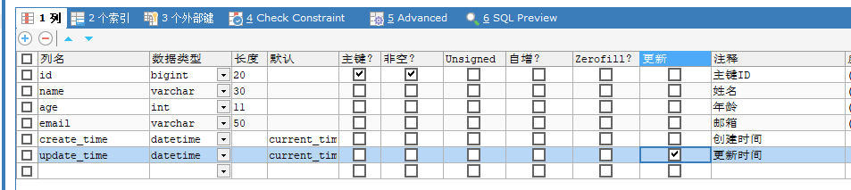
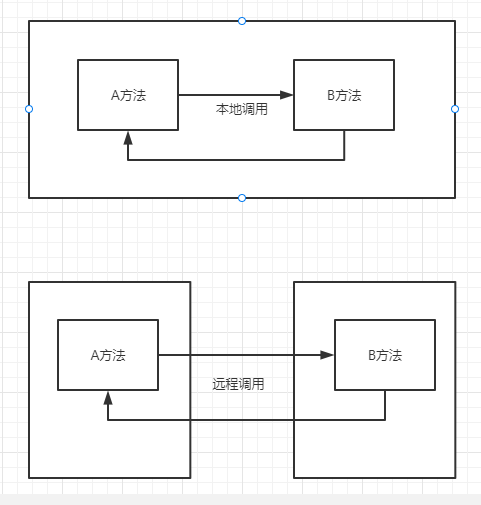
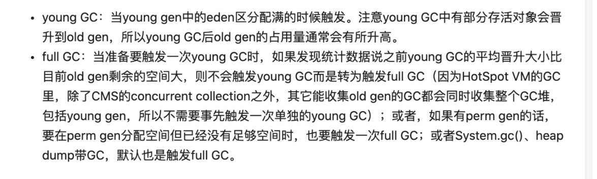
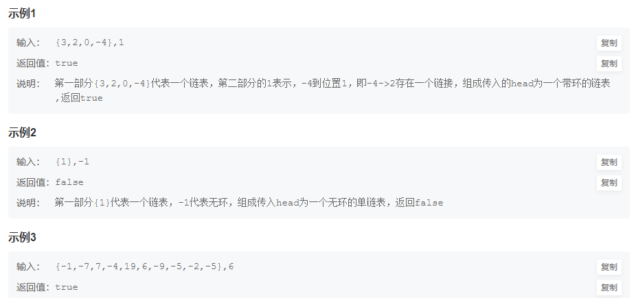
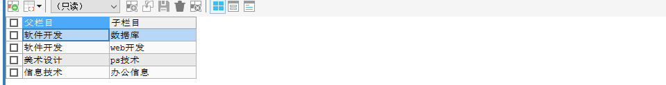

面试常问问题总结**

## 一、JavaSE

### 1.1 ☆==集合==

**华为、 深信服**

集合是一个Java存储容器，主要指的是**内存层面**的存储，不涉及到**持久化的存储**

注：向Collection中add的对象都必须要重写equals()

==数组==：

- **特点**

  - 一旦初始化以后，其长度就确定了
  - 一旦数组定义好，其元素的类型也就确定了

- **缺点**

  - 其长度就不可修改
  - 添加、删除、插入数据等操作不便捷
  - 获取数组中实际元素的个数的需求，数组没有现成的属性或方法可用
  - 数组存储数据的特点：有序、可重复。对于无序、不可重复的需求，不能满足

  

**整体的框架图**


- **Collection**接口
  - ==**List**==接口
    - **ArrayList**：(jdk1.2)作为List接口的**主要实现类**；线程**不安全**的，**效率高**；底层使用**Object[]** elementData数组存储
    - **LinkedList**：(jdk1.2) 底层使用**双向链表**存储，对于频繁的**插入删除**操作，使用此类**效率**比ArrayList**高**，**双向链表**
    - **Vector**：(jdk1.0)作为List接口的**古老**实现类；**线程安全**的，**效率低**；底层使用Object[] elementData存储
  - ==**Set**==接口
    - **HashSet**：作为Set接口的**主要实现类**；线程**不安全**，可以存储**null**值
      - LinkedHashSet：作为HashSet的**子类**；遍历其内部数据时，可以按照**添加的顺序遍历**
    - **TreeSet**：可以按照添加对象的**指定属性**，进行**排序**
- **Map**接口
  - ==HashMap==：作为Map的**主要**实现类；线程**不安全**的，**效率高**；存储**null**的key和value
    - LinkedHashMap：在原有的HashMap底层结构基础上，添加了一对**指针**，指向前一个和后一个数据，对于频繁的遍历操作
  - ==HashTable==：作为Map的**古老**实现类；线程**安全**的，**效率低**；**不能**存储null的key和value
    - Properties：常用来处理配置文件。key和value都是String类型
  - ==TreeMap==：保证按照添加的key-value对进行**排序**，实现排序遍历，此时考虑**key的自然排序**，底层**红黑树**

**HashMap的底层**：**数组+链表**（jdk7以及之前）

​								 **数组+链表+ 红黑树**（jdk8）


#### 1.1.1 Set add元素的过程

- 首先调用 **a** 所在类的**hashCode**()方法，计算元素a的**哈希值**


- 此**哈希值**接着通过某种**算法**计算出在HashSet**底层数组**中的存在**位置**（即为：索引位置）


- 判断数组此位置上是否已经有元素：
  - 如果此位置上**没有**其他元素，则元素a添加成功。    **------情况1**
  - 如果此位置上**有**其他元素**b**（或以链表形式存在的多个元素），则比较元素a与元素b的**哈希值**
    - 如果哈希值**不相同**，则元素a添加成功，使用**链表的方式**添加   **------情况2**
    - 如果哈希值**相同**，需要调用元素a所在类的**equals()**方法：

​						>>>equals()返回**true**：元素a添加**失败**

​						>>>equals()返回**false**：元素添加**成功**     **------情况3**


对于添加成功的**情况2和情况3**而言：元素**a**与已经指定索引位置上数据以**链表的方式**存储

**Jdk7：**元素a放到数组中，指向原来的元素，认为新添加的元素大概率会被再访问

**Jdk8：**原来的元素在数组中，指向元素a

总结为==“七上八下”==

HashSet底层：==数据+链表==


#### 1.1.2 重写hashCode和equals方法？

Object类中的hasCode()是随机生成一个哈希值，所以需要重写。

向Set中添加的数据，其所在的类一定要重写hashCode()和equals()

重写的hashCode()和equals()尽可能保持一致性，相等的对象必须具有相等的散列码，如果两个对象属性都一样，要保证哈希值一样。


#### 1.1.3 HashMap VS Hashtable

美团

|                       |           HashMap            |        HashTable         |
| :-------------------: | :--------------------------: | :----------------------: |
|      实现Map接口      |              √               |            √             |
| 允许key - value为null |              √               |            ×             |
|       线程安全        |              ×               |            √             |
|        效率高         |              √               |            ×             |
|          API          | containsValue 和 containsKey |         contains         |
|         同步          |      ConcurrentHashMap       |     Synchronize修饰      |
|       Hash算法        |   hash/rehash 算法大致一样   | hash/rehash 算法大致一样 |

#### 1.1.4 HashMap扩容

**同花顺**  

默认容量**16** 

扩容**2**倍 

加载因子**0.75**

==**1.7** 数组 + 链表  **头插法**==

**扩容都是针对的数组**，先将数组**复制**一份，数组的容量是原来的**两倍**，然后将原数组中的数据全部转移到新数组中

1. 先生成**新数组**
2. 遍历**老数组**中的每个位置上的链表上的每个元素
3. 取每个元素的Key，并基于新数组长度，计算出每个元素在新数组中的下标
4. 将元素添加到新数组中去
5. 所有元素转移完了之后，将新数组赋值给HashMap对象的table属性

==头插法==：新来的值会取代原有的值，原有的值就顺推到链表中去，因为写这个代码的作者认为后来的值被查找的可能性更大一点，提升查找的效率。

==尾插法==：新来的值会插入到链表的尾部


==**1.8** 数组 + 链表 + 红黑树  尾插法==

**扩容都是针对的数组**，先将数组复制一份，数组的容量是原来的两倍，然后将原数组中的数据全部转移到新数组中，但是因为jdk1.8中有红黑树的原因，新的树的相对位置可能和原始数组中的不一样，因为树的位置是根据数组的大小决定的。大于8是红黑树，小于8是链表

1. 先生成新数组
2. 遍历老数组中的每个位置上的链表或者红黑树
3. 如果是链表，则直接将链表中的每个元素重新计算下标，并添加到新数组中去
4. 如果是红黑树，则先遍历红黑树，先计算出红黑树中每个元素对应的新数组的下标位置
   1. 统计每个下标位置的元素个数
   2. 如果该位置下的元素个数超过了8，则生成一个新的红黑树，并将根节点添加到新数组的对应位置
   3. 如果该位置下的元素个数没有超过8，那么生成一个链表，并将链表的头结点添加到新书的对应位置
5. 所有元素转移完成之后，将新数组赋值给hashMap对象的table属性


==**为什么从头插法到尾插法？**== 

- 为了安全，防止环化

- 因为需要算一下链表的长度，所以会顺带在尾部插入


**注意：**

- 1.7中Hash算法比较复杂→想得到位置分布更加均匀一点

- 1.8中进行了简化，因为新增了红黑树，提高了插入和查询效率，复杂的hash算法会消耗部分时间


**HashMap**默认的**初始长度** ==16==，为了可以实现**均匀分布**


#### 1.1.5 ArrayList扩容

==JDK7==

底层创建了长度为**10**的Object[] **数组** elementData

如果此次的添加导致底层elementData数组**容量不够**，则**扩容**

默认情况下，扩容为原来的容量的**1.5倍**，同时需要将原有数组中的数据**复制到**新的数组中

（建议开发中使用带参的构造器，可以避免中间操作的扩容，提高效率）


==JDK8==

底层创建了Object[] 数组 elementData 初始化为{},并没有创建长度为10的数组

第一次调用add()时，底层才创建了长度为10的数组，并将第一个数据添加到elementData[0]中

后续的添加和扩容操作和jdk7无异


#### 1.1.6  TreeMap的底层数据结构

- 红黑树

- 红黑树的Node排序是根据是根据Key进行比较

- 每次新增删除节点，都可能导致红黑树的重排
- 红黑树中不支持两个or两个以上的Node节点对应红黑值相等
- 查询的时间复杂度O(logn)

#### 1.1.7 HashMap遍历方式

同花顺

**通过ForEach循环进行遍历**

```java
// Iterating entries using a For Each loop
for (Map.Entry<Integer, Integer> entry : map.entrySet()) {
    System.out.println("Key = " + entry.getKey() + ", Value = " + entry.getValue());
}
```

**ForEach迭代键值对方式**

```java
// 迭代键
for (Integer key : map.keySet()) {
    System.out.println("Key = " + key);
}
// 迭代值
for (Integer value : map.values()) {
    System.out.println("Value = " + value);
}
```

 **使用带泛型的迭代器进行遍历**

```java
Iterator<Map.Entry<Integer, Integer>> entries = map.entrySet().iterator();
while (entries.hasNext()) {
    Map.Entry<Integer, Integer> entry = entries.next();
    System.out.println("Key = " + entry.getKey() + ", Value = " + entry.getValue());
}
```

**使用不带泛型的迭代器进行遍历**

```java
Iterator<Map.Entry> entries = map.entrySet().iterator();
while (entries.hasNext()) {
    Map.Entry entry = (Map.Entry) entries.next();
    Integer key = (Integer) entry.getKey();
    Integer value = (Integer) entry.getValue();
    System.out.println("Key = " + key + ", Value = " + value);
}
```

 **通过Java8 Lambda表达式遍历**

```java
map.forEach((k, v) -> System.out.println("key: " + k + " value:" + v));
```


#### 1.1.8  ArrayList VS LinkedList

**==LinkedList==** ：

- 底层：**链表**，可以在分散的内存
- 不适合查询
- 适合增删

**==ArrayList==**：

- 底层：**动态数组**，连续内存存储
- 适合下标访问（随机访问）
- 添加慢（因为扩容的时候需要新建一个双倍大小的数组，在把旧元素放入到新数组中）


1. 首先，他们的底层数据结构不同，ArrayList底层是基于动态数组实现的，LinkedList底层是基于链表实现的
2. 由于底层数据结构不同，他们所适用的场地也不同，ArrayList更适合随机查找，LinkedList更适合删除和添加 。
3. 另外ArrayList和LinkedList都实现了List接口，但是LinkedList还额外实现了Deque接口，所以LinkedLinked还可以当做队列来使用


#### 1.1.9 CopyOnWriterArrayList

**ArrayList**是线程**不安全的**：**并发add**的时候，同时进入add，但是**后线程**覆盖了**前线程**添加的**数据**

1. 首先**CopyOnWriterArrayList**的内部也是用**数组**来实现的，在向**CopyOnWriterArrayList**添加元素时候，会复制一个数组，**写操**作在**新数组**上进行，**读操作**在**原数组**上进行
2. 并且，**写操作**会**加锁**，防止出现并发**写入丢失数据**的问题
3. 写操作结束之后会把**原数组**指向**新数组**
4. **CopyOnWriterArrayList**允许在**写操作**时来**读取数据**，大大**提高**了读的性能，因此适用**读多写少**的应用场景，但是CopyOnWriterArrayList会比较**占用内存**，同时**可能读到的**数据不是**实时最新的数据**，所以**不适合**实时性要求**很高**的场景


#### 1.1.10 ConcurrentHashMap扩容

**远景智能**

**ConcurrentHashMap**一个**并发容器**，在多线程开发中很经常会使用到这个类，它与HashMap的区别是**HashMap是线程不安全**的，在高并发的情况下，使用HashMap进行大量变更操作容易出现问题，但是ConcurrentHashMap是线程安全的。

**JDK1.7** 


由很多个**Segment**对象组成ConcurrentHashMap，扩容是针对每个Segment内部而言的

1. 1.7版本的**ConcurrentHashMap**是基于**Segment**分段实现的
2. 每个**Segment**相对于一个**小型的HashMap**
3. 每个Segment**内部**会进行**扩容**，和HashMap的扩容逻辑**类似**
4. 先生成新的数组，然后**转移**元素到新数组中
5. **扩容的判断**也是每个**Segment**内部**单独判断**的，判断时否**超过阈值**


**JDK1.8**

1. 1.8版本的ConcurrenthashMap**不再**基于Segment实现
2. 当某个线程进行**pu**t时，发现**ConcurrentHashMap**正在**进行扩容**那么该线程**一起进行扩容**
3. 当某个线程进行**put**时，发现**没有**正在进行扩容，则将**key-value**添加到ConcurrentHashMap中，**然后判断**是否**超过了阈值**，超过阈值则进行扩容
4. ConcurrentHashMap**支持多线程扩容**
5. 扩容之前也先 生成一个**新的数组**
6. 在转移元素之前，先将原数组分组，将每组分给不同的线程进行元素的转移，每个线程负责一组或者多组的元素转移工作。每个线程之间互相不干扰


==ConcurrentHashMap原理==

HashTable是使用synchrozied锁整个Map

**JDK1.7**

- 数据结构：ReenTranLock分段锁+Segment+HashEntry，一个Segment中包含一个HashEntry数组，每个HashEntry又是一个链表的结构
- 元素查询：二次hash,第一个Hash定位到Segment，第二次Hash定位到元素所在的链表的头部
- 锁：Segment分段锁 Segment继承了ReentranLock，锁定操作的Segment，其他的Segment不受影响，并发度为segment个数，可以通过构造函数指定，数组扩容不会影响其他的Segment
- get方法无需加锁，volatile保证

**JDK1.8**

- 数据结构：synchronized+CAS+Node+红黑树，Node的val和next都用volatile修饰，保证可见性
- 查找、替换、赋值操作都使用CAS
- 锁：锁链表的head结点，不影响其他元素的读写，锁粒度更细，效率更高，扩容时，阻塞所有的读写操作、并发扩容


### 1.2 Java三大特性 

**同花顺**、**VIVO**

==**继承、多态、封装**==

 

**多态**的概念：指一个**引用（类型）**在**不同情况下**的多种状态。也可以理解为 **通过指向父类的指针，来调用在不同子类中实现的方法**

==**具体开发中的应用：（可以用来举例子）**==

在实际的开发中，常常会遇到**一个功能**有很**多种实现**方式，比如：

**支付方式**包括：**微信支付、支付宝支付、京东支付、银联支付**等等。不同的支付方式的大概**流程是相似**的，实现细节有所区别。给每一种方式写一个类不便于管理和扩展。这个时候大多就是用到的java的多态机制。可以先定义一个公共接口，接口定义支付流程的各个方法，具体的支付方式实现该接口的方法。在控制controller层，利用spring的注入获取支付类型和支付方式实现类的引用映射，根据请求需要的支付类型，就可以调用对应的支付方式的方法，以此实现业务的解耦和扩展。后期需要增加支付方式，只需要实现共同接口即可。


### 1.3 构造器工作原理

1. **分配对象空间**，将空间内存初始化成二进制的零并将对象中成员初始化为**0或者null**，因为java不允许用户操作一个不定值对象
2. 执行**属性值**的**显示初始化**
3. **执行构造器**
4. 将变量**关联**到**堆中的对象上**


### 1.4 重载 VS 重写

| ==区别点== |               重载方法               |                 重写方法                 |
| :--------: | :----------------------------------: | :--------------------------------------: |
|  发生范围  |               同一个类               |                   子类                   |
|  参数列表  | **不同**（参数类型、个数、顺序不同） | **方法名**、**参数列表**必须**全部相同** |
|  返回类型  |                可修改                |     子类方法**<=**父类方法返回值类型     |
|    异常    |                可修改                |     子类方法**<=**父类方法的抛出异常     |
| 访问修饰符 |                可修改                |  一定不能做更严格的限制（可以降低限制）  |
|  发生阶段  |              **编译期**              |                **运行期**                |


### 1.5 修饰符权限

|           | 类内部 | 本包 | 子类（同包） | 外部包 |
| :-------: | :----: | :--: | :----------: | :----: |
|  public   |   √    |  √   |      √       |   √    |
|  default  |   √    |  √   |      √       |   ×    |
| protected |   √    |  √   |      ×       |   ×    |
|  private  |   √    |  ×   |      ×       |   ×    |

### 1.6 JDK VS JRE

==JRE== Java Runtime Enviroment是**Java**的**运行环境**，是面向的**Java程序的使用者**，只有**JRE**只能运行**Java程序**

==JDK== Java Development kit 是**Java**开发工具包，他提供了**Java**的开发环境和运行环境。**JDK中包含了JRE**

==JVM==是Java Virtual Machine(Java虚拟机)的缩写，是整个Java平台实现跨平台的最核心的部分，能够运行以Java语言写作的软件程序

**简单来说就是JDK是Java的开发工具，JRE是Java程序运行所需的环境，JVM是Java虚拟机．它们之间的关系是JDK包含JRE和JVM，JRE包含JVM**


### 1.7 类加载顺序

华为

1. 首先加载**父类**的**静态代码块**
2. **子类**的**静态代码块**
3. **父类普通变量**以及 **{ }**
4. **父类构造方法**被加载
5. **子类变量**或者**{ }**被加载
6. **子类构造方法**被加载


### 1.8 代码题

```java
public class Demo1 {
    public static void main(String[] args) throws NoSuchFieldException, IllegalAccessException {
        String s = new String ("abc");
        //在这中间可以添加N行代码。但必须保证s引用的指向不变，最终将输出变成abcd
        //反射
        Field value = s.getClass().getDeclaredField("value");
        value.setAccessible(true);
        value.set(s,"abcd".toCharArray());
        System.out.println(s);
    }
}
```

```java
String s1 = new String("abc"); //创建了两个对象 "abc"常量对象，s1也是一个对象
String s2 = "abc";  //创建了一个对象，就是s2
//s1==s2 ? true or false
System.out.println(s1==s2);   //false s1 和 s2的地址不一样

String s3 = s1.intern();  //String对象的intern方法，首先会检查字符串常量池中是否存在“abc”，如果存在则返回该字符串引用，如果不存在，则把“abc”添加到常量池中，并返回该字符串的引用
//s2==s3 ? true or false
System.out.println(s2 == s3);  //true
```

```java
Integer i1 = 100;
Integer i2 = 100;
//i1 == i2? true or false
System.out.println(i1==i2); //true

Integer i3 = 128;
Integer i4 = 128;
//i3 == i4? true or false
System.out.println(i3 == i4); // false
```

==多态相关：==

华为

```java
public class TestDemo01 {
    public static void main(String[] args) {
        Father son = new Son();
        System.out.println(son.id);
        son.getAns();
    }
}
class Father{
    int id = 100;
    public void getAns(){
        System.out.println("100");
    }
}
class Son extends Father{
    int id = 101;
    @Override
    public void getAns() {
        System.out.println("101");
    }
}
>>>100  //调用父类的实例变量
>>>101  //调用子类的同名算法
//成员变量是没有多态的概念的，在声明期间，声明的是父类，所以是使用的父类的变量
```


### 1.9 String & StringBuilder & StringBuffer

**==String类==**

**从类的声明，我们看出，String类继承了Serializable,Comparable和CharSequence接口**

主要的属性有：**value** 和 **hash**

value是一个**字符数组**，用来**存储字符串**

hash是**String**的**hash**值缓存，方便比较


- String是不可以修改对象的。


- StringBuilder和StringBuffer可以修改对象的。


1. String是不可变的，如果尝试去修改，会新生成一个字符串对象，StringBuffer和StringBuilder是可变的
2. StringBuffer是线程安全的，StringBuilder是线程不安全的，所有在单线程环境下StringBuilder的效率会高一点


|               | 是否可变 | 是否安全 | 性能 |
| :-----------: | :------: | :------: | :--: |
|    String     |  不可变  |   安全   |  低  |
| StringBuilder |   可变   |  不安全  |  高  |
| StringBuffer  |   可变   |   安全   | 较高 |


### 1.10 数组==null & 数组长度为0

**数组是一个空对象**

```java
int[] array = null; 数组为空，此时array不指向任何对象；
```

**数据里面的元素为0**

```java
int[] array = new array[0]; 定义一个长度为0的数组；int[] array = new array[2]; 定义一个长度为2的数组，此时如果数组没有被初始化，默认的值为null；
```

两者如果在一句代码中，则要先判断是否为空，否则可能会出现空指针异常

```java
if(array == null || 0 == array.length) {...}   // 这种写法正确
```


### 1.11 == 和equals

**==面试题：==和equals的区别==**

====：==

1. 可以使用在**基本数据类型**变量和**引用数据**类型变量中

2. 如果比较的是**基本数据类型**变量：比较两个变量**保存的数据是否相等**（不一定类型要相同）
3. 如果比较的是**引用数据类型**变量：比较两个对象的**地址值**是否相同，即**两个引用是否指向同一个对象实体**

```java
String s1 = new String("atguigu");
String s2 = new String("atguigu");
System.out.println(s1 == s2);  //false
```

```java
String s1 = "atguigu";
String s2 = "atguigu";
System.out.println(s1 == s2);  //true
```

==equals()方法==

1. 是一个方法，而非一个运算符
2. 基本数据类型没有方法调用，只能使用引用数据类型来调用
3. Object类中的equals()方法的定义：

```java
public boolean equals(Object obj){  
    return (this == obj);
}
```

说明：Object类中的定义的equals() 和 == 定义是相同的，是比较两个对象的地址值是否相等

4. String、Data以及其他类型的equals()方法并不是像3中那样定义的，而是进行了重写Object中的equals()，比较的不是地址值了，而是比较的两个对象的“实体内容”是否相同
5. 通常情况下，我们自定义的类如果使用equals()的话，也通常是比较两个对象的“实体内容”是否相同。那么，我们就需要对Object中的euqals()方法进行重写，具体的重写方法如下：Customer是一个类

```java
@Override
public boolean equals(Object obj){  
    if(this == obj){    
        return true;  
    }  
    if(obj instanceof Customer){    
        Customer cust = (Customer)obj;   
        //比较两个对象的每个属性是否相同    
        return this.age = cust.age && this.name.equals(cust.name);  
    }  return false;
}
```

其实就是比较对象里面的所有的属性是否一致，一致就返回true，不一致就返回false


### 1.12 简述final

- 修饰**类**：表示类**不可被继承**
- 修饰**方法**：表示方法不可被子类**覆盖**（override），但是可以**重载**（overload）
- 修饰**变量**：表示变量**不可以被修改**


**为什么  局部内部类  和  匿名内部类  只能访问局部final变量？**

因为：因为虽然匿名内部类在方法的内部，但实际编译的时候，内部类编译成Outer.Inner,这说明内部类所处的位置和外部类中的方法处在同一个等级上，外部类中的方法中的变量或参数只是方法的局部变量，这些变量或参数的作用域只在这个方法内部有效

**finally**：异常捕获的时候需要用到的，try中return后的代码会执行吗？会的，调用finally的时机是try块真的要return时。

**finalize**：是**Object类**中的一个方法。垃圾回收机制中  如果想被回收的时候不是真的被回收，第二次被gc回收的时候才能回收。finalize()只会在对象内存回收前被调用一次


### 1.13 接口 VS 抽象类

- 抽象类可以存在普通成员函数，而**接口中只能**存在**public abstract**方法
- 抽象类中的成员变量可以是各种类型的，而**接口中**的成员变量**只能**是**public static final**
- 抽象类只能继承一个，接口可以实现多个


**接口**的设计目的，是对类的行为进行约束  **like a**

**抽象类**的设计目的，是代码复用，现有子类，再有父类，对子类的共同部分进行提取，抽象类是不可以实例化的。 **is a**


### 1.14 深拷贝 vs 浅拷贝

**同花顺**


### 1.15 反射

**JAVA反射机制**是在运行状态中，对于**任意一个类**，都能够知道这个类的所有属性和方法；对于任意一个对象，都能够调用它的任意一个方法和属性；这种动态获取的信息以及动态调用对象的方法的功能称为java语言的反射机制。

反射的应用场所：**反射是框架设计的灵魂。**

**大量使用了动态代理，而动态代理的实现也依赖反射。**

​	**Spring框架**也用到很多反射机制，最经典的就是xml的配置模式。Spring 通过 XML 配置模式装载 Bean 的过程：

1) 将程序内所有 XML 或 Properties 配置文件加载入内存中; 
2) Java类里面解析xml或properties里面的内容，得到对应实体类的字节码字符串以及相关的属性信息; 
3) 使用反射机制，根据这个字符串获得某个类的Class实例; 
4) 动态配置实例的属性。

==优点==：在运行期间确定对象、绑定对象、操作对象、最大限度的发挥了Java的**灵活性**

==缺点==：反射会跳过**类型检查**等，导致安全问题。例如通过反射跳过泛型的编译前类型检查

**总结：**

业务代码中不建议使用Java反射

开发框架中一定会用到Java反射


### 1.16 Java异常

异常主要分为**Error**和**Exception**两种

- **Error**类以及他的子类的实例，代表了JVM本身的错误，错误不能被程序员通过代码处理
- **Exception**以及他的子类，代表程序**运行时**发送的各种**不期望**发生的事情。可以被Java异常处理机制使用，是异常处理的核心。


最后总计一下`try{}  catch(){}   finally{}`的执行顺序。

1. 先执行`try`中的语句，包括`return`后面的表达式； 
2. 有异常时,执行`catch`中的语句，包括`return`后面的表达式，无异常跳过`catch`语句； 
3. 然后执行`finally`中的语句，如果`finally`里面有`return`语句，执行`return`语句，程序结束； 
4. `finally{}`中没有`return`时，无异常执行`try`中的`return`，如果有异常时则执行`catch`中的`return`。前两步执行的`return`只是确定返回的值，程序并未结束，`finally{}`执行之后，最后将前两步确定的`return`的返回值返回


Throws VS throw

==**区别一：**==

 throws:
     跟在方法声明后面，后面跟的是异常类名

 throw:
    用在方法体内，后面跟的是异常类对象名   

==**区别二：**==

throws:
    可以跟多个异常类名，用逗号隔开

 throw:
   只能抛出一个异常对象名 

==**区别三：**==

throws:
     表示抛出异常，由该方法的调用者来处理

 throw:
    表示抛出异常，由该方法体内的语句来处理

==**区别四：**==

throws:
     throws表示有出现异常的可能性，并不一定出现这些异常

 throw:
    throw则是抛出了异常，执行throw一定出现了某种异常


### 1.17 IO流

IO流的作用是在==本地磁盘和网络上进行操作==

一般==文本文件==使用==字符流==来处理

一般==非文本文件==使用==字节流==来处理

I/O 是针对内存      in ：硬盘—>内存

​								out：内存—>硬盘


InputStream：字节输入流

Reader：字符输入流

OutputStream：字节输出流

Writer：字符输出流


BIO：Blocking IO 同步阻塞IO模式，数据的读取写入必须阻塞在一个线程内等待其完成

NIO：Non-Block IO


### 1.18 Switch关键字

switch可以作用于**char  byte  short  int** 以及他们的**包装类**，switch**不可以**用在**long double float boolean**上

JDK之后可以作用于**枚举类**，在JDK1.7之后，可以作用于**String**


### 1.19 Java语言采用何种编码方式

 Java语言采用==Unicode==编码标准，它为每个字符制订了一个唯一的数值，因此在任何的语言，平台，程序都可以放心的使用。


### 1.20 static关键字

static关键字的主要用途**就是方便在没有创建对象时调用方法和变量，优化程序性能**

==**static变量**==

用`static`修饰的变量被称为**静态变量**，也被称为**类变量**，可以直接通过**类名**来访问它。静态变量被所有的对象共享，在内存中只有一个副本，仅当在类初次加载时会被初始化，而非静态变量在创建对象的时候被初始化，并且存在多个副本，各个对象拥有的副本互不影响。

==**static方法**==

 `static`方法不依赖于任何对象就可以进行访问，在`static`方法中不能访问类的非静态成员变量和非静态成员方法，因为非静态成员方法/变量都是必须依赖具体的对象才能够被调用，但是在非静态成员方法中是可以访问静态成员方法/变量的。

==**static代码块**==

静态代码块的主要用途是可以用来**优化程序的性能**，因为它只会在类加载时加载一次，很多时候会将一些只需要进行一次的初始化操作都放在`static`代码块中进行。如果程序中有多个`static`块，在类初次被加载的时候，会按照`static`块的顺序来执行每个`static`块。


### 1.21 无参构造器的作用

 Java程序存在**继承**，在**执行子类**的**构造方法**时，如果没有用`super()`来调用父类特定的构造方法，则会调用父类中“没有参数的构造方法”。如果父类只定义了有参数的构造函数，而子类的构造函数没有用`super`调用父类那个特定的构造函数，就会出错。


### 1.22 变量

成员变量 又称为 全局变量，可以分为**类变量**和**实例变量**

|          |         类变量         |        实例变量        |         局部变量         |
| :------: | :--------------------: | :--------------------: | :----------------------: |
| 定义位置 | 类中，方法外（static） | 类中，方法外(无static) |          方法中          |
|  初始值  |      有默认初始值      |      有默认初始值      |       无默认初始值       |
| 存储位置 |         方法区         |           堆           |            栈            |
| 生命周期 |   类何时被加载和卸载   |  实例何时被创建及销毁  | 方法何时被调用及结束调用 |

### 1.23 值传递

**Java只有值传递**

1. 传递基本数据类型，是用的值传递

```java
public class Main {
    public static void main(String[] args) {
        int a = 1;
        printValue(a);
        System.out.println("a:" + a);
    }
    public static void printValue(int b){
        b = 2;
        System.out.println("b:"+ b);
    }
}
b:2
a:1
```

2. 传递对象，传递的是一个引用的副本，只是这个副本引用和原始的引用指向的同一个对象，所以副本引用修改过对象属性之后，通过原始引用查看对象属性肯定也是被修改过的。

```java
public class Main2 {
    public static void main(String[] args) {
        Preson p = new Preson();
        p.name = "zhangsan";
        printValue(p);
        System.out.println("p.name: " + p.name);
    }
    public static void printValue(Preson q){
        q.name = "lisi";
        System.out.println("q.name: "+ q.name);
    }
}
class Preson{
    public String name;
}
q.name: lisi
p.name: lisi
```


### 1.24 常用的Object方法

`Object clone()`：创建与该对象的类相同的新对象 

`boolean equals(Object)`：比较两对象是否相等 

`void finalize()`：当垃圾回收器确定不存在对该对象的更多引用时，对象垃圾回收器调用该方法 

`Class getClass()`：返回一个对象运行时的实例类 

`int hashCode()`：返回该对象的散列码值 

`void notify()`：唤醒等待在该对象的监视器上的一个线程 

`void notifyAll()`：唤醒等待在该对象的监视器上的全部线程 

`String toString()`：返回该对象的字符串表示 

`void wait()`：在其他线程调用此对象的 `notify()` 方法或 `notifyAll()`方法前，导致当前线程等待


## 二、SSM框架	

### 2.1 Spring

#### 2.1.0 Spring概况

轻量级的开源的J2EE框架。它是一个容器框架，用来装javaBean（java对象），中间层框架可以起一个连接作用。

Spring是一个轻量级的控制反转（IOC）和切面（AOP）的容器框架

- 从大小与开销两方面而言Spring都是轻量级的
- 通过控制反转（IOC）的技术达到松耦合目的
- 提供了面向切面编程的丰富支持，允许通过分离应用的业务逻辑与系统进行内聚性的开发
- 包含并管理应用对象（Bean）的配置和生命周期，这个意义上是一个Bean的容器
- 将简单的组件配置、组合成为复杂的应用，这个意义上是一个框架


#### 2.1.1 Spring项目问题排查

- 看状态码
  - 如果是404：说明是url的错误，可以回去看一下url跳转路径是否正确
  - 如果是500说明是服务端出错了，查看自己的代码是哪里出错了，如果找不出来，可以依次打断点，然后查看每一行的输出结果查看


#### 2.1.2 AOP

同花顺、兴业数金

==AOP==

**面向切面编程**，**AOP**采用的是**横向切面**的方式，**注入**与**主业务流程无关**的功能，例如==**事务管理**==和==**日志管理**==。

作用：在不修改源代码的情况下，可以实现功能的增强

场景一：**记录日志**

场景二：**监控方法运行时间**（监控性能）

场景三：**权限控制**

场景四：**缓存优化**（第一次调用查询数据库，将查询结果放入内存对象，第二次调用，直接从内存对象返回，不需要查询数据库）

场景五：**事务管理**（调用方法前开启事务，调用方法后提交关闭事务）


**AOP实现的原理是什么？** ——**兴业数金**

是面向对象编程**OOP**的一种补充

Spring AOP的动态代理主要有两种方式实现，**JDK动态代理**（业务层有接口），**cglib动态代理**。**JDK动态代理**通过**反射**来**接收**被代理的类，但是被代理的类必须实现接口，核心是**InvocationHandler**和**Proxy**类。cglib动态代理的类一般是没有实现接口的类，cglib是一个代码生成的类库，可以在运行时动态生成某个类子类，所以，cglib是通过继承的方式做的工台代理，因此如果某个类被标记为final，那么它是无法使用cglib做动态代理的


#### 2.1.3 IOC

==**IOC简单介绍下**==

兴业数金

IOC其实就是Spring容器

==**容器概念**==：实际上就是一个**map**，里面**存放**都是**各种对象**（**在xml里配置的bean节点、@repository、@service、@controller、@component**）。在项目启动的时候会读取配置文件里面的bean节点，根据全限定类名使用**反射**创建对象放到**map里面**、扫描到打上上述注解的类还是通过**反射**创建对象放到map里面。   这个时候map里面就有了各种对象了，接下来我们在代码里面需要用到里面的对象，再通过**依赖（DI）注入**（@autowired）

==**控制反转**==：没有引入IOC容器之前，对象A**依赖于**B（在A对象里面存在着对象B的属性，说明对象A依赖着对象B），那么对象A在初始化或者运行到某一点的时候，自己必须主动去创建对象B或者使用已经创建的对象。无论是创建还是使用对象B，**控制权**都是在**自己**手上的。

​		引入了IOC容器之后，对象A与对象B之间失去了联系，当对象运行到需要对象B的时候，IOC容器会主动创建一个对象B注入到对象A需要的地方。 控制权到了IOC的手里。

==**依赖注入**==：依赖注入是**实现IOC**的一种**方法**，就是由IOC容器在运行期间，**动态地**将**某种依赖**关系**注入**到**对象**之中。


Spring的动态代理实现的原理是什么？

远景智能

**反射**


#### 2.1.3 Bean的生命周期

1. 解析类得到**BeanDefinition**
2. 如果有多个构造方法，则要**推断**构造方法
3. **确定**好**构造方法**，进行**实例化**得到一个**对象**
4. 对对象中的加了**@Autowired**注解的**属性**进行**属性填充**
5. **回调Aware**方法，比如BeanNameAware，BeanFactoryAware
6. 调用**BeanPostProcessor**的**初始化前**的**方法**
7. 使用**初始化**方法
8. 调用**BeanPostProcessor**的**初始化后**的**方法**，在这里会进行**AOP**
9. 如果当前创建的Bean是**单例的** 则会把Bean放入到**单例池**
10. 使用**Bean**
11. Spring容器关闭时调用**DisposableBean**中的**destory()**方法


#### 2.1.4 Bean线程不安全

Spring本身并没有针对Bean做线程安全的处理：

1.如果Bean是无状态的，那么Bean则是线程安全的

2.如果Bean是有状态的，那么Bean则是线程不安全的


另外，Bean是不是线程安全的，跟Bean的作用域没有关系，Bean的作用域只是表示Bean的生命周期，对于任何生命周期的Bean都是一个对象，这个对象是不是线程安全的，还是得看这个Bean对象本身


#### 2.1.5 Spring的事务实现方式

两种方式可以实现：**1.编程式 2.声明式** @**Transactional**注解就是声明式

**首先**，事务这个概念是**数据库层面**的，Spring只是基于数据库中的事务进行了**扩展**，以及提供了一些能让程序员**更加方便**操作事务的方式

比如：我们可以通过在某个方法上添加**@Transactional注解**，就可以开启事务，这个方法中所有的sql都会在一个事务中执行，统一成功或者失败。

在一个方法上加了@Transactional注解后，Spring会基于这个类生成一个**代理对象**，会将这个**代理对象**作为Bean放入到IOC容器中。当使用这个代理对象的时候，如果这个方法上**存在**@Transactional注解，那么代理逻辑会先把事务的**自动提交**设置为**false**，然后**再去执行**原本的**业务逻辑方法**，如果执行业务逻辑方法**没有出现异常**，那么代理逻辑中就会将**事务进行提交**，如果执行逻辑业务**出现了异常**，那么就会**进行回滚**。

当然，针对哪些异常回滚事务是可以配置的，可以利用@**Transactional**注解中的**rollbackFor**属性进行配置，默认情况下会对**RuntimeException**和**Error**进行**回滚**。


**MySQL**是**RC**

**Spring**是**RR**，最终以Spring的配置**覆盖**


#### 2.1.6 事务传播机制

深信服

多个事务方法相互调用的时候，事务如何在这些方法间传播


```
方法A是一个事务的方法，方法A执行过程中调用了方法B，那么方法B有无事务以及B对事务的要求不同都会对方法A的事务具体执行造成影响，同时方法A的事务对方法B的事务执行也有影响，这种影响具体是什么就由两个方法所定义的事务传播类型所决定
```


==**Required(默认)**==—Required修饰的是方法B

- 如果**当前（调用方）**没有事务，则**自己（被调用方）**创建一个事务 
  - A方法中 调用B方法，A没有事务，B新建一个事务
- 如果当前存在事务，则加入这个事务
  - A方法中 调用B方法，A有事务，那么就将B添加到A事务中去

==**Support**==

- 如果当前没有事务，则以非事务方法执行
- 如果当前存在事务，则加入到当前事务中

==**Mandatory**==

- 如果当前不存在事务，就抛出异常

- 如果当前存在事务，则加入到当前事务中

==**Requires_New**==

- 新建事务，如果当前存在事务，则把当前事务**挂起**（A处理A的事务，B处理B的事务，各不干扰）

==**not_supported**==

以非事务方式执行，如果当前存在事务，则挂起当前事务

方法A（事务）中调用方法B，方法B是非事务方式

==**Never**==

不使用事务，如果当前事务存在，则抛异常

**==Nested==**

- 如果当前事务存在，则在嵌套事务中执行，否则和Reqired的操作一样，开启一个事务


#### 2.1.7 事务失效场景

Spring事务的原理是AOP，进行了切面增强，那么失效的根本原因是这个AOP不起作用了。

- **发生了自调用**，this调用
- **方法不是public的**，@Transactional只能用于public的方法上，否则事务不会失效，如果非要用在非public方法上，可以开启AspectJ代理模式
- **数据库不支持事务**，  MySQL中的MyISAM就不支持事务
- **没有被Spring管理**，在方法上添加了@Transactional，但是这个类并没有放入到IOC容器中去
- **异常被吃掉（try catch），**事务不会回滚


#### 2.1.8 BeanFactory和ApplicationContext

ApplicationContext 是BeanFactory的子接口

- 继承了MessageSource，因此**支持国际化**
- 统一的**资源文件访问方式**
- 提供在**监听器中**注册**bean的事件**
- 同时**加载多个配置文件**
- **载入多个上下文**，使得每一个上下文都专注于一个特定的层次，比如应用的web层。


1. **BeanFactory**采用的是**延迟加载**形式来创建Bean的，只有在使用到**某个**Bean的时候，才会对该Bean进行加载**实例化**。这样我们就**不能发现**一个Spring**配置的问题**。如果Bean的某一个属性**没有注入**，BeanFactory加载后，**直到第一次**使用调用getBean方法**才会抛出异常**

2. **ApplicationContext**，它是在容器启动时，**一次性**创建了**所有的**Bean。这样，在容器启动的时，我们就可以发现Spring中存在的配置错误，这样**有利于检查**所依赖属性**是否注入**。
3. 相当于基本的BeanFactory，ApplicationContext**唯一的不足**是**占用内存空间**。当**应程序程序配置Bean**较多时，程序**启动较慢**
4. BeanFactory通常以**编程的方式**被创建，ApplicationContext还能**以声明的方式**创建，如使用ContextLoader


BeanFactory是个Factory，也就是IOC容器或对象工厂，FactoryBean是个Bean。在Spring中，所有的Bean都是由BeanFactory(也就是IOC容器)来进行管理的。但对FactoryBean而言，这个Bean不是简单的Bean，而是一个能生产或者修饰对象生成的工厂Bean,它的实现与设计模式中的工厂模式和修饰器模式类似。


#### 2.1.9 Bean的作用域

- **singleton**：**默认**，每个容器中只有一个bean实例，单例的模式由**BeanFactory**自身来维护。该对象的生命周期与SpringIOC容器**一致**的（但是在第一次被注入的时候才会创建）
- **propotype**：为  **每个bean请求**  提供**一个实例**。在每次注入时都会创建一个**新的对象**
- **request**：bean被定义为在每个**HTTP**请求中创建一个单例对象，也就是说在单个请求中都会复用这一个单例对象
- **session**：与request类似，一个session中可能会有**很多个request**，**确保**每个**session**中有一个**单例对象**，也就是说在**单个请求**中都会**复用**这个单例对象
- **application**：bean被**定义**在**ServletContext**的生命周期中**复用**一个**单例对象**
- **websocket**：bean被定义在**websocket**的生命周期中复用一个**单例对象**
- **global-session**：全局作用域


#### 2.1.10 单例Bean不是线程安全的

Spring中的Bean**默认**是**单例模式**，框架**并没有**对bean进行**多线程的封装处理**

如果Bean是**有状态的** 那就需要开发人员**自己来**进行**线程安全**的**保证**，最简单的方法就是**改变Bean的作用域**，把**singleton** 改为 **propotype**，这样每次请求Bean就相当于 **new Bean()** 这样就可以**保证线程的安全。**

- 有状态就是有数据存储功能
- 无状态就是不会保存数据

可以使用**ThreadLocal**进行解决**不安全的问题**

或者使用synchronized、lock、CAS等同步方法


#### 2.1.11 Bean的自动装配，哪些方式

开启自动配置，只需要在xml配置文件中<bean>中定义“autowrie”属性

```xml
<bean id="cutomer" class="com.xxx.xxx.Customer" autowrie="">
```

autowire属性有五种装配的方式：

- no-缺省情况下，自动装配是通过“ref”属性手动设定的

```
手动装配：以value或者ref的方式明确指定属性值都是手动装配需要通过’ref‘属性来连接bean
```

- byName-根据bean的属性名称进行自动装配

```
Customer的属性名称是person，Spring会将bean id为person的bean通过setter方法进行自动装配<bean id=“Customer” class=“com.xxx.xxx.Cutomer” autowire="byName"><bean id="person" class= "com.xxx.xxx.Person">
```

- byType-根据bean的类型进行自动装配

```
Customer的属性person的类型是Person，Spring会将Person类型通过setter方法进行自动装配<bean id=“Customer” class=“com.xxx.xxx.Cutomer” autowire="byType"><bean id="person" class= "com.xxx.xxx.Person">
```

- constructor-类似于byType，不过是应用于构造器的参数。如果一个bean与构造器参数的类型相同，则进行自动装配，否则就会导致异常

- autodetect-如果有默认的构造器，则通过constructor方式进行自动装配，否则使用byType的方式进行自动装配


#### 2.1.12 Spring中的设计模式

- **简单工厂模式**：由一个工厂类根据传入的参数，动态决定应该创建哪一个产品类

Spring中的**BeanFactory**就是简单工厂模式的体现，根据传入一个唯一的标识来获得Bean对象，但是否是在传入参数后创建还是传入参数前创建这个要根据具体情况来定。

- **工厂方法：**

实现了**FactoryBean**接口的bean是一种类叫做factory的bean。

-  **单例模式**：保证一个类仅有一个实例，并提供一个访问他全部访问点

Spring对单例的实现：Spring中的单例模式完成了后半句话，即提供了全局的访问点BeanFactory。但是没有从构造器级别去控制单例，这是因为Spring管理的是任意的java对象

- **适配器模式**

**SpringMVC**中的**HandlerAdater**

- **装饰器模式**：动态地给一个对象添加一些额外的职责。就增加功能来说，Decorator模式相比生成子类更为灵活

类名中含有Wrapper或者是含有Decorator的

- **动态代理**：

切面在应用运行时刻被织入。一般情况下，在织入切面的时，AOP容器会成为目标对象创建动态的创建一个代理对象

织入：把切面应用到目标对象并创建新的代理对象的过程


#### 2.1.13 SSM的区别

**Spring**：是一个IOC容器，用来管理Bean，使用依赖注入实现控制反转，可以很方便的整合各种框架，提供AOP机制弥补OOP的代码重复问题，比如日志、异常等

**SpringBoot**：是Spring提供的一个快速开发工具，让程序员能更加方便，更加快速的开发Spring+SpringMVC应用。简化了配置，整了一系列的解决方案。

**SpringMVC**：是Spring为web框架的一个解决方案，提供了一个总的前端控制器Servlet，用来接收请求，然后定义了一套路由策略以及适配执行handle，将handle结果使用视图解析技术生成视图展示给前端


### 2.2 SpringBoot

#### 2.2.1 如何在SpringBoot中开启事务

**兴业数金**

只需要做两步：

1. 在Application上添加 @EnableTransactionManagement

2. 在Service实现类的方法上添加@Transactional注解。


遇到过的实例是：

我开发了一个教育课堂的项目，里面有一个下单的操作，并且在下单操作的同时，要开始记录已经观看的视频记录有多少了。

所有在sava下单操作类中需要写两个步骤，第一个步骤是将下单的视频添加到视频订单数据表中，第二部是在视频播放记录表中添加一个数据。 如果不开启事务的话，在遭遇宕机的情况下可能会出现一个表中添加了记录，另一个表中没有添加记录。


**==SpringBoot中开启事务的底层原理是什么？==**

TODO 同Spring中开启事务


#### 2.2.2 SpringBoot的常用注解有哪些

**兴业数金**

1、**@SpringBootApplication**

**@Repository**用于标注数据访问组件，即DAO组件。

**@Service**一般用于修饰service层的组件

**@RestController**用于标注控制层组件(如struts中的action)，表示这是个控制器bean,并且是将函数的返回值直 接填入HTTP响应体中,是REST风格的控制器；它是@Controller和@ResponseBody的合集。

**@ResponseBody**表示该方法的返回结果直接写入HTTP response body中

**@Component**泛指组件，当组件不好归类的时候，我们可以使用这个注解进行标注。

**@Bean**相当于XML中的<bean></bean>,放在方法的上面，而不是类，意思是产生一个bean,并交给spring管理。

**@AutoWired**把配置好的Bean拿来用，完成属性、方法的组装，它可以对类成员变量、方法及构造函数进行标注，完成自动装配的工作。

**@Qualifier**

当有多个同一类型的Bean时，可以用@Qualifier("name")来指定。与@Autowired配合使用
**@RequestMapping**RequestMapping是一个用来处理请求地址映射的注解；提供路由信息，负责URL到Controller中的具体函数的映射，可用于类或方法上。用于类上，表示类中的所有响应请求的方法都是以该地址作为父路径。


#### **☆2.2.3 SprootBoot自动配置**

中金所

**类**是怎么加载到**IOC容器**中来的

@**SpringBootApplication**中主要有**三种**主要的**注解**：

- @ComponentScan():扫描哪些包到容器中。
- @EnableAutoConfiguration():将Bean注入到IOC容器中，
- @SpringBootConfiguration：加载相关的配置文件的。


#### 2.2.4 Starter

使用**Spring+SpringMVC**，如果需要引入MyBatis等框架，需要到**xml**中定义**MyBatis**需要的**Bean**

**Starter**就是定义一个**Starter的jar包**，写一个**@Configuration配置类**、将这些**bean**定义**在里面**，然后在starter包的META-INF/**spring.factories**中写入**该配置类**，springboot会按照约定来加载该配置类

开发人员只需要将相应的starter包依赖进应用，进行相应的属性配置，就可以直接进行代码开发，使用对应的功能了。比如mybatis-spring-boot-starter


### 2.3 MyBatis

#### 2.3.1 MyBatis中的#和$的区别

**兴业数金**

1.  前者是预编译处理，MyBatis处理#{}时，它会将sql中的#{}替换为？，然后调用PreparedStatement的set方法来赋值，传入字符后，会在值的两边加上单引号，
2.  ${}是字符串替换，Mybatis在处理${}的时候，他会将sql中的${}替换为变量的值，传入的数据两边不会加上单引号

注意：

​	使用${}会导致sql注入，不利于系统的安全性，**为什么会导致sql注入？** 因为${}是拼接的意思，可以拼接任何的数，所以会有1=1 这样的操作，就会直接查询到数据库中的内容。


#### 2.3.2 MyBatis的工作原理

中金所


### 2.4 MyBatis Puls

> 为什么学习MyBatisPlus

可以帮助我们节省大量工作时间，所有的CURD代码他都可以自动化完成

MybatisPlus是简化MyBatis的

> 特性

无侵入、损耗小、强大的CRUD操作、支持lambda形式调用、内置代码生成器、内置分页插件、内置性能分析插件


#### 2.4.1 快速入门

1、导入对应的依赖

2、研究依赖如何配置

3、代码如何编写

4、提高扩展技术能力

`真实开发中，version（乐观锁）、deleted（逻辑删除）、gmt_create、gmt_modified`

```xml
<dependency>
    <groupId>com.baomidou</groupId>
    <artifactId>mybatis-plus-boot-starter</artifactId>
    <version>3.0.5</version>
</dependency>
```

说明：使用mybatis-plus可以节省我们大量的代码，尽量不要同时导入mybatis和mybatis-plus！ 版本差异

```properties
# 5.7.33 MySQL
spring.datasource.username=root
spring.datasource.password=0000
spring.datasource.url=jdbc:mysql://local:3306/mybatis_plus?useSSL=false&useUnicode=true&characterEncoding=utf-8
spring.datasource.driver-class-name=com.mysql.jdbc.Driver
```

**教学笔记：**

https://mp.baomidou.com/guide

> 思考问题？

1、SQL谁帮我们写的？MyBatis-plus帮忙写的

2、方法哪里来的？MyBatis-plus帮忙写的


#### 2.4.2 配置日志

```properties
# 日志配置
mybatis-plus.configuration.log-impl=org.apache.ibatis.logging.stdout.StdOutImpl
```


#### 2.4.3 主键生成策略

> 数据库插入的id的默认值为：全局的唯一id

对应数据库中的主键（uuid、自增id、雪花算法、redis、zookeeper）

**雪花算法：**


41bit时间戳

10bit工作机器id（5bit数据中心ID，5bit的机器ID）

12bit作为毫秒内的流水号

**几乎可以唯一**


实体类字段上`@TableId(type = IdType.AUTO)`

> AUTO：主键自增

数据库字段一定要是自增！

> NONE:未设置主键
>
> INPUT：手动输入
>
> ID_WORKER：默认的全局唯一id
>
> UUID：全局唯一id
>
> ID_WORKER_STR：ID_WORKER字符串表示


**更新测试**

```java
//测试更新
@Test
public void testUpdate(){
    User user = new User();
    user.setName("狂神说JUC");
    user.setAge(3);
    user.setEmail("felix_xhf@163.com");
    user.setId(6L);
    int i = userMapper.updateById(user);
    System.out.println(i);
}
```


会进行自动填充

创建时间、修改时间！这些个操作一遍都是自动化完成的，我们不希望手动更新

阿里巴巴开发手册：所有的数据库表：gmt_create、gmt_modified几乎所有的表都要配置上！而且需要自动化

> 方式一：数据库级别

1、在表中新增字段 create_time、update_time



2、再次测试插入方法，我们先把实体类同步


> 方式二：代码级别

1、删除数据库的默认值、更新操作


2、实体类字段属性上需要增加注解

```java
//字段添加填充内容
@TableField(fill = FieldFill.INSERT)
private Date createTime;
@TableField(fill = FieldFill.INSERT_UPDATE)
private Date updateTime;
```

3、编写处理器来处理注解

```java
@Component//一定不要忘记把处理器加到IOC容器中！
@Slf4j
public class MyMetaObjectHandler implements MetaObjectHandler {
    //插入时候的填充策略
    @Override
    public void insertFill(MetaObject metaObject) {
        log.info("Start insert fill...");
        this.setFieldValByName("createTime",new Date(),metaObject);
        this.setFieldValByName("updateTime",new Date(),metaObject);
    }

    //更新时候的填充策略
    @Override
    public void updateFill(MetaObject metaObject) {
        log.info("start update fill...");
        this.setFieldValByName("updateTime", new Date(),metaObject);
    }
}
```


#### 2.4.4 乐观锁

面试中进程被问

**原子引用！**

> 乐观锁：十分乐观，它总是认为不会出现问题，无论干什么不去上锁！如果出现了问题，再次更新值测试
>
> 悲观锁：十分悲观，它总是认为出现问题，无论干什么都会上锁！再去操作

`乐观锁实现方式`：

> - 取出记录时，获取当前version
> - 更新时，带上这个version
> - 执行更新时， set version = newVersion where version = oldVersion
> - 如果version不对，就更新失败

```sql
乐观锁：1、先查询，获得版本号version=1

--A
update user set name = "kuangshen" ,version = version+1
where id = 2 and version = 1

--B 线程抢先完成，这个时候version=2，会导致A修改失败
update user set name = "kuangshen" ,version = version+1
where id = 2 and version = 1
```

1、在数据库中增加version字段


2、我们实体类加对应的字段

```java
@Version //代表是一个乐观锁的注解
private Integer version;
```

3、注册组件

```java
@Configuration
@EnableTransactionManagement
public class MyBatisPlusConfig {
    //注册乐观锁插件
    /**
     * 旧版
     */
    @Bean
    public OptimisticLockerInterceptor optimisticLockerInterceptor() {
        return new OptimisticLockerInterceptor();
    }
}
```

4、测试

查询的结果：


更新结果：


```java
//乐观锁失败测试
@Test
public void testOptimisticLocker2(){
    //线程1
    User user = userMapper.selectById(1L);
    user.setName("felix");
    user.setEmail("1465662738@qq.com");
    userMapper.updateById(user);

    //线程2
    User user2 = userMapper.selectById(1L);
    user2.setName("felix2222");
    user2.setEmail("1465662738@qq.com2222");
    userMapper.updateById(user2);

    //可以使用自旋锁来进行操作
    userMapper.updateById(user);//如果没有乐观锁就会覆盖插队线程的值
}
```


#### 2.4.5 查询操作

```java
//测试查询
@Test
public void testSelect(){
    List<User> users = userMapper.selectBatchIds(Arrays.asList(1, 2, 3));
    users.forEach(System.out::println);

    User user = userMapper.selectById(1L);
    System.out.println(user);
}
```

```java
//条件查询
@Test
public void testSelectByBatchIds(){
    HashMap<String, Object> map = new HashMap<>();

    map.put("name","Jack");
    List<User> users = userMapper.selectByMap(map);
    users.forEach(System.out::println);
}
```


#### 2.4.6 分页查询

1、原始的limit进行分页

2、papeHelper第三方插件

3、MyBatisPlus也内置了分页插件

```java
//分页插件
@Bean
public PaginationInterceptor paginationInterceptor() {
    PaginationInterceptor paginationInterceptor = new PaginationInterceptor();
    return paginationInterceptor;
}
```

直接使用page对象即可


#### 2.4.7 删除操作

```java
//测试删除
@Test
public void testDelete(){
    userMapper.deleteById(1446340920357179393L);
    userMapper.deleteBatchIds(Arrays.asList(1,2));
}
```


#### 2.4.8 逻辑删除

> 物理删除：从数据库中直接移除
>
> 逻辑删除：再数据库中没有被移除，而是通过一个变量来让他失效，delete=0 => delete=1  管理员可以查看被删除的记录！防止数据的丢失，类似于回收站


```java
@TableLogic //逻辑删除
private Integer deleted;
```

```java
@Bean//逻辑删除
public ISqlInjector sqlInjector(){
    return new LogicSqlInjector();
}
```

```properties
# 配置逻辑删除
mybatis-plus.global-config.db-config.logic-delete-value=1
mybatis-plus.global-config.db-config.logic-not-delete-value=0
```


实际上是**更新操作**。

`再查询的时候会过滤deleted=1的数据`


#### 2.4.9 性能分析插件

我们在平时的开发中，会遇到一些慢sql，测试！druid...

**作用**：性能分析拦截器，用于输出每条SQL语句以及其执行时间

MP也提供了性能的分析插件，如果超过了这个时间就停止执行

**1、导入插件**

```java
@Bean //SQL执行效率插件
@Profile({"dev","test"})
public PerformanceInterceptor performanceInterceptor(){
    PerformanceInterceptor performanceInterceptor = new PerformanceInterceptor();
    //在工作中，不允许用户等待
    performanceInterceptor.setMaxTime(100);//设置SQL执行的最大时间，如果超过了则不执行，
    performanceInterceptor.setFormat(true);//是否格式化

    return performanceInterceptor;
}
```

记住，要在SpringBoot中配置环境为dev或者test环境！


**2、测试使用！**


只要超出了规定的时间，就会抛出异常！

使用性能分析插件可以帮助我们提高效率


#### 2.4.10 条件构造器（十分重要）

Wrapper

我们写一些复杂的sql就可以使用它来替换

```java
/*
* @Description: 查询name不为空的用户，并且邮箱不为空的用户，年龄大于等于12岁的
* @Author: Mr.Felix
* @Time: 2021/10/8
**/
@Test
void contextLoads() {
    QueryWrapper<User> wrapper = new QueryWrapper<>();
    wrapper.isNotNull("name")
            .isNotNull("email")
            .ge("age",12);

    userMapper.selectList(wrapper).forEach(System.out::println);
}
```


#### 2.4.11 代码自动生成器

可以观看官网资料 或者 狂神代码

https://www.bilibili.com/video/BV17E411N7KN?p=17&spm_id_from=pageDriver


### 2.5 SpringMVC

#### 2.5.1 MVC的缺点

 MVC全名是Model View Controller


- **优点**：功能模块和显示模块的分离，同时它还提高了应用系统的可维护性、可扩展性、可移植性和组件的可复用性
- **缺点**：没有明确定义、不适合中小型的项目、增加了系统结构和实现的复杂性、视图与控制器间过于紧密的连接


#### 2.5.2 ☆DispatcherServlet


1. **用户**发送**请求**至前端控制器**DispatcherServlet**
2. **DispatcherServlet**收到请求后请求调用**HandlerMapping**处理器映射器（HandlerMapping的作用：<url -> Handler 的映射关系>） Handler的作用是：用来处理请求的方法或者类（也称为处理器）
3. **HandlerMapping**找到具体的**handler**（可以根据xml配置、注解进行查找）之后，生成Handler和处理器拦截器（如果有则生成）一并返回给**DispatcherServlet**
4. DispatcherServlet调用**HandlerAdapter**处理器适配器。
5. HandlerAdapter经过适配调用具体的处理器（**controller**，后端控制器）
6. **Controller**执行完成返回**ModelAndView**
7. **HandlerAdapter**将controller执行结果**ModelAndView**返回给**DispatcherServlet**
8. **DispatcherServlet**将**ModelAndView**传给**ViewResolver**视图解析器
9. **ViewResolver**解析后返回具体的**View**
10. **DispatcherServlet**根据**View**进行渲染视图
11. **DispatcherServlet**响应客户


#### 2.5.3 SpringMVC的主要组件

**Handler**：处理器—处理业务逻辑的（类或者方法）在Controller层中@RequestMapping标注就是一个Handler

- ==HandlerMapping(接口)==：处理器映射器：根据用户请求的资源url来查找Handler，在SpringMCV中会有很多请求，每个请求都需要一个Handler处理，具体接收到一个请求之后使用哪个Handler进行，这就是HandlerMapping需要做的事情
- ==HandlerAdapter：==因为SpringMCV中的Handler可以是任意的形式，只要能处理请求就ok，但是Servlet需要的处理方法的结构确实固定的，都是以request热reponse为参数的方法，如何让固定的Handler是用来干活的工具；HandlerMapping用于根据需要干的活找到相应的工具；HandlerAdapter是使用工具干活的人
- HandlerExceptionResolve：处理错误的
- ViewResolver：将String类型的视图名和Local解析为View类型的视图
- RequestToViewNameTranslator
- LocalResolve
- ThemeResolve
- MultipartResolve
- FlashMapManager


### 2.5 SpringCloud


### 2.6 分布式

**Dubbo+Zookeeper+SpringBoot**

**RPC**   Remote procedure Call  两个核心：通信和序列化




Dubbo是一款高性能的


## 三、计算机网络


### 3.1 网络分层结构

一般面试会考察五层模型


- ==应用层==：为应用程序提供**交互服务**。在互联网中的应用层协议很多，如域名系统**DNS**、**HTTP协议**、**SMTP协议**等。
- ==表示层==：负责数据格式的转换，如**加密解密**、**压缩解压**缩等。
- ==会话层==：负责在网络中的**两节点**之间**建立**、**维持**和**终止通信**，如服务器验证用户登录便是由会话层完成的。
- ==运输层==：负责向两台主机进程之间的通信提供数据传输服务。传输层的协议主要有传输控制协议**TCP**和用户数据协议**UDP**。
- ==网络层==：选择合适的路由和交换结点，确保数据及时传送。主要包括**IP协议**。
- ==数据链路层==：将网络层传下来的IP数据包组装成帧，并再相邻节点的链路上传送帧。
- ==物理层==：实现相邻节点间比特流的透明传输，尽可能屏蔽传输介质和通信手段的差异。


### 3.2 三次握手

假设发送端为**客户端**，接收端为**服务端**。开始时**客户端**和**服务端**的状态都是**Close**

- ==第一次握手==：**客户端**向**服务端**发起建立**连接请求**，**客户端**会随机生成一个起始序列号**x**，**客户端**向**服务端**发送的字段中包含**标志位SYN=1**，**序列号seq=x**。第一次握手前**客户端**的状态为**CLOSE**，第一次握手后**客户端**的状态为**SYN-SENT**。此时服务端的状态为**LISTEN**
- ==第二次握手==：**服务端**在收到**客户端**发来的报文后，会随机生成一个服务端的起始序列号**y**，然后给客户端回复一段报文，其中包括**标志位SYN=1**，**ACK=1**，序列号**seq=y**，确认号**ack=x+1**。第二次握手前服务端的状态为**LISTEN**，第二次握手后服务端的状态为**SYN-RCVD**（received），此时**客户端**的状态为**SYN-SENT**。（其中**SYN=1**表示要和**客户端**建立一个连接，**ACK=1**表示确认**序号有效**）
- ==第三次握手==：**客户端**收到服务端发来的报文后，会**再**向服务端发送报文，其中包含标志位**ACK=1**，序列号**seq=x+1**，确认号**ack=y+1**。第三次握手前**客户端**的状态为**SYN-SENT**，第三次握手后**客户端**和**服务端**的状态都为**ESTABLISHED**。（established）


### 3.3 两次握手可以？

==不可以==

==主要为了防止已失效的连接请求报文段突然又传送到了B，因而产生错误。==

如A发出连接请求，可能因为网络阻塞原因，A没有收到确认报文，于是A再重传一次连接请求。

连接成功，等待数据传输完毕后，就释放了连接。

而A发出的第一个连接请求等到连接释放以后的某个时间才到达B

此时B误认为A又发出一次新的连接请求，于是就向A发出确认报文段，同意建立连接，不采用三次握手

只要B发出确认，就建立新的连接了，此时A不理睬B的确认且不发送数据，则B一直等待A发送数据，浪费资源。


### 3.4 四次挥手

- **A的应用进程**先向其TCP发出连接**释放报文**段（**FIN=1**，序号**seq=u**），并**停止再发送**数据，主动关闭TCP连接，进入**FIN-WAIT-1**（终止等待1）状态，**等待B的确认**。

- B收到连接释放报文段后**即**发出**确认报文段**（**ACK=1**，确认号**ack=u+1**，序号**seq=v**），B进入**CLOSE-WAIT**（关闭等待）状态，此时的TCP处于**半关闭状态**，**A到B的连接释放**。

- **A**收到**B的确认**后，进入**FIN-WAIT-2**（终止等待2）状态，等待B发出的**连接释放报文段**。

- B发送完数据，就会发出连接释放报文段（FIN=1，ACK=1，序号seq=w，确认号ack=u+1），B进入LAST-ACK（最后确认）状态，等待A的确认。

- A收到B的连接释放报文段后，对此发出确认报文段（**ACK=1，seq=u+1，ack=w+1**），A进入**TIME-WAIT**（时间等待）状态。此时TCP未释放掉，需要经过时间等待计时器设置的时间**2MSL（最大报文段生存时间）后**，A才进入**CLOSED**状态。B收到A发出的确认报文段后关闭连接，若没收到A发出的确认报文段，B就会重传连接释放报文段。

  

### 3.5 客户端在TIME-WAIT状态下必须等待2 MSL

- **保证A**发送的**最后一个ACK报文**段能够**到达B**。这个ACK报文段**有可能丢失**，B收不到这个确认报文，就会超时重传连接释放报文段，然后A可以在2MSL时间内收到这个重传的连接释放报文段，接着A重传一次确认，重新启动2MSL计时器，最后A和B都进入到CLOSED状态，若A在TIME-WAIT状态不等待一段时间，而是发送完ACK报文段后立即释放连接，则无法收到B重传的连接释放报文段，所以不会再发送一次确认报文段，**B就无法正常进入到CLOSED状态。**
- **防止已失效的连接请求报文段出现在本连接中**。A在发送完最后一个ACK报文段后，再经过**2MSL**，就可以使这个连接所产生的所有报文段都从网络中消失，使下一个新的连接中不会出现旧的连接请求报文段。


### 3.6 为什么连接是三次握手，关闭的时候是四次挥手

因为当Server端收到Client端的SYN连接请求报文后，可以直接发送SYN+ACK报文。其中ACK报文是用来**应答的**，SYN报文是用来**同步的**。

但是关闭连接时，当Server端收到连接释放报文时，很可能并不会立即关闭SOCKET，所以只能先回复一个ACK报文，告诉Client端：“你发的连接释放报文我收到了”。

只有等到Server端所有的报文都发送完了，才能发送连接释放报文，因此不能一起发送。故需要四步握手。


### 3.7 TCP特点

- TCP是**面向连接**的**运输层协议**
- **点对点**，每一条TCP连接只能有两个端点
- TCP提供**可靠**交付的服务
- TCP提供**全双工**通信
- 面向**字节流**


### 3.8 TCP和UDP的区别

|                ==**TCP**==                 |                         ==**UDP**==                          |
| :----------------------------------------: | :----------------------------------------------------------: |
|                  面向连接                  |                          面向无连接                          |
|                 可靠的交付                 |                          不可靠交付                          |
| 面向字节流，把数据看成是一串无结构的字节流 |                           面向报文                           |
|                 有拥塞控制                 | 没有拥塞控制，因此网络出现拥塞不会使源主机的发送速率降低（IP电话、实时视频会议） |
|                   点到点                   |                    一对一、一对多、多对多                    |
|               首部开销20字节               |                        首部开销8字节                         |

### 3.9 TCP和UDP应用场景

==TCP：==

- FTP文件传输
- HTTP/HTTPS

==UDP：==

- 包总量较少的通信，如DNS、SNMP等
- 视频、音频等多媒体通信
- 广播通信


### 3.10 HTTP的特点

1. ==灵活==：HTTP允许传输**任意类型**的数据。传输的类型由**Content-Type**加以标记。
2. ==无状态==：是指服务端对于客户端每次发送的请求都认为它是一个新的请求，上一次会话和下一次会话没有联系；HTTP 协议这种特性有优点也有缺点，优点在于解放了服务器，不会造成不必要连接占用，缺点在于如果后续处理需要前面的信息，则它必须重传，这样可能导致每次连接传送的数据量增大。
3. 支持客户端/服务器模式。
4. ==简单快速==：客户向服务器请求服务时，只需传送**请求方法**和**路径**。请求方法常用的有GET、HEAD、POST。每种方法规定了客户与服务器联系的类型不同。由于HTTP协议简单，使得HTTP服务器的程序规模小，因而通信速度很快。


### 3.11 HTTP请求报文和响应报文的格式

**HTTP请求**由**请求行**、**请求头部**、**空行**和**请求体**四个部分组成。

- ==请求行==：**请求方法**，访问的资源URL，使用的HTTP版本；**GET和POST**是最常见的HTTP方法，除此以外还包括DELETE、HEAD、OPTIONS、PUT、TRACE。
- ==请求头==包含一些属性，格式为“属性名:属性值”，服务端据此获取[客户端](https://www.nowcoder.com/jump/super-jump/word?word=客户端)的信息，主要有cookie、host、connection、accept-language、accept-encoding、user-agent。
- ==请求体==：用户的**请求数据**如用户名，密码等。

```http
POST /xxx HTTP/1.1  请求行
Accept:image/gif.image/jpeg, 请求头部
Accept-Language:zh-cn
Connection:Keep-Alive
Host:localhost
User-Agent:Mozila/4.0(compatible;MSIE5.01;Window NT5.0)
Accept-Encoding:gzip,deflate

username=dabin 请求体
```


==HTTP响应==也由四个部分组成，分别是：**状态行、响应头、空行和响应体。**

- 状态行：协议版本，状态码及状态描述。
- 响应头：connection、content-type、content-encoding、content-length、set-cookie、Last-Modified，、Cache-Control、Expires。
- 响应体：服务器返回给客户端的内容。

```http
HTTP/1.1 200 OK
Server:Apache Tomcat/5.0.12
Date:Mon,6Oct2003 13:23:42 GMT
Content-Length:112

<html>
    <body>响应体</body>
</html>
```


### 3.12 HTTP状态码


### 3.13 POST VS GET

|          |   参数位置   | 被浏览器缓存 | 参数长度 | 参数安全性 | 浏览器访问 |
| :------: | :----------: | :----------: | :------: | ---------- | ---------- |
| ==Ge==t  |    url中     |      能      |   受限   | 较差       | 支持       |
| ==Post== | 请求体中body |     不能     |  不受限  | 较好       | 不支持     |


### 3.14 HTTP长短连接

**HTTP1.0默认使用的是短连接**。浏览器和服务器每进行一次HTTP操作，就建立一次连接，任务结束就中断连接。

**HTTP/1.1起，默认使用长连接**。要使用长连接，客户端和服务器的HTTP首部的Connection都要设置为[keep](https://www.nowcoder.com/jump/super-jump/word?word=keep)-alive，才能支持长连接。

HTTP长连接，指的是**复用TCP连接**。多个HTTP请求可以复用同一个TCP连接，这就节省了TCP连接建立和断开的消耗。


### 3.15 HTTP1.0 VS HTTP1.1

- **长连接**：HTTP1.0默认使用短连接，每次请求都需要建立新的TCP连接，连接不能复用。HTTP1.1支持长连接，复用TCP连接。
- **缓存处理**：在HTTP1.0中主要使用header里的`If-Modified-Since,Expires`来做为缓存判断的标准，HTTP1.1则引入了更多的缓存控制策略，可供选择的缓存头来控制缓存策略。
- **带宽优化及网络连接的使用**：HTTP1.0中，存在一些浪费带宽的现象，例如[客户端](https://www.nowcoder.com/jump/super-jump/word?word=客户端)只是需要某个对象的一部分，而服务器却将整个对象送过来了，并且不支持断点续传功能，HTTP1.1则在请求头引入了range头域，它允许只请求资源的某个部分，即返回码是206（Partial Content），这样就方便了开发者自由的选择以便于充分利用带宽和连接。
- **错误通知的管理**：在HTTP1.1中新增了24个错误状态响应码，如409（Conflict）表示请求的资源与资源的当前状态发生冲突；410（Gone）表示服务器上的某个资源被永久性的删除。
- **Host头处理**：在HTTP1.0中认为每台服务器都绑定一个唯一的IP地址，因此，请求消息中的URL并没有传递主机名。但随着虚拟主机技术的发展，在一台物理服务器上可以存在多个虚拟主机，并且它们共享一个IP地址。HTTP1.1的请求消息和响应消息都应支持Host头域，且请求消息中如果没有Host头域会报告一个错误（400 Bad Request）。


### 3.16 HTTP1.1 VS HTTP2.0

HTTP2.0相比HTTP1.1支持的特性：

- **新的二进制格式**：HTTP1.1的解析是基于文本。HTTP2.0的协议解析采用二进制格式，实现方便且健壮。
- **多路复用**：一个request对应一个id，这样一个连接上可以有多个request，接收方可以根据request的 id将request再归属到各自不同的服务端请求里面。
- **头部压缩**，HTTP1.1的header带有大量信息，而且每次都要重复发送；HTTP2.0使用encoder来减少需要传输的header大小。
- **服务端推送**：服务器除了对最初请求的响应外，服务器还可以额外的向[客户端]推送资源，无需[客户端]请求。


### 3.17 HTTP VS HTTPS

- **HTTP**：超文本传输协议的缩写，用于从网站服务器传输数据到上网者的本地浏览器的协议

**超文本**：声音、视频、图片等

**明文传输**，一旦在传输过程中被截获，那就会有信息泄露的危险，不安全。


- HTTPS：**HTTP + SSL**（安全 套接字 协议，它是靠证书来验证服务端的身份）

**HTTPS**的==缺点==：

- SSL证书是收费的，功能越强，越贵
- SSL会延长页面加载的时间，有统计延长大概延长50%
- https在缓存方面不如http
- https会更多占用服务器的连接资源
- https在面对黑客攻击，Dos拒绝服务攻击方面也没啥作用


### 3.18 什么是数字证书

服务端可以向证书颁发机构CA申请证书，以避免中间人攻击（防止证书被篡改）。

证书包含三部分内容：tbsCertificate（to be signed certificate）待签名证书内容、证书签名[算法](https://www.nowcoder.com/jump/super-jump/word?word=算法)和CA给的签名（使用证书签名[算法](https://www.nowcoder.com/jump/super-jump/word?word=算法)对tbsCertificate进行哈希运算得到哈希值，CA会用它的私钥对此哈希值进行签名，并放在签名部分）。签名是为了验证身份。


### 3.19 HTTPS原理

首先是TCP三次握手，然后客户端（浏览器）发起一个HTTPS连接建立请求，[客户端]先发一个Client Hello的包，然后服务端响应一个Server Hello，接着再给[客户端]发送它的证书，然后双方经过密钥交换，最后使用交换的密钥加解密数据。


### 3.20 DNS解析过程

**DNS解析：URL → IP地址**

1. 浏览器搜索自己的**DNS缓存**
2. 若没有，则搜索**操作系统中**的**DNS缓存和hosts文件**
3. 若没有，则操作系统将域名发送至**本地域名服务器**，本地域名服务器查询自己的**DNS缓存**，查找成功则返回结果，否则依次向**根域名服务器**、**顶级域名服务器**、**权限域名服务器**发起查询请求，最终**返回IP地址**给**本地域名服务器**
4. **本地域名服务器**将得到的IP地址返回给**操作系统**，同时自己也将IP地址**缓存起来**
5. **操作系统**将 **IP 地址**返回给**浏览器**，同时自己也将**IP地址缓存起来**
6. **浏览器**得到域名对应的**IP地址**


### 3.21☆ 输入URL的过程

1. DNS解析域名，找到主机IP。
2. 浏览器利用IP直接与网站主机通信，三次握手，建立 TCP 连接。浏览器会以一个随机端口向服务端的 web 程序 80 端口发起 tcp 的连接。
3. 建立TCP连接后，浏览器向主机发起一个HTTP请求。
4. 服务器响应请求，发回网页内容。
5. 浏览器解析网页内容，进行渲染，呈现给用户。


网络层使用ARP  ip→Mac地址 物理地址

### 3.22 cookie vs session

由于HTTP协议是无状态的协议，需要用某种机制来识具体的用户身份，用来跟踪用户的整个会话。常用的会话跟踪技术是cookie与session。

**cookie**就是由服务器发给[客户端]的特殊信息，而这些信息以文本文件的方式存放在[客户端]，然后[客户端](https://www.nowcoder.com/jump/super-jump/word?word=客户端)每次向服务器发送请求的时候都会带上这些特殊的信息。


**cookie工作流程**：

1. servlet创建cookie，保存少量数据，发送给浏览器。
2. 浏览器获得服务器发送的cookie数据，将自动的保存到浏览器端。
3. 下次访问时，浏览器将自动携带cookie数据发送给服务器。


**session原理**：首先浏览器请求服务器访问web站点时，服务器首先会检查这个客户端请求是否已经包含了一个session标识、称为SESSIONID，如果已经包含了一个sessionid则说明以前已经为此客户端创建过session，服务器就按照sessionid把这个session检索出来使用，如果客户端请求不包含session id，则服务器为此客户端创建一个session，并且生成一个与此session相关联的独一无二的sessionid存放到cookie中，这个sessionid将在本次响应中返回到客户端保存，这样在交互的过程中，浏览器端每次请求时，都会带着这个sessionid，服务器根据这个sessionid就可以找得到对应的session。以此来达到共享数据的目的。 这里需要注意的是，session不会随着浏览器的关闭而死亡，而是等待超时时间。


==区别：==

- Session是在**服务端**保存的一个数据结构，用来跟踪**用户的状态**，这个数据可以保存在**集群**、**数据库**、**文件**中
- Cookie是客户端保存用户信息的一种机制，用来记录用户的一些信息，也是实现Session的一种方式。

Cookie：不安全、

session占服务器资源、session保存数据更多，

二者**生命周期不同**：

cookie的生命周期受到cookie 自身生命周期以及客户端是否保留cookie 文件的影响； 

session的生命周期受到session 自身的存活周期以及客户端连接是否关闭的影响；


### 3.23 对称加密 vs 非对称加密

==对称加密==：通信双方使用**相同的密钥**进行加密。特点是**加密速度快**，但是**缺点是**需要**保护好密钥**，如果密钥泄露的话，那么加密就会被别人破解。常见的对称加密有AES，DES。


==非对称加密==：它需要生成两个密钥：**公钥和私钥**。**公钥是公开的**，**任何人**都可以获得，而**私钥**是**私人保管**的。我们提交代码到github的时候，就可以H key：在本地生成私钥和公钥，私钥放在本地`.ssh`目录中，公钥放在github网站上，这样每次提交代码，就不用输入用户名和密码了，github会根据网站上存储的公钥来识别我们的身份。**公钥负责加密**，**私钥负责解密**；或者私钥负责加密，公钥负责解密。这种加密[算法](https://www.nowcoder.com/jump/super-jump/word?word=算法)安全性更高，但是计算量相比对称加密大很多，加密和解密都很慢。常见的非对称[算法](https://www.nowcoder.com/jump/super-jump/word?word=算法)有**RSA**。


### 3.24 窗口滑动机制

**TCP 利用滑动窗口实现流量控制。**

**流量控制**是为了**控制发送方**发送速率，**保证接收方来得及接收**。 TCP会话的双方都各自维护一个发送窗口和一个接收窗口。接收窗口大小取决于应用、系统、硬件的限制。发送窗口则取决于对端通告的接收窗口。接收方发送的确认报文中的window字段可以用来控制发送方窗口大小，从而影响发送方的发送速率。将**接收方**的确认报文**window**字段设置为 **0**，则**发送方**不能发送数据。


TCP头包含window字段，16bit位，它代表的是窗口的字节容量，最大为65535。这个字段是接收端告诉发送端自己还有多少缓冲区可以接收数据。于是发送端就可以根据这个接收端的处理能力来发送数据，而不会导致接收端处理不过来。接收窗口的大小是约等于发送窗口的大小。


### 3.25 拥塞控制

防止过多的数据注入到网络中。 几种拥塞控制方法：慢开始( slow-start )、拥塞避免( congestion avoidance )、快重传( fast retransmit )和快恢复( fast recovery )。

- 慢开始

  - 把拥塞窗口 cwnd 设置为一个最大报文段MSS的数值。而在每收到一个对新的报文段的确认后，把拥塞窗口增加至多一个MSS的数值。每经过一个传输轮次，拥塞窗口 cwnd 就加倍。 为了防止拥塞窗口cwnd增长过大引起网络拥塞，还需要设置一个慢开始门限ssthresh状态变量。

  - 当 cwnd < ssthresh 时，使用慢开始算法

    当 cwnd > ssthresh 时，停止使用慢开始算法而改用拥塞避免算法

    当 cwnd = ssthresh 时，既可使用慢开始算法，也可使用拥塞控制避免算法

- 拥塞避免

  - 让拥塞窗口cwnd缓慢地增大，每经过一个往返时间RTT就把发送方的拥塞窗口cwnd加1，而不是加倍。这样拥塞窗口cwnd按线性规律缓慢增长。

- 快重传

  - 有时个别报文段会在网络中丢失，但实际上网络并未发生拥塞。如果发送方迟迟收不到确认，就会产生超时，就会误认为网络发生了拥塞。这就导致发送方错误地启动慢开始，把拥塞窗口cwnd又设置为1，因而降低了传输效率。

- 快恢复

  - 当发送方连续收到三个重复确认，就会把慢开始门限ssthresh减半，接着把cwnd值设置为慢开始门限ssthresh减半后的数值，然后开始执行拥塞避免[算法](https://www.nowcoder.com/jump/super-jump/word?word=算法)，使拥塞窗口缓慢地线性增大


### 3.26 进程 VS 线程

**美团**

- **进程**：操作系统分配系统资源的最小单位。每个进程都有自己独立的一块内存空间。一个进程可以有多个线程。一个运行的xx.exe就是一个进程
- **线程**：CPU调度的最小单位。多个线程共享进程的**堆**和**方法区**资源。


### 3.27进程间的通信方式

1. 管道 （匿名管道 和 命名管道）
2. 消息队列  
3. 共享内存 + 信号模型
4. 信号
5. 套接字（socket）


### 3.28 Linux命令

1. cd 切换目录
2. ls 查看文件与目录的命令
3. ls -l  列出长数据串，包含文件的属性与权限数据等
4. ls -a 列出全部的文件，连同隐藏文件
5. mkdir 创建指定的名称的目录
6. cp：复制文件
7. mv：移动文件
8. rm：删除文件或者目录
9. kill终止指定的进程

为了停止正在运行的进程，让其在后台运行，我们可以使用组合键 Ctrl+Z


### 3.29 服务器的最大并发连接数

- 有TCP四元组决定的
  - 源端口
  - 目的端口

2的（32次方+16次方）


## 四、多线程

### 4.1 Sychronized的偏向锁、轻量级锁、重量级锁

1. **偏向锁**：在**锁对象**的**对象头**中记录⼀下**当前**获取到该锁的**线程ID**，**该线程**下次如果⼜来获取该锁就可以**直接获取**到了
2. **轻量级锁**：由偏向锁升级⽽来，当⼀个线程获取到锁后，此时这把锁是偏向锁，此时如果有第⼆个线程来竞争锁，偏向锁就会升级为轻量级锁，之所以叫轻量级锁，是为了和重量级锁区分开来，轻量级锁底层是通过⾃旋来实现的，并不会阻塞线程
3. 如果⾃旋次数过多仍然没有获取到锁，则会升级为**重量级锁**，重量级锁会导致线程阻塞
4. **⾃旋锁**：⾃旋锁就是线程在获取锁的过程中，不会去阻塞线程，也就⽆所谓唤醒线程，阻塞和唤醒这两个步骤都是需要操作系统去进⾏的，⽐较消耗时间，⾃旋锁是线程通过CAS获取预期的⼀个标记，如果没有获取到，则继续循环获取，如果获取到了则表示获取到了锁，这个过程线程⼀直在运⾏中，相对⽽⾔没有使⽤太多的操作系统资源，⽐较轻量。

5. **可重入锁**：可重入就是说某个线程已经获得某个锁，可以再次获取锁而不会出现死锁

### 4.2 Sychronized VS ReentrantLock

1. sychronized是⼀个关键字，ReentrantLock是⼀个类

2. sychronized会⾃动的加锁与释放锁，ReentrantLock需要程序员⼿动加锁与释放锁
3. sychronized的底层是JVM层⾯的锁，ReentrantLock是API层⾯的锁
4. sychronized是⾮公平锁，ReentrantLock可以选择公平锁或⾮公平锁
5. sychronized锁的是对象，锁信息保存在对象头中，ReentrantLock通过代码中int类型的state标识
   来标识锁的状态
6. sychronized底层有⼀个锁升级的过程


### 4.3 ThreadLocal

**远景智能**

通常情况下，我们创建的变量是可以被任何线程访问并修改的。**如果想实现每一个线程都有自己的专属本地变量，就需要用到了ThreadLocal类**

（ThreadLocal类相当于是每个线程绑定了一个自己的值，可以将ThreadLocal类形象的比喻成存放数据的盒子，盒子中可以存储每个线程的私有数据）

如果你创建了⼀个**ThreadLocal 变量**，那么访问**这个变量**的**每个线程**都会有这个变量的**本地副本**，这也是ThreadLocal 变量名的由来。他们可以使⽤ get()和 set() ⽅法来获取**默认值**或将其值**更改为当前线程所存的副本的值**，从⽽避免了线程安全问题。ThreadLocal可以避免两个线程竞争。

一些私有的变量全部放在了**ThreadLocalMap**中，ThreadLocal可以理解为是对ThreadLocalMap的一种封装


### 4.4 内存泄露

ThreadLocalMap中的**Key是弱引用**，**value是强引用**，key会被清理掉，而value是不会被清理掉，这样一来，ThreadLoacalMap中就会出现key为null的Entry。假如我们不做任何措施的话，value永远无法被GC回收，这个时候就可能产生内存泄露。ThreadLocalMap实现中已经考虑到了这种情况，在调用set()，get()，remove()方法的时候，会清理掉key为null的记录。


### 4.5 创建线程池

池化思想：线程池、字符串常量池、数据库连接池

==优点==：

- 提高资源的利用率
- 提高程序的响应速度
- 便于统一管理线程对象
- 可以控制最大的并发数

**如果没有线程池**：1、手动创建对象 2、执行任务 3、执行完毕，释放线程对象


基本思想：如果当前所有线程全部被占用，那么就会将多余的任务放到等待队列中去。直到线程被空余然后再将之后的任务进行分配。


**当队列已经满了之后：发现**任务9**在等待队列中放不下了，此时**再**创建一个**新的线程对象，将任务4给线程4进行执行


如果队列满了，线程数量到达max，采取相应的策略：可能是抛异常，可能是拒绝任务


一般情况下**不会**使用**Executors**去创建，而是使用**ThreadPoolExecutors**的方式，这样的处理方式让写的同学更加明确线程池的运行规则，规避资源耗尽的风险


ThreadPoolExecutor 3 个**最重要的参数：**

1. corePoolSize：核心线程数：定义了**最小**可以**同时运行**的**线程数量**
2. maxmumPoolSize：当队列中存放的任务达到队列容量的时候，当前可以同时运行的线程数量变为**最大线程数**maxmumPoolSize
3. workQueue：当新任务来的时候会先判断当前运行的线程数量是否达到核心线程数，如果达到了，新任务就会被放到队列中。


```java
public class Main {
    public static void main(String[] args) {
        ExecutorService thread = new ThreadPoolExecutor(3,5,1L,
                TimeUnit.SECONDS,
                new ArrayBlockingQueue<>(3),
                Executors.defaultThreadFactory(),
                new ThreadPoolExecutor.AbortPolicy());

        for (int i = 0; i < 8; i++) {
            thread.execute(()->{
                System.out.println(Thread.currentThread().getName() + "=====》办理业务");
            });
        }
        thread.shutdown();
    }
}
pool-1-thread-1=====》办理业务
pool-1-thread-2=====》办理业务
pool-1-thread-3=====》办理业务
pool-1-thread-2=====》办理业务
pool-1-thread-3=====》办理业务
pool-1-thread-5=====》办理业务
pool-1-thread-1=====》办理业务
pool-1-thread-4=====》办理业务
```

### 4.6 线程池原理

内部是通过**队列+线程池**实现的，当我们利用线程池执行任务的时候：

1. 如果此时线程池中的线程数量小于corePoolSize，即使线程池中的线程都处于空闲状态，也要创建新的线程来处理被添加的任务
2. 如果此时线程池中的线程数量等于corePoolSize，但是**缓冲队列**workQueue未满，那么任务被放到缓冲队列
3. 如果此时线程池中的线程数量大于等于corePoolSize，缓冲队列workQueue满，并且线程池中的数量小于maximunPoolSize，那么新建线程来处理被添加的任务
4. 如果此时线程池中的线程数量大于corePoolSize，缓冲队列workQueue满，并且线程池中的数量等于maximunPoolSize，那么通过Handler所定的策略来处理此任务
5. 线程池中的线程数量大于corePoolSize，如果某线程空闲时间超过keepAliveTime，线程将被终止。这样，线程池可以动态的调整池中的线程数


###  4.7 interrupt()方法

华为

- ==interrupt()==，在一个线程中调用另一个线程的interrupt()方法，即会向那个线程发出信号——**线程中断状态已被设置**。至于那个线程何去何从，由具体的代码实现决定。      **interrupt()不能中断在运行中的线程，它只能改变中断状态而已。**
- ==isInterrupted()==，用来判断当前线程的中断状态(true or false)。
- ==interrupted()==是个Thread的static方法，用来恢复中断状态，名字起得额


### 4.8 线程调度的方法

- wait() :使一个线程处于等待（阻塞）状态，并且释放所持有的对象的锁
- sleep()：使一个正在运行的线程处于睡眠状态，是一个静态方法，调用此方法要处理InterruptedException异常；
- notify():   唤醒一个处于等待状态的线程，当然在调用此方法的时候，并不能确切的唤醒某一个等待状态的线程，而是由JVM确定唤醒哪个线程，而且与优先级无关
- notityAll()：唤醒所有处于等待状态的线程，该方法并不是将对象的锁给所有线程，而是让它们竞争，只有获得锁的线程才能进入就绪状态；


### 4.9 JUC编程

#### 1、什么是JUC

java.util工具包、包、分类

**业务：普通的线程代码 Thread**

Runnanle：没有返回值，效率比Callable相对较低


#### 2、线程 VS 进程

- **进程**：**操作系统**分配**系统资源**的**最小单位**。每个进程都有自己**独立的**一块**内存空间**。一个进程可以有多个线程。一个运行的xx.exe就是一个进程
- **线程**：**CPU**调度的**最小单位**。多个线程共享进程的**堆**和**方法区**资源。

**Java默认**有几个线程：**2**个 ：**main**线程、**gc**线程

Java真的可以开启线程吗？  —开不了的。只能通过本地方法去调用底层C++，Java无法直接操作硬件


- 并发（多线程）：多线程操作同一个资源     本质：**充分利用CPU的资源**
  - CPU一核，模拟出来多条线程，天下武功，唯快不破，快速交替
- 并行：多个人一起行走
  - CPU多核：多个线程可以同时执行；线程池

```java
public class Test1 {
    public static void main(String[] args) {
        //获取CPU的核数
        //CPU密集型，IO密集型
        System.out.println(Runtime.getRuntime().availableProcessors());
    }
}
```


#### 3、线程的状态

**new**  新生

**runnable**  运行

**blocked** 阻塞

**waitting** 死死的等

**time_waitting** 超时等待

**terminated** 终止


#### 4、wait vs sleep

##### 4.1、来自不同的类 

wait => Object

sleep => Thread

企业中，一般使用**TimeUnit** 

##### 4.2、关于锁的释放

wait：**会释放锁**

sleep：睡觉了，抱着锁睡觉，**不释放**锁

##### 4.3 使用的范围不同

wait：必须在同步代码块中

sleep：可以在任何地方睡

##### 4.4 是否需要捕获异常

wait：不需要捕获异常

sleep：必须捕获异常(可能会有超时等待的情况)


#### 5、Lock锁（重点）

Lock锁中需要知道的内容：

```java
Lock l = ...; l.lock(); 
try { 
     // access the resource protected by this lock 
} finally { 
     l.unlock(); 
} 
```

**lock()加锁、unlock()解锁**


- 公平锁：十分公平：可以先来后到  3h、3s
- 非公平锁：十分不公平：可以插队（默认）

```java
public class SaleTicketDemo01 {
    public static void main(String[] args) {
        //并发：多线程操作同一个资源类，把资源类丢入线程
        Ticket ticket = new Ticket();
        //@FunctionalInterface: 函数式接口 jdk8  lambda表达式   (参数)->{方法体}
        new Thread(()->{ for (int i = 0; i < 40; i++) ticket.sale();},"A").start();
        new Thread(()->{ for (int i = 0; i < 40; i++) ticket.sale();},"B").start();
        new Thread(()->{ for (int i = 0; i < 40; i++) ticket.sale();},"C").start();
    }
}
//资源类  OOP
class Ticket{
    //属性、方法
    private int number = 50;

    //第一部：实例化锁
    Lock lock = new ReentrantLock();

    //卖票的方式
    public void sale(){
        //第二部：加锁
        lock.lock();
        try{
            if (number > 0){
                System.out.println(Thread.currentThread().getName() + "卖出了" + number-- + "票，剩余：" + number);
            }
        }catch (Exception e){
            e.printStackTrace();
        }finally {
            //解锁
            lock.unlock();
        }
    }
}
```


##### ☆Lock vs Synchronized的区别

1. Synchronized 内置的java关键字、Lock是一个类
2. Synchronized 无法判断获取锁的状态，Lock可以判断是否获取到了锁
3. Synchronized 会自动释放锁，Lock必须要手动释放锁，如果不释放，**死锁**
4. Synchronized 线程1（获得锁，阻塞）、线程（等待、傻傻的等）；Lock锁就不一定会等待下去了
5. Synchronized 可重入锁，不可以中断的，非公平；Lock可以重入锁、可以判断锁、非公平（可以自己设置）
6. Synchronized 适合锁少量的代码同步问题；Lock适合锁大量的同步代码


#### 6、生产者消费者

==面试的：单例模式、排序算法、生产者和消费者、死锁==

**方法1、Synchronized wait notify**

```java
package JavaSE.JUC.demo01.pc;

/*
 * @description:线程交替执行，线程之间的通信问题  等待唤醒、通知唤醒
 * A  B  操作同一个变量  num=0
 * A: num+1
 * B: num-1
 * @author: Felix_XHF
 * @create:2021-10-03 20:52
 */
public class A {
    public static void main(String[] args) {
        Data data = new Data();

        new Thread(()->{
            for (int i = 0; i < 10; i++) {
                try {
                    data.increment();
                } catch (InterruptedException e) {
                    e.printStackTrace();
                }
            }
        },"生产者A").start();

        new Thread(()->{
            for (int i = 0; i < 10; i++) {
                try {
                    data.decrement();
                } catch (InterruptedException e) {
                    e.printStackTrace();
                }
            }
        },"消费者B").start();

        new Thread(()->{
            for (int i = 0; i < 10; i++) {
                try {
                    data.increment();
                } catch (InterruptedException e) {
                    e.printStackTrace();
                }
            }
        },"生产者C").start();

        new Thread(()->{
            for (int i = 0; i < 10; i++) {
                try {
                    data.decrement();
                } catch (InterruptedException e) {
                    e.printStackTrace();
                }
            }
        },"消费者D").start();
    }
}

//判断等待、业务、通知
class Data{
    private int number = 0;

    //+1
    public synchronized void increment() throws InterruptedException {
        System.out.println(Thread.currentThread().getName() + "进入increment方法");
        if (number != 0){
            //等待
            this.wait();
        }
        number++;
        System.out.println(Thread.currentThread().getName() + "添加产品，剩余" + number + "件产品");
        //通知其他线程，我+1完毕了
        this.notifyAll();
    }

    //-1
    public synchronized void decrement() throws InterruptedException {
        System.out.println(Thread.currentThread().getName() + "进入decrement方法");
        if (number == 0){
            //等待
            this.wait();
        }
        number--;
        System.out.println(Thread.currentThread().getName() + "使用产品，剩余" + number + "件产品");
        //通知其他线程，我-1完毕了
        this.notifyAll();
    }
}

```

==问题：如果有四个线程？怎么解决==

线程也可以被唤醒，而不会被通知，中断或者超时，即所谓的**虚假唤醒**

**虚假唤醒**的解释：当一定的条件触发时会唤醒很多在阻塞态的线程，但**只有部分**的线程唤醒是**有用的**，**其余**线程的唤醒是**多余**的。

1. **生产者A**先进入**increment**方法，此时**没有产品**，条件判断语句不成立，**生产产品**，**唤醒**其他线程。

```java
if (number != 0)    this.wait();
```

>生产者A进入increment方法
>生产者A添加产品，剩余1件产品

2. 生产者A继续进入increment方法，此时**已经有**一个产品，条件满足，进入阻塞队列并==释放锁==。

>生产者A进入increment方法

3. 消费者B进入decrement方法，此时**已有产品**，条件**不满足**，**使用**一个产品并**唤醒其他线程**

```java
if (number == 0) this.wait();
number--;
System.out.println(Thread.currentThread().getName() + "使用产品，剩余" + number + "件产品");      
this.notifyAll();
```

> 消费者B进入decrement方法
> 消费者B使用产品，剩余0件产品

4. 消费者B的CPU时间片未结束，继续进入decrement方法，但此时已没有产品了，进入阻塞队列并==释放锁==

> 消费者B进入decrement方法

5. 由于**步骤3**已经唤醒了生产者A线程（注意生产者A停留在if代码块中），此时**生产者A直接跳出 if 代码**块并**添加产品**并**唤醒其他线程**

> 生产者A添加产品，剩余1件产品

6. 生产者A时间片未结束，继续进入increment方法，此时有产品，进入阻塞队列

>生产者A进入increment方法

7. 生产者C进入increment方法，此时有产品，进入阻塞队列

> 生产者C进入increment方法

8. 在**步骤5**中唤醒了阻塞队列中的消费者A线程，此时消费者A跳出 if 代码块消费产品并唤醒了生产者B线程、生产者D线程，由于时间片未结束，消费者A继续进入increment方法，但此时已经没有产品了，进入阻塞队列

> 消费者B使用产品，剩余0件产品 消费者B进入decrement方法

9. 经过这么久，终于要到发生同步错误的地方了！！！注意**步骤8**中消费者A唤醒了位于阻塞队列中的生产者A线程和生产者C线程，而这两个线程此时**都**停留在**if代码块**中。

   首先 CPU时间片给到了**生产者C**，生产者C生产了一个产品，但时间片未结束，继续进入increment方法，此时已有产品，因此生产者C停留在this.wait()处

>生产者C进入increment方法
>生产者C添加产品，剩余1件产品

10. 此时CPU时间片给到了**生产者A**，生产者A跳出**if判断条件**，添加一个产品（**此时产品变为两个**）并**唤醒其他线程**（生产者C线程又被唤醒了），同样CPU时间片未结束会产生和步骤9生产者线程C同样的操作

>生产者A进入increment方法
>生产者A添加产品，剩余2件产品

11. 在**步骤10**中生产者C线程又被**唤醒**，此时CPU时间片又给到生产者C，生产者跳出 if 代码块并生产一个产品（此时产品变为**3个**）

==为什么会产生虚假唤醒？==

1. 生产者唤醒了所有处于阻塞队列中的线程，我们希望的是生产者A唤醒的应该是两个消费者，而不是唤醒了生产者C
2. 我们都知道，wait方法的作用是将线程停止执行并送入到阻塞队列中，但是wait方法还有一个操作就是释放锁。因此当生产者A执行wait方法时，该线程就会把它持有的对象锁释放，这样生产者C就可以拿到锁进入synchronized修饰的increment方法中，即使它被卡在if判断，但被唤醒后它就会又添加一个产品了,不会在判断是否满足阻塞条件。

==解决办法：==

☆**if改为while判断** 

参考网址：https://blog.csdn.net/weixin_45668482/article/details/117373700

**方法2、JUC**

```java
public class B {
    public static void main(String[] args) {
        Data data = new Data();

        new Thread(()->{
            for (int i = 0; i < 10; i++) {
                try {
                    data.increment();
                } catch (InterruptedException e) {
                    e.printStackTrace();
                }
            }
        },"A").start();

        new Thread(()->{
            for (int i = 0; i < 10; i++) {
                try {
                    data.decrement();
                } catch (InterruptedException e) {
                    e.printStackTrace();
                }
            }
        },"B").start();

        new Thread(()->{
            for (int i = 0; i < 10; i++) {
                try {
                    data.increment();
                } catch (InterruptedException e) {
                    e.printStackTrace();
                }
            }
        },"C").start();

        new Thread(()->{
            for (int i = 0; i < 10; i++) {
                try {
                    data.decrement();
                } catch (InterruptedException e) {
                    e.printStackTrace();
                }
            }
        },"D").start();
    }
}

class Data2{
    private int number = 0;
    Lock lock = new ReentrantLock();
    Condition condition = lock.newCondition();

    public void increment() throws InterruptedException {
        try {
            lock.lock();
            while (number != 0){
                condition.await();
            }
            number++;
            System.out.println(Thread.currentThread().getName()+"=>" + number);
            condition.signalAll();
        } catch (InterruptedException e) {
            e.printStackTrace();
        } finally {
            lock.unlock();
        }
    }

    public void decrement() throws InterruptedException {
        try {
            lock.lock();
            while (number == 0){
                condition.await();
            }
            number--;
            condition.signalAll();
            System.out.println(Thread.currentThread().getName()+"=>" + number);
        } catch (InterruptedException e) {
            e.printStackTrace();
        } finally {
            lock.unlock();
        }
    }
}
```

ABCD的线程没有按照顺序进行更新，是个随机的状态，如果做到有序的执行

**Condition精准的通知和唤醒线程**

代码测试：

```java
package JavaSE.JUC.demo01.pc;

import java.util.concurrent.locks.Condition;
import java.util.concurrent.locks.Lock;
import java.util.concurrent.locks.ReentrantLock;
/*
* 执行顺序：A->B->C
* */
public class C {
    public static void main(String[] args) {
        Data3 data3 = new Data3();

        new Thread(()->{
            for (int i = 0; i < 40; i++) {
                data3.printA();
            }
        },"A").start();
        new Thread(()->{
            for (int i = 0; i < 40; i++) {
                data3.printB();
            }
        },"B").start();
        new Thread(()->{
            for (int i = 0; i < 40; i++) {
                data3.printC();
            }
        },"C").start();
    }
}

class Data3{
    private int number = 1;  //1A  2B  3C

    private Lock lock = new ReentrantLock();
    private Condition condition1 = lock.newCondition();
    private Condition condition2 = lock.newCondition();
    private Condition condition3 = lock.newCondition();

    public void printA(){
        try {
            lock.lock();
            //等待、执行、执行
            while(number != 1){
                //等待
                condition1.await();
            }
            System.out.println(Thread.currentThread().getName() + "=>AAAAAAAA");
            //唤醒指定的人，B
            condition2.signal();
            number++;
        } catch (Exception e) {
            e.printStackTrace();
        } finally {
            lock.unlock();
        }
    }
    public void printB(){
        try {
            lock.lock();
            while (number!=2){
                condition2.await();
            }
            System.out.println(Thread.currentThread().getName() + "=>BBBBBBBB");
            number++;
            condition3.signal();
        } catch (Exception e) {
            e.printStackTrace();
        } finally {
            lock.unlock();
        }
    }
    public void printC(){
        try {
            lock.lock();
            while (number != 3){
                condition3.await();
            }
            System.out.println(Thread.currentThread().getName() + "=>CCCCCCCC");
            number = 1;
            condition1.signal();
        } catch (Exception e) {
            e.printStackTrace();
        } finally {
            lock.unlock();
        }
    }
}
```


#### 7、8锁现象

==锁是什么？ 如何判断锁的是谁？==

1、标准情况下，两个线程先打印 ==发短信==还是 打电话？ 锁的是方法的调用者，锁的是phone，sendSms先加锁，所有先打印**发短信**

2、sendSms延迟4秒，两个线程先打印 ==发短信==还是 打电话？  加了延迟4秒，但是sendSms持有锁4秒不释放锁，所以还是先**发短信**

```java
public class Test01 {
    public static void main(String[] args) {
        Phone phone = new Phone();
        //锁的存在
        new Thread(()->{
            phone.sendSms();
        },"A").start();

        //延迟1秒
        try {
            TimeUnit.SECONDS.sleep(1);
        } catch (InterruptedException e) {
            e.printStackTrace();
        }

        new Thread(()->{
            phone.call();
        },"A").start();
    }
}

class Phone{
    //synchronized 锁的对象是方法的调用者
    //两个方法用的是同一个锁，是Phone，谁先拿到，谁先执行
    public synchronized void sendSms(){
        try {
            TimeUnit.SECONDS.sleep(4);
        } catch (InterruptedException e) {
            e.printStackTrace();
        }
        System.out.println("发短信");
    }
    public synchronized void call(){
        System.out.println("打电话");
    }
}

>>>发短信
>>>打电话
```

3、增加了一个普通方法，两个线程先打印 发短信 还是 hello？   ==hello==（普通方法）普通方法没有锁，所以先执行了，加锁的方法延迟了4秒输出打印
4、两个对象，两个同步方法。    ==打电话==（1s后输出） 发短信4s后输出

```java
public class Test02 {
    public static void main(String[] args) {
        //两个对象 两个调用者 两把锁
        Phone2 phone1 = new Phone2();
        Phone2 phone2 = new Phone2();

        //锁的存在
        new Thread(()->{
            phone1.sendSms();
        },"A").start();

        try {
            TimeUnit.SECONDS.sleep(1);
        } catch (InterruptedException e) {
            e.printStackTrace();
        }

        new Thread(()->{
            phone2.call();
        },"A").start();

    }
}


class Phone2{

    //synchronized 锁的对象是方法的调用者
    //两个方法用的是同一个锁，是Phone，谁先拿到，谁先执行
    public synchronized void sendSms(){
        try {
            TimeUnit.SECONDS.sleep(4);
        } catch (InterruptedException e) {
            e.printStackTrace();
        }
        System.out.println("发短信");
    }

    public synchronized void call(){
        System.out.println("打电话");
    }

    //这里没有锁！不是同步方法，不受锁的影响
    public void hello(){
        System.out.println("hello");
    }
}
打电话
发短信
```

5、增加两个静态的同步方法,只有一个对象，先打印 发短信 or 打电话    （==发短信==）

6、两个对象，锁的是Class模板，所以发短信一直在前面，锁是==同一个东西==。

```java
public class Test03 {
    public static void main(String[] args) {
        //两个对象
        Phone3 phone1 = new Phone3();
        Phone3 phone2 = new Phone3();


        //锁的存在
        new Thread(()->{
            phone1.sendSms();
        },"A").start();

        try {
            TimeUnit.SECONDS.sleep(1);
        } catch (InterruptedException e) {
            e.printStackTrace();
        }

        new Thread(()->{
            phone2.call();
        },"A").start();

    }
}

//Phone3唯一的一个Class对象
class Phone3{
    //synchronized 锁的对象是方法的调用者
    //static  静态方法
    //类一加载就有了，锁的是 Class 模板
    public static synchronized void sendSms(){
        try {
            TimeUnit.SECONDS.sleep(4);
        } catch (InterruptedException e) {
            e.printStackTrace();
        }
        System.out.println("发短信");
    }

    public static synchronized void call(){
        System.out.println("打电话");
    }

}
发短信
打电话
```

7、一个静态同步方法、一个普通同步方法  打印 发短信 or 打电话 （打电话） 锁的不是同一个东西

8、两个对象，一个静态同步方法、一个普通同步方法  打印 发短信 or 打电话 （打电话） 锁的不是同一个东西

```java
public class Test04 {
    public static void main(String[] args) {
        //两个对象
        Phone4 phone1 = new Phone4();
        Phone4 phone2 = new Phone4();


        //锁的存在
        new Thread(()->{
            phone1.sendSms();
        },"A").start();

        try {
            TimeUnit.SECONDS.sleep(1);
        } catch (InterruptedException e) {
            e.printStackTrace();
        }

        new Thread(()->{
            phone2.call();
        },"A").start();
    }
}

class Phone4{
    //static  静态同步方法  锁的是Class类模板
    public static synchronized void sendSms(){
        try {
            TimeUnit.SECONDS.sleep(4);
        } catch (InterruptedException e) {
            e.printStackTrace();
        }
        System.out.println("发短信");
    }
    //普通同步方法  锁的是调用者，
    public synchronized void call(){
        System.out.println("打电话");
    }
}

```

**小结：**

- new this 具体的一个手机
- static Class 唯一的一个模板


#### 8、集合类不安全

##### 8.1 CopyOnWriterArrayList

```java
/*
* ConcurrentModificationException  并发修改异常！
* */
public class ListTest {
    public static void main(String[] args) {
//        List<String> list = Collections.synchronizedList(new ArrayList<>());
        List<String> list = new CopyOnWriteArrayList<>();
//        List<String> list = new ArrayList<>();
        //并发下，ArrayList是不安全的
        /*
        * 解决方法：
        * 1.List<String> list = new Vector<>();
        * 2.List<String> list = Collections.synchronizedList(new ArrayList<>());
        * 3.List<String> list = new CopyOnWriteArrayList<>();
        * */
        //CopyOnWrite 写入时复制，COW，计算机程序设计领域的一种优化策略
        //多个线程调用的时候，list，读取的时候，固定的。写入（覆盖的现象）
        //在写入的时候，避免覆盖，造成数据问题

        //CopyOnWriteArrayList比 Vector 牛逼在  Vector使用的是Synchronized锁，CopyOnWriteArrayList使用的lock锁

        for (int i = 0; i < 10; i++) {
            new Thread(()->{
                list.add(UUID.randomUUID().toString().substring(0,5));
                System.out.println(Thread.currentThread().getName() + "=>" + list);
            },String.valueOf(i)).start();
        }
    }
}
```

add方法的源码

```java
public boolean add(E e) {
    final ReentrantLock lock = this.lock;
    lock.lock();
    try {
        Object[] elements = getArray();
        int len = elements.length;
        Object[] newElements = Arrays.copyOf(elements, len + 1);
        newElements[len] = e;
        setArray(newElements);
        return true;
    } finally {
        lock.unlock();
    }
}
```

##### 8.2 CopyOnWriterArraySet

```java
public class SetTest {
    public static void main(String[] args) {
//        Set<String> set = new HashSet<>();
//        Set<String> set = Collections.synchronizedSet(new HashSet<>());
        Set<String> set = new CopyOnWriteArraySet<>();

        /*
        * ConcurrentModificationException
        * 解决方法：
        * 1、Set<String> set = Collections.synchronizedSet(new HashSet<>());
        * 2、Set<String> set = new CopyOnWriteArraySet<>();
        * */
        for (int i = 1; i <=30; i++) {
            new Thread(()->{
                set.add(UUID.randomUUID().toString().substring(0,5));
                System.out.println(Thread.currentThread().getName()+ "=>"+set);
            },String.valueOf(i)).start();
        }
    }
}

```

**HashSet底层是HashMap**

```java
public HashSet() {
    map = new HashMap<>();
}
```

add set的本质是map 的 key  key是无法重复的

```java
public boolean add(E e) {
    return map.put(e, PRESENT)==null;
}
PRESENT是一个不变的值
```


##### 8.3 ConcurrentHashMap

> Map不安全

```java
public class HashMapTest {
    public static void main(String[] args) {
        //map是这样用的吗   工作中不用HashMap
        //默认等价于什么？   new HashMap<String,String>(16,0.75f);  //加载因子、初始化容量
//        Map<String, String> map = new HashMap<>();
//        Map<String, String> map = Collections.synchronizedMap(new HashMap<>());
        Map<String, String> map = new ConcurrentHashMap<>();

        /*
        * 解决办法：
        * 1、Map<String, String> map = Collections.synchronizedMap(new HashMap<>());
        * 2、Map<String, String> map = new ConcurrentHashMap<>();
        * */

        for (int i = 0; i < 30; i++) {
            new Thread(()->{
                map.put(Thread.currentThread().getName(), UUID.randomUUID().toString().substring(0,5));
                System.out.println(map);
            },String.valueOf(i)).start();
        }
    }
}

```


#### 9、Callable()

- 可以有返回值
- 可以跑出异常
- 方法不同，run() / call()


Thread只能和Runnable有关系，Callable不能和Thread有直接的关系，所以必须通过FutureTask建立间接的关系

>代码测试

```java
public class CallableTest {
    public static void main(String[] args) throws ExecutionException, InterruptedException {
        MyThread thread = new MyThread();
        //适配类
        FutureTask futureTask = new FutureTask(thread);
        new Thread(futureTask,"A").start();
        new Thread(futureTask,"B").start();  //结果会被缓存，效率高
        String str = (String) futureTask.get();
        System.out.println(str);
    }
}

class MyThread implements Callable<String> {

    @Override
    public String call() {
        System.out.println("call()");
        return "hello";
    }
}

```


#### 10、常用辅助类

##### **CountDownlatch**

```java
public class CountDownLatchTest {
    public static void main(String[] args) throws InterruptedException {
        //倒计时 6,必须要执行任务的时候，再使用
        CountDownLatch countDownLatch = new CountDownLatch(6);
        for (int i = 0; i < 7; i++) {
            new Thread(()->{
                System.out.println(Thread.currentThread().getName()+"=>" + "Go out");
                countDownLatch.countDown();  //-1
            },String.valueOf(i)).start();
        }
        countDownLatch.await(); // 等待计数器归零，然后再向下执行
        System.out.println("close door");
    }
}
```

##### CyclicBarrier

加法计数器

```java
public class CyclicBarrierTest {
    public static void main(String[] args) {
        /*
        * 集齐7颗龙珠召唤神龙
        * */

        CyclicBarrier cyclicBarrier = new CyclicBarrier(7,()->{
            System.out.println("召唤神龙成功");
        });

        for (int i = 1; i <= 7; i++) {
            final int temp = i;
            //lambda能操作到变量i吗
            new Thread(()->{
                System.out.println(Thread.currentThread().getName() + "=>收集" + temp + "个龙珠");
                try {
                    cyclicBarrier.await();
                } catch (InterruptedException e) {
                    e.printStackTrace();
                } catch (BrokenBarrierException e) {
                    e.printStackTrace();
                }
            }).start();
        }
    }
}
```


##### Semaphore

信号量

抢车位  六辆车 只有三个位置

123  456等待

```java
public class SemaphoreTest {
    public static void main(String[] args) {
        //线程数量：停车位  限流的时候可能会用
        Semaphore semaphore = new Semaphore(3);
        for (int i = 1; i <=6 ; i++) {
            new Thread(()->{
                //acquire()得到
                //release()释放
                try {
                    semaphore.acquire();
                    System.out.println(Thread.currentThread().getName() + "抢到车位");
                    TimeUnit.SECONDS.sleep(2);
                    System.out.println(Thread.currentThread().getName() + "离开车位");
                } catch (InterruptedException e) {
                    e.printStackTrace();
                }finally {
                    semaphore.release();
                }
            },String.valueOf(i)).start();
        }
    }
}
```

原理：

`acquire()`得到:假设已经满了，等待，等待被释放为止
`release()`释放:会将当前的信号量释放+1

作用：多个共享资源互斥的使用，并发限流


#### 11、读写锁

 接口

- 实现类：ReentrantReadWriteLock：读的时候可以多线程一起读，写的时候只能一个线程来写。

```java
/*
 * 读-读 ： 可以共存
 * 读-写 ： 不可以共存
 * 写-写 ： 不可以共存
 */
public class ReadWriteLockTest {
    public static void main(String[] args) {
//        MyCache myCache = new MyCache();
        MyCacheLock myCache = new MyCacheLock();

        for (int i = 1; i <= 5; i++) {
            final int temp = i;
            new Thread(()->{
                myCache.put(temp+"",temp+"");
            },String.valueOf(i)).start();
        }

        for (int i = 1; i <= 5; i++) {
            final int temp = i;
            new Thread(()->{
                myCache.get(temp+"");
            },String.valueOf(i)).start();
        }
    }
}


//自定义缓存
class MyCache{
    private volatile Map<String,Object> map = new HashMap<>();

    //存
    public void put(String key ,Object value){
        System.out.println(Thread.currentThread().getName() + "写入" + key);
        map.put(key,value);
        System.out.println(Thread.currentThread().getName() + "写入OK");
    }

    //取
    public void get(String key){
        System.out.println(Thread.currentThread().getName() + "读取" + key);
        Object o = map.get(key);
        System.out.println(Thread.currentThread().getName() + "读取成功");
    }
}

//加锁的缓存
class MyCacheLock{
    private volatile Map<String,Object> map = new HashMap<>();
    //读写锁：更加细粒度的控制
    private ReentrantReadWriteLock lock = new ReentrantReadWriteLock();

    //存，写入的时候，只希望同时只有一个线程写
    public void put(String key ,Object value){
        try {
            lock.writeLock().lock();
            System.out.println(Thread.currentThread().getName() + "写入" + key);
            map.put(key,value);
            System.out.println(Thread.currentThread().getName() + "写入OK");
        } catch (Exception e) {
            e.printStackTrace();
        } finally {
            lock.writeLock().unlock();
        }
    }

    //取，读，所有人都可以读
    public void get(String key){
        try {
            lock.readLock().lock();
            System.out.println(Thread.currentThread().getName() + "读取" + key);
            Object o = map.get(key);
            System.out.println(Thread.currentThread().getName() + "读取成功");
        } catch (Exception e) {
            e.printStackTrace();
        } finally {
            lock.readLock().unlock();
        }
    }
}
```


#### 12、阻塞队列


**BlockingQueue**不是新的东西

使用情形：

多线程，线程池


==四组API==

| 方式         | 抛出异常  | 有返回值 | 阻塞等待 | 超时等待 |
| ------------ | --------- | -------- | -------- | -------- |
| 添加         | add()     | offer()  | put()    |          |
| 移除         | remove()  | poll()   | take()   |          |
| 检测队首元素 | element() | peek()   |          |          |

- 抛出异常

```java
/*
* 抛出异常
* */
public static void test1(){
    //队列的大小（初始化）
    ArrayBlockingQueue blockingQueue = new ArrayBlockingQueue(3);
    System.out.println(blockingQueue.add("a"));
    System.out.println(blockingQueue.add("b"));
    System.out.println(blockingQueue.add("c"));

    //IllegalStateException: Queue full
    System.out.println(blockingQueue.add("d"));

    System.out.println("===============");
    System.out.println(blockingQueue.remove());
    System.out.println(blockingQueue.remove());
    System.out.println(blockingQueue.remove());
    //NoSuchElementException
    System.out.println(blockingQueue.remove());
}
```

- 不会抛出异常

```java
public static void test2(){
    ArrayBlockingQueue blockingQueue = new ArrayBlockingQueue(3);

    System.out.println(blockingQueue.offer("a"));
    System.out.println(blockingQueue.offer("b"));
    System.out.println(blockingQueue.offer("c"));

    System.out.println(blockingQueue.peek());

    System.out.println(blockingQueue.poll()); //a
    System.out.println(blockingQueue.poll()); //b
    System.out.println(blockingQueue.poll()); //c

    System.out.println(blockingQueue.poll()); // null
}
```


- 阻塞等待

```
/*
* 等待，阻塞（一直阻塞）
* */
public static void test3() throws InterruptedException {
    ArrayBlockingQueue blockingQueue = new ArrayBlockingQueue(3);

    //一直阻塞
    blockingQueue.put("a");
    blockingQueue.put("b");
    blockingQueue.put("c");

    //blockingQueue.put("d"); // 队列没有位置了，一直阻塞
    System.out.println(blockingQueue.take());
    System.out.println(blockingQueue.take());
    System.out.println(blockingQueue.take());

    System.out.println(blockingQueue.take());
}
```

- 超时等待

```java
/*
 * 等待，阻塞（等待超时）
 * */
public static void test4() throws InterruptedException {
    ArrayBlockingQueue blockingQueue = new ArrayBlockingQueue(3);

    blockingQueue.offer("a");
    blockingQueue.offer("b");
    blockingQueue.offer("c");

    //blockingQueue.offer("d", 2,TimeUnit.SECONDS); //超时退出

    blockingQueue.poll();
    blockingQueue.poll();
    blockingQueue.poll();
    blockingQueue.poll(2, TimeUnit.SECONDS);
}
```


#### 13、线程池（重点）

并发：多个线程操作一个变量

并行：多个线程同时进行

线程池：**三大方法、7大参数、四大拒绝策略**

> 池化技术

程序的运行，本质：占用系统的资源！优化资源的使用！=》池化技术

线程池、连接池、内存池、对象池//...创建、销毁。十分浪费资源

池化技术：事先准备好一些资源，有人要用，就来我这里拿，用完之后还给我


**线程池的好处**：

- 降低资源的消耗
- 提高响应的速度
- 方便管理

==线程复用、可以控制最大并发数、管理线程==


> 线程

```java
//Executors 工具类、三大方法
ExecutorService threadPool = Executors.newSingleThreadExecutor();//单个线程
Executors.newFixedThreadPool(5); //创建固定的线程池的大小
Executors.newCachedThreadPool();//可伸缩的，遇强则强、遇弱则弱
```

```java
try {
    for (int i = 0; i < 9; i++) {
        //使用了线程池之后，使用线程池来创建线程
        executor.execute(()->{
            System.out.println(Thread.currentThread().getName() + "   OK");
        });
    }
} catch (Exception e) {
    e.printStackTrace();
} finally {
    //线程池使用完毕之后是要关闭的
    executor.shutdown();
}
```


> 7大参数

源码分析

**newSingleThreadExecutor**

```java
public static ExecutorService newSingleThreadExecutor() {
    return new FinalizableDelegatedExecutorService
        (new ThreadPoolExecutor(1, 1,
                                0L, TimeUnit.MILLISECONDS,
                                new LinkedBlockingQueue<Runnable>()));
}
```

**newFixedThreadPool**

```java
public static ExecutorService newFixedThreadPool(int nThreads) {
    return new ThreadPoolExecutor(nThreads, nThreads,
                                  0L, TimeUnit.MILLISECONDS,
                                  new LinkedBlockingQueue<Runnable>());
}
```

**newCachedThreadPool**

```java
public static ExecutorService newCachedThreadPool() {
    return new ThreadPoolExecutor(0, Integer.MAX_VALUE,
                                  60L, TimeUnit.SECONDS,
                                  new SynchronousQueue<Runnable>());
}
```

本质：**ThreadPoolExecutor**

```java
public ThreadPoolExecutor(int corePoolSize,//核心线程池大小
                          int maximumPoolSize,//最大核心线程池大小
                          long keepAliveTime,//超时了没有人调用就会释放
                          TimeUnit unit,//超时单位
                          BlockingQueue<Runnable> workQueue,//阻塞队列
                          ThreadFactory threadFactory,//线程工厂：创建线程，一般不用动
                          RejectedExecutionHandler handler//拒绝策略
                         ) {
    if (corePoolSize < 0 ||
        maximumPoolSize <= 0 ||
        maximumPoolSize < corePoolSize ||
        keepAliveTime < 0)
        throw new IllegalArgumentException();
    if (workQueue == null || threadFactory == null || handler == null)
        throw new NullPointerException();
    this.acc = System.getSecurityManager() == null ?
            null :
            AccessController.getContext();
    this.corePoolSize = corePoolSize;
    this.maximumPoolSize = maximumPoolSize;
    this.workQueue = workQueue;
    this.keepAliveTime = unit.toNanos(keepAliveTime);
    this.threadFactory = threadFactory;
    this.handler = handler;
}
```


自己创建线程**ThreadPoolExecutor**

```java
ThreadPoolExecutor executor = new ThreadPoolExecutor(2,
        5,
        3,
        TimeUnit.SECONDS,
        new LinkedBlockingQueue<>(3),
        Executors.defaultThreadFactory(),
        new ThreadPoolExecutor.DiscardPolicy()
);
```


> 四大拒绝策略

- ```java
  new ThreadPoolExecutor.AbortPolicy//报错，拒绝新的任务
  ```

- ```java
  new ThreadPoolExecutor.CallerRunsPolicy()//不报错，谁让你来的谁去做
  ```

- ```java
  new ThreadPoolExecutor.DiscardPolicy() //不报错，丢弃最新的
  ```

- ```java
  new ThreadPoolExecutor.DiscardOldestPolicy()//不报错，尝试去和最早的竞争
  ```


**最大线程到底该如何定义：**

**CPU密集型**：几核的CPU就定为几

**IO密集型**：假设程序中，有15个大型任务， io十分占用资源，所以判断你的程序中十分耗IO的过程，一般设置为2倍


#### 14、四大函数式接口（必须掌握）

lambda表达式

链式编程

函数式接口

Stream流式计算


```java
@FunctionalInterface
public interface Runnable {
    public abstract void run();
}
```


**Function**

函数式接口**：只有一个方法的接口**

```java
@FunctionalInterface
public interface Function<T, R> {
    R apply(T t);
}//函数型接口，有一个输入参数，有一个输出
```

```java
public static void main(String[] args) {
    Function function = new Function<String,String>() {
        @Override
        public String apply(String str) {
            return str;
        }
    };
    Object abc = function.apply("abc");
    System.out.println(abc);
}
```

```java
public static void main(String[] args) {
    Function<String,String> function = (str)->{return str;};
    System.out.println(function.apply("abc"));
}
```

**Predicate** 

断定型接口：有一个输入参数，返回值是 布尔值

```java
@FunctionalInterface
public interface Predicate<T> {
    boolean test(T t);
}
```

```java
public static void main(String[] args) {
    Predicate<String> predicate = (str)->{return str.isEmpty();};
    System.out.println(predicate.test("abs"));
}
```


**Consumer**

消费型接口：有一个输入，没有返回值

```java
public interface Consumer<T> {
    void accept(T t);
}
```

```java
public static void main(String[] args) {
    Consumer<String> consumer = (str)->{
        System.out.println(str);
    };

    consumer.accept("abc");
}
```


**Supplier**

供给型接口：没有输入，有一个返回值

```java
@FunctionalInterface
public interface Supplier<T> {
    T get();
}
```

```java
public static void main(String[] args) {
    Supplier<String> supplier = ()->{
        return "1024";
    };
    System.out.println(supplier.get());
}
```


#### 15、Stream流式计算

什么是Stream流式计算？

大数据：存储+计算

存储：集合、MySQL

计算都应该交给流来操作！


```java
/*
现在有5个用户！筛选
1.id必须是偶数
2.年龄必须大于23岁
3.用户名转为大写
4.用户名字母倒着排序
5.只输出一个用户
 */
public class Test {
    public static void main(String[] args) {
        User user1 = new User(1,"a",21);
        User user2 = new User(2,"b",22);
        User user3 = new User(3,"c",23);
        User user4 = new User(4,"d",24);
        User user5 = new User(6,"e",25);
        //集合用于存储
        List<User> list = Arrays.asList(user1,user2,user3,user4,user5);

        //Stream用于计算
        list.stream()
                .filter((u)->{return u.getId()%2==0;})
                .filter((u)->{return u.getAge()>23;})
                .map(u->{return u.getName().toUpperCase();})
                .sorted((u1,u2)->{return u2.compareTo(u1);})
                .limit(1)
                .forEach(System.out::println);
    }
}
```


#### 16、ForkJoin

什么是ForkJoin？

在Jdk1.7出现的。并行执行任务！提高效率

大数据：Map Reduce（把大任务拆分成小任务）


**ForkJoin特点：工作窃取：**


因为维护的是双端队列，头尾都是可以操作的

```java
/*
求和任务：
3（普通） 6（ForkJoin） 9（Stream并行流）
如何使用ForkJoin
1. 使用forkJoinPool 通过它来执行
2. 计算任务forkjoinPool.execute(ForkJoinTask task)
3. 计算类要继承ForkJoinTask
 */
public class ForkJoinTest extends RecursiveTask<Long> {
    private Long start;//1
    private Long end;//10_0000_0000
    //临界值
    private Long temp = 10000L;

    public ForkJoinTest(Long start, Long end) {
        this.start = start;
        this.end = end;
    }
    private void test(){
        if (end - start > temp){
            //分支合并计算
        }
    }
    //计算方法
    @Override
    protected Long compute() {
        if (end - start < temp){
            Long sum = 0L;
            for (Long i = start; i <= end ; i++) {
                sum += i;
            }
            return sum;
        }else{
            long middle = start + (end - start)/2;
            ForkJoinTest task1 = new ForkJoinTest(start, middle);
            task1.fork();//拆分任务，把任务压入线程队列
            ForkJoinTest task2 = new ForkJoinTest(middle, end);
            task2.fork();
            return task1.join() + task2.join();
        }
    }
}
```


#### 17、JMM

> 请你谈谈你对Volatile的理解

Volatile是Java虚拟机提供**轻量级的同步机制**

- 保证可见性
- ==不保证原子性==
- 禁止指令重排

> 什么是JMM？

JMM：Java内存模型，不存在的东西，概念，约定


**关于JMM的一些同步的约定：**

- 线程解锁前，必须把共享变量==立即==刷回主存
- 线程加锁前，必须读取主存中的最新值到工作内存中
- 加锁和解锁必须是同一把锁


**问题：线程A修改了值，但是线程B不能及时可见**

- 需要线程B知道线程A中的被修改过的值


**内存交互操作有8种，虚拟机实现必须保证每一个操作都是原子的，不可在分的（对于double和long类型的变量来说，load、store、read和write操作在某些平台上允许例外）**

- lock   （锁定）：作用于主内存的变量，把一个变量标识为线程独占状态
- unlock （解锁）：作用于主内存的变量，它把一个处于锁定状态的变量释放出来，释放后的变量才可以被其他线程锁定
- read  （读取）：作用于主内存变量，它把一个变量的值从主内存传输到线程的工作内存中，以便随后的load动作使用
- load   （载入）：作用于工作内存的变量，它把read操作从主存中变量放入工作内存中
- use   （使用）：作用于工作内存中的变量，它把工作内存中的变量传输给执行引擎，每当虚拟机遇到一个需要使用到变量的值，就会使用到这个指令
- assign （赋值）：作用于工作内存中的变量，它把一个从执行引擎中接受到的值放入工作内存的变量副本中
- store  （存储）：作用于主内存中的变量，它把一个从工作内存中一个变量的值传送到主内存中，以便后续的write使用
- write 　（写入）：作用于主内存中的变量，它把store操作从工作内存中得到的变量的值放入主内存的变量中

**JMM对这八种指令的使用，制定了如下规则：**

- 不允许read和load、store和write操作之一单独出现。即使用了read必须load，使用了store必须write
- 不允许线程丢弃他最近的assign操作，即工作变量的数据改变了之后，必须告知主存
- 不允许一个线程将没有assign的数据从工作内存同步回主内存
- 一个新的变量必须在主内存中诞生，不允许工作内存直接使用一个未被初始化的变量。就是怼变量实施use、store操作之前，必须经过assign和load操作
- 一个变量同一时间只有一个线程能对其进行lock。多次lock后，必须执行相同次数的unlock才能解锁
- 如果对一个变量进行lock操作，会清空所有工作内存中此变量的值，在执行引擎使用这个变量前，必须重新load或assign操作初始化变量的值
- 如果一个变量没有被lock，就不能对其进行unlock操作。也不能unlock一个被其他线程锁住的变量
- 对一个变量进行unlock操作之前，必须把此变量同步回主内存


#### 18、Volatile

> 保证可见性

```java
public class JMM {
    //不加volatile程序就会死循环！
    //加volatile可以保证可见性
    private volatile static int number = 0;
    public static void main(String[] args) {
        new Thread(()->{//线程1
            while (number == 0){}
        },"A").start();

        try {
            TimeUnit.SECONDS.sleep(1);
        } catch (InterruptedException e) {
            e.printStackTrace();
        }
        number = 1;
        System.out.println(number);
    }
}
```


> 不保证原子性

原子性：不可分割

线程A在执行任务的时候，不能被打扰的，也不能被分割。要么同时成功，要么同时失败

```java
package JavaSE.JUC.volatileTest;

/*
 * @description:不保证原子性
 * @author: Felix_XHF
 * @create:2021-10-06 13:25
 */
public class VDemo02 {
    private volatile static int num = 0;

    public static void add(){
        num++;
    }
    public static void main(String[] args) {
        //理论上结果为2w
        for (int i = 1; i <=20 ; i++) {
            new Thread(()->{
                for (int j = 0; j < 1000; j++) {
                    add();
                }
            },String.valueOf(i)).start();
        }

        while(Thread.activeCount()>2){
            //main  gc
            Thread.yield();
        }

        System.out.println(Thread.currentThread().getName() + " " + num);
    }
}

main 18535
如果不加synchronized和lock怎么保证原子性
```


 **反编译看到字节码文件**


**使用原子类，解决原子性问题**


```java
/*
 * @description:不保证原子性
 * @author: Felix_XHF
 * @create:2021-10-06 13:25
 */
public class VDemo02 {
    private volatile static AtomicInteger num = new AtomicInteger();

    public static void add(){
//        num++;//根本不是原子性操作
        num.getAndIncrement(); //AtomicInteger +1 方法  使用的CAS，最底层的
    }
    public static void main(String[] args) {
        //理论上结果为2w
        for (int i = 1; i <=20 ; i++) {
            new Thread(()->{
                for (int j = 0; j < 1000; j++) {
                    add();
                }
            },String.valueOf(i)).start();
        }

        while(Thread.activeCount()>2){
            //main  gc
            Thread.yield();
        }

        System.out.println(Thread.currentThread().getName() + " " + num);
    }
}
```

> 为什么原子类可以保证原子性

这些类的底层都直接和操作系统挂钩！在内存中修改值  ！  Unsafe类是一个很特殊的存在


> 指令重排

什么是**指令重排**？

你写的程序，计算机并不是按照你写的那样去执行的

源代码--> 编译器优化的重排--> 指令并行也可能会重排--> 内存系统中也会 重排-->执行

```java
int x = 1; //1
int y = 2; //2
x = x + 5; //3
y = x * x; //4
```

我们所期望的执行顺序：1234

2134也完全可以运行，1324 也可以执行

可能是4123吗？不可能的


**处理器在进行指令重排的时候，考虑：数据之间的依赖性！**


可能造成影响的结果： abxy这四个值默认都是0；

| 线程A | 线程B |
| :---: | :---: |
| x = a | y = b |
| b = 1 | a = 2 |

正常结果：x=0； y=0； 

| 线程A | 线程B |
| :---: | :---: |
| b = 1 | a = 2 |
| x = a | y = b |

x = a； b = 1在线程A中是没有数据依赖的，所以可以会被重排

指令重排导致的**异常结果**：x=2；y=1


> volatile可以避免指令重排

内存屏障：CPU指令

1、保证特定的操作的执行顺序

2、可以保证某些变量的内存可见性（利用这些特性就可以保证volatile的可见性）


#### 19、单例模式

```java
package JavaSE.JUC.single;

/*
 * @description:懒汉式单例模式
 * @author: Felix_XHF
 * @create:2021-10-06 14:08
 */
public class LazyMan {
    private LazyMan(){
        System.out.println(Thread.currentThread().getName()+"  OK");
    }

    private volatile static LazyMan lazyMan;

    //双重检测锁模式的 懒汉式单例 DCL懒汉式
    public static LazyMan getInstance(){
        if (lazyMan == null){
            synchronized (LazyMan.class){
                if (lazyMan == null){
                    lazyMan = new LazyMan();  //不是一个原子性操作
                    /*
                    * 1、分配内存空间
                    * 2、执行构造方法，初始化对象
                    * 3、把这个对象指向这个空间
                    *
                    * A可能会出现指令重排的现象  123 -> 132
                    * B发现已经有对象的了，直接return instance，此时A线程还没有完成构造，使用volatile禁止指令重排
                    *
                    * */
                }
            }
        }
        return lazyMan;
    }

    //单线程下，确实OK
    //多线程下，就有问题了
    public static void main(String[] args) {
        for (int i = 1; i <= 10; i++) {
            new Thread(()->{
                LazyMan instance = LazyMan.getInstance();
            },String.valueOf(i)).start();
        }
    }
}
```


#### 20、CAS

> 什么是CAS ： CAS compare and swap 比较并交换

```java
public final boolean compareAndSet(int expect, int update) {
    return unsafe.compareAndSwapInt(this, valueOffset, expect, update);
}
```


> Unsafe类


CAS：比较当前工作内存中的值和主内存中的值和主内存中的值，如果这个值是期望的，那么则执行操作！如果不是就一直操作！

**缺点：**

1、循环会耗时

2、一次性只能保证一个共享变量的原子性

3、ABA问题


> ABA问题：狸猫换太子


```java
public static void main(String[] args) {
    //CAS compare and swap 比较并交换
    AtomicInteger atomicInteger = new AtomicInteger(2020);

    //期望、更新
    //如果我们期望的值达到了，那么就更新，否则就不更新
    //对于我们写的SQL来说，乐观锁
    //===========================捣乱的线程========================
    System.out.println(atomicInteger.compareAndSet(2020,2021));
    System.out.println(atomicInteger.get());

    System.out.println(atomicInteger.compareAndSet(2021,2020));
    System.out.println(atomicInteger.get());
    //===========================期望的线程==========================
    System.out.println(atomicInteger.compareAndSet(2020,6666));
    System.out.println(atomicInteger.get());
}
```


#### 21、原子引用

带版本号的原子操作，可以解决**ABA问题**，只需要引入原子引用，对应的思想：乐观锁

```java
package JavaSE.JUC.CAS;

import java.util.concurrent.TimeUnit;
import java.util.concurrent.atomic.AtomicStampedReference;

public class CASDemo {

    public static void main(String[] args) {
        //CAS compare and swap 比较并交换
        //AtomicStampedReference注意：如果泛型是一个包装类，注意对象的引用问题
        //和乐观锁的原理一样
        AtomicStampedReference<Integer> atomicStampedReference = new AtomicStampedReference<>(1,1);

       new Thread(()->{
           int stamp = atomicStampedReference.getStamp(); //获得版本号
           System.out.println("A1=>" + stamp);

           try {
               TimeUnit.SECONDS.sleep(2);
           } catch (InterruptedException e) {
               e.printStackTrace();
           }

           System.out.println("A2:" + atomicStampedReference.compareAndSet(1, 2
                   , atomicStampedReference.getStamp()
                   , atomicStampedReference.getStamp() + 1));

           System.out.println("A2=>" + atomicStampedReference.getStamp());

           System.out.println("A3:" +atomicStampedReference.compareAndSet(2, 1
                   , atomicStampedReference.getStamp()
                   , atomicStampedReference.getStamp() + 1));

           System.out.println("A3=>" + atomicStampedReference.getStamp());
       },"A").start();

       new Thread(()->{
           int stamp = atomicStampedReference.getStamp(); //获得版本号
           System.out.println("B1=>" + stamp);
           try {
               TimeUnit.SECONDS.sleep(3);
           } catch (InterruptedException e) {
               e.printStackTrace();
           }

           System.out.println("B2: " + atomicStampedReference.compareAndSet(1, 6,
                   stamp, stamp + 1));

       },"B").start();
    }
}
A1=>1
B1=>1
A2:true
A2=>2
A3:true
A3=>3
B2: false
```


#### 22、各种锁的理解

##### 1、公平锁、非公平锁

- 公平锁：十分公平：可以先来后到  3h、3s
- 非公平锁：十分不公平：可以插队（默认）

##### **2、可重入锁**

可重入锁（递归锁）

拿到了外面的锁之后，也就可以拿到里面的锁，这是自动获得的

```java
package JavaSE.JUC.lock;

/*
 * @description:可重入锁
 * @author: Felix_XHF
 * @create:2021-10-06 15:51
 */
public class Demo01 {
    //Synchornized版本
    public static void main(String[] args) {
        Phone phone = new Phone();
        new Thread(()->{
            phone.sms();
        },"A").start();

        new Thread(()->{
            phone.sms();
        },"B").start();
    }
}

class Phone{
    public synchronized void sms(){
        System.out.println(Thread.currentThread().getName() + "=>sms");
        call(); //这里也有锁
    }
    public synchronized void call(){
        System.out.println(Thread.currentThread().getName() + "=>call");
    }
}
A=>sms
A=>call
B=>sms
B=>call
```

Lock版本 

```java
package JavaSE.JUC.lock;

import java.util.concurrent.locks.Lock;
import java.util.concurrent.locks.ReentrantLock;

/*
 * @description:
 * @author: Felix_XHF
 * @create:2021-10-06 15:56
 */
public class Demo02 {
    public static void main(String[] args) {
        Phone phone = new Phone();
        new Thread(()->{
            phone.sms();
        },"A").start();

        new Thread(()->{
            phone.sms();
        },"B").start();
    }
}

class Phone1{
    Lock lock = new ReentrantLock();

    public void sms(){
        lock.lock();  //细节问题：实际上是两把锁
        //lock的锁必须配对，否则就会死在里面
        try {
            System.out.println(Thread.currentThread().getName() + "=>sms");
            call(); //这里也有锁
        } catch (Exception e) {
            e.printStackTrace();
        } finally {
            lock.unlock();
        }
    }
    public void call(){
        lock.lock();
        try {
            System.out.println(Thread.currentThread().getName() + "=>call");
        } catch (Exception e) {
            e.printStackTrace();
        } finally {
            lock.unlock();
        }
    }
}
```


##### **3、自旋锁**

spinlock自旋锁

结合CAS的操作


##### **4、死锁**


jps

jps -l


`产生死锁的四个必要条件`

1. **互斥**条件：一把锁只能被一条线程持有
2. **请求与保持**条件：一个进程因请求资源而阻塞时，对已获得的资源保持不放。
3. **不剥夺**条件:进程已获得的资源，在末使用完之前，不能强行剥夺。
4. **循环**等待条件:若干进程之间形成一种头尾相接的循环等待资源关系。


## 五、MySQL

### 5.1 索引实现原理

**索引**用来**快速地**寻找那些具有**特定值**的记录。如果没有索引，一般来说执行查询时遍历**整张表**

索引的原理：**就是把无序的数据变成有序的查询**

1. 把创建了索引的列的内容进行**排序**
2. 对排序结果生成**倒排表**
3. 在倒排序内容上拼上数据**地址链**
4. 在查询的时候，先拿到倒排表的内容，再取出数据地址链，从而拿到具体数据


### 5.2 MySQL的索引结构

==**B+Tree VS  Hash索引**==

==InnoDB==默认是==B+Tree==索引的

**B+Tree**是一个**平衡的多叉树**，从**根节点**到每个**叶子节点**的高度差**值不超过1**，而且**同层级**的**节点间**有**指针相互链接**。在B+tree上的常规索引，从根节点到叶子节点的搜索**效率**基本相当，不会出现大幅度波动，而且基于索引的**顺序扫描**时，也可以利用**双向指针快速左右移动**，效率非常**高**。因此，B+tree被广泛用于数据库。


==Hash索引==

哈希索引，只要一次哈希算法就可以找到地址，速度快（单条查询速度快）不适合范围查询

哈希索引**没有**办法利用索引完成排序，以及**模糊查询**，也**不支持**多列**联合索引**的最左匹配规则

哈希索引存在**哈希碰撞**问题


### 5.3 索引类型

**普通索引**：允许被索引的数据列包含**重复的值**

**==唯一索引==：（非聚簇索引）**可以保证数据记录的**唯一性**（不能有重复值）

**==主键==**：（**聚簇索引**）是一种特殊的**唯一索引**，在**一张表**中只能定义**一个**主键索引，主键用于**唯一标识**一条记录，使用关键字**Primary key**来创建。==非空==                               ==MyISAM中的主键是和唯一索引一样的结构==

**联合索引**：索引可以覆盖多个数据列，如像INDEX（column A，column B）

**全文索引**：通过建立**倒排索引**，可以极大的提升检索效率，解决判断字段是否包含的问题，用来**解决like**模糊查询


**主键 vs唯一**

主键不允许空值，唯一索引允许空值
主键只允许一个，唯一索引允许多个
主键产生唯一的聚集索引，唯一索引产生唯一的非聚集索引


==优点==：索引可以极大的提高数据库的**查询速度**

通过使用索引，可以在查询的过程中，使用优化隐藏器，**提高系统的性能**

==缺点==：会降低**插入、删除、更新表**的速度，因为在执行这写操作的时候，还要操作索引文件

索引需要站物理空间，除了数据表占数据空间之外，每一个索引还要占一定的物理空间，如果是**聚簇索引**，**占用的空间更大。**


### 5.4  聚簇索引

- 聚簇索引：**B+Tree**：将数据与索引放到了一块、并且是按照一定的顺序组织的，找到索引也就找到了数据，数据的物理存放顺序与索引顺序是一致的，即：只要索引是相邻的，那么对应的数据一定也是相邻地存放在磁盘上。
- 非聚簇索引：**B+Tree**：叶子节点不存储数据、存储的是数据行地址，也就是说根据索引查找到数据行的位置在取磁盘查找数据，这个就类似于一本字典，按照索引去查找

优势：

1. 查询通过==聚簇索引==可以==直接==获取数据，相比非聚簇索引需要==二次查询==（非覆盖索引的情况下：==只要索引，不要数据==）效率要==高==
2. 聚簇索引对于==范围查询==的效率==很高==，因为其数据是==按照大小排序==的
3. 聚簇索引适合用在==排序==的场合，非聚簇索引不合适

劣势：

1. ==维护==索引很==昂贵==，特别是==插入新行==或者==主键被更新==至要==分页==的时候，建议在大量插入新行后，选在负载较低的时间段，通过optimize table优化表，因为必须要移动的行数据可能造成碎片。使用独享空间可以弱化碎片
2. 表因为使用==UUID==作为==主键==，使数据==存储稀疏==，这就会出现==聚簇索引==有可能有比==全表扫描更慢==，所以建议使用==int==的==auto_increament==作为主键
3. 如果主键比较大的话，那==辅助索引==将会变得更大，因为辅助索引的叶子存储的是主键值；过长的主键值，会导致非叶子结点占用更多的物理空间。

**InnoDB**中==一定有主键==，主键一定是==聚簇索引==，不手动设置、则会使用unique索引（唯一索引），没有unique索引，则会使用数据库内部的一个行的隐藏id来当做主键索引。在聚簇索引之上创建的索引称之为辅助索引，辅助索引访问数据总是需要二次查询。

**MyISM**使用的是非聚簇索引，没有聚簇索引。

涉及到大数据量的排序，全表扫描，count之类的操作的话，还是MyISAM占优势些，因为索引所占空间小，这些操作是需要在内存中完成的。


### 5.5 索引设计的原则

查询更快、占用的空间更小

1. 适合**索引**的列是出现在**where子句**中的列，或者**连接子句**中执行的列
2. **基数较小的表**，索引效果会**较差**，没有必要在此列建立索引
3. **使用短索引**，如果对长字符串进行索引，应该自定一个前缀长度，这样能够节省大量索引空间
4. **不要过度索引**。索引需要需要额外的磁盘空间，并且降低写操作的性能。
5. 定义有**外键**的数据列一定要**建立索引**

==不适合建立索引的情况：==

- **更新频繁**的字段**不适合**创建索引
- 若是不能**有效区分数据的**列不适合做索引（如性别，男女未知，最多也就是三种，区分度实在是太低了）
- 尽量的**扩展索引**，不要**新建索引**。比如表中已经有a的索引，现在要加(a,b)的索引，那么只需要修改原来的索引即可。
- 对于那些**查询中**很少**涉及的列**，重复值比较多的列不要建立索引
- 对于定义为**text**、**image**和**bit**的数据类型的列不要建立索引


### 5.6 索引失效的情况

- **like以%开头**，索引无效；当like前缀没有%，后缀有%时，索引有效
- **or语句前后没有同时使用索引**。当or左右查询字段只有一个是索引，该索引失效，只有当or左右查询字段均为索引时，才会生效
- **组合索引**，不是使用**第一列索引**，索引失效
- 数据类型出现**隐式转化**。如**varchar**不加**单引号**的话可能会自动转换为**int**型，使索引无效，产生**全表扫描**
- 在**索引列**上使用 **IS NULL** 或 **IS NOT NULL**
- 在索引字段上使用**not，<>，!=**
  - 优化方法：key<>0 改为 key>0 or key<0
- 对索引**字段**进行**计算操作**、**字段上**使用函数
- 当全表扫描速度比索引**速度快**时，mysql会使用**全表扫描**，此时**索引失效**


索引失效分析工具

可以使用**explain**命令加在要分析的sql语句前面，在执行结果中查看**key**这一列的值，如果为**NULL**，说明没有使用索引。


### 5.6 InnoDB表必须建主键

且**必须**是**整型**的**自增主键**

**不建议**使用**UUID**作为**主键索引**

InnoDB表如果不建主键索引，那么就会自动到所有的列字段中，找到一个不重复的字段作为主键索引，如果没有找到各不相同的字段，维护一个隐藏列，类似于整型的自增主键。

==自增==：一定会往树的最后插入的，如果不是自增的，可能会插入到原来结构的中间去，会破坏树的结构，导致前面树的分裂，进行一个重构，会影响性能。


### 5.7  联合索引

B+Tree


**联合索引是怎么排序的？**

name、age、position

按照顺序，先判断name，然后age，最后是position


**最左前缀法则**

name position： name会走，position不会走索引    为什么？视频18


### 5.6 红黑树 Hash B+Tree

**索引数据结构 红黑树，Hash B+Tree**

==索引==是帮助MySQL高效获取数据的==排好序==的==数据结构==


```sql
select * from t where t.col2 = 89;
```

没有索引的话，就会依次进行查找

1. 如果将col2加索引，例如是 **==二叉树==**  树的每个节点是key-value的结构 （key是索引34 value是磁盘文件地址0x07）如图右边所示

   二叉树的**缺点**  假设给col1加索引，结构使用的是**二叉树**，首先维护二叉树结构的时候，花费的时间很多，其次查询退化成链表的样子

   

2. ==红黑树==  早期确实用过，现在早就不用了


**红黑树**的问题：千万级别 的数据，层级还是非常巨大，效率也是非常的差


3. ==Hash==

- 会发生hash碰撞
- 不支持范围查找


3. ==B-Tree==

   - 叶节点具有相同的深度，叶节点的指针为空

   - 所有索引元素不重复

   - 节点中的数据索引从左到右递增排列

   - 

     

4. ==B+Tree==

   - 非叶子结点不存储data，只存储索引（冗余），可以放更多的索引
   - 叶子节点包含所有索引字段
   - 叶子节点用指针连接，提高期间访问的性能
   - 16KB
   - 


### 5.7 B Tree VS B+Tree

==B Tree==：

- 叶子节点**没有维护**一个**双指针**，**不支持**范围查找
- 非叶子节点**存放**数据

==B+Tree==：

- 叶子节点**维护**一个**双指针**，**支持**范围查找
- 非叶子节点**不存放**数据，只存放**索引**，所有的数据全部放到**叶子节点**（为什么？BTree结构可能在千万级数据量的时候，树的层数过多，因为一个节点的大小默认为16KB，索引占用的空间不大，但是数据占用空间可能会很大，影响想能）


### 5.8 事务及其特性

**美团**x2  货拉拉

==定义==：**事务是指是程序中一系列严密的逻辑操作**，而且所有操作必须**全部成功完成**，否则在每个操作中所作的所有更改都会被撤消。可以通俗理解为：就是把多件事情当做一件事情来处理，好比大家同在一条船上，要活一起活，要完一起完 。

**事物的四个特性（ACID）**：

为了一致性 从而使用原子性、隔离性、持久性

**A：原子性**：操作这些指令时，要么全部执行成功，要么全部不执行。只要其中一个指令执行失败，所有的指令都执行失败，数据进行回滚，回到执行指令前的数据状态。

**C**： **一致性**（Consistency）：中间的数据对外不可见，初始数据和最终数据对外可见。一定是从**前面的数据状态**到**后面的数据状态**

**I**：**隔离性**（Isolation）**：**隔离性是当多个用户并发访问数据库时，比如操作同一张表时，数据库为每一个用户开启的事务，不能被其他事务的操作所干扰，多个并发事务之间要相互隔离。

 **D**：**持久性**（Durability）**：**当事务正确完成后，它对于数据的改变是永久性的。


### 5.9 并发事务的问题

#### 5.2.1 脏读

**==脏读==：==脏读是指在一个事务处理过程里读取了另一个未提交的事务中的数据==。**  解决办法：**Read committed**（读提交）一个事务要等另一个事务提交后才能读取数据。或者使用==**排他锁**==可以解决

#### 5.2.2 幻读

**定义**：**幻读**是指**同样一笔查询**在整个事务过程中多次执行后，查询所得的==**结果集**==是不一样的。幻读针对的是**==多笔记录==**。在Read Uncommitted隔离级别下， 不管事务2的==插入操作==是否提交，事务1在插入操作之前和之后执行相同的查询，取得的结果集是不同的。所以，**Read  Uncommitted**同样**无法避免**幻读的问题。

#### **5.2.3 不可重复读**

**定义**：不可重复读取是指**同一个事务**在整个事务过程中对**同一笔数据**进行**读取**，每次读取结果都不同。如果事务1在事务2的更新操作之前读取一次数据，在事务2的更新操作之后再读取同一笔数据一次，两次结果是不同的，所以，**Read Uncommitted**也**无法避免**不可重复读取的问题。

#### 5.2.4 幻读与不可重复读区别

不可重复读的重点是**修改** :  同样的条件, 你读取过的数据, 再次读取出来发现值不一样了

不可重复读例子：

在事务1中，Mary 读取了自己的工资为1000,操作并没有完成 

在事务2中，这时财务人员修改了Mary的工资为2000,并提交了事务 

在事务1中，Mary 再次读取自己的工资时，工资变为了2000 

在一个事务中前后两次读取的结果并不致，导致了不可重复读。


幻读例子：幻读的重点在于**新增**或者**删除** (数据条数变化)，同样的条件, 第1次和第2次读出来的记录数不一样

目前工资为1000的员工有10人。

事务1,读取所有工资为1000的员工。 共读取10条记录 

这时另一个事务向employee表插入了一条员工记录，工资也为1000 

事务1再次读取所有工资为1000的员工 

共读取到了11条记录，这就像产生了幻读。

#### 5.2.5 **第二类丢失更新**

是不可重复读的特殊情况。如果两个事物都读取同一行，然后两个都进行写操作，并提交，第一个事物所做的改变就会丢失。


### 5.10 事务的隔离级别

**同花顺、兴业数金**、**远景智能**、美团

**Read uncommitted**

- 读未提交，顾名思义，就是一个事务可以读取另一个未提交事务的数据。

**Read committed**

- 读提交，顾名思义，就是一个事务要等另一个事务提交后才能读取数据。

**Repeatable read**

- ==MySQL的默认隔离级别是**可重复读**==

- 重复读，就是在开始读取数据（事务开启）时，不再允许修改操作

**Serializable 序列化**

- Serializable 是最高的事务隔离级别，在该级别下，事务串行化顺序执行，可以避免脏读、不可重复读与幻读


==**MySQL的默认隔离级别是哪个？**==

**兴业数金、远景智能**

值得一提的是：大多数数据库默认的事务隔离级别是Read committed，比如Sql Server , Oracle。 Mysql的默认隔离级别是Repeatable read

### 5.11 MySQL 锁的类型

**同花顺、远景智能**

#### 5.4.0 类型概述

- 基于锁的**属性**分类：**共享锁、排他锁**
- 基于锁的**粒度**分类：**行级锁**（InnoDB）、**表级锁**（InnoDB和MyISM）、业级锁（BDB引擎）、记录锁、间隙锁、临建锁
- 基于锁的**状态**分类：意向**共享**锁、意向**排他**锁


==共享锁（读锁）（S锁）（Share Lock）==：当一个**事务**为数据加上**读锁**之后，其他事务只能对该数据加**读锁**，而**不能**对数据加**写锁**，直到所有的读锁释放之后其他事务才能对其进行加持写锁。共享锁的特性主要是为了**支持并发**的读取数据，读取数据的时候不支持，避免出现==**重复读**==的问题。

==排他锁（写锁）（X锁）（exclusion Lock）==：当一个事务为数据加上写锁的时候，其他请求将不能再为数据加任何的锁，直到该锁释放之后，其他事务才能对数据进行加锁。排他锁的目的是在数据修改的时候，不允许其他人同时修改，也不允许其他人读取。避免了出现==**脏数据和脏读**==的问题。


==表锁==：上锁的时候，锁住的是**整个表**，当**下一个事务**访问该表的时候，必须等**前一个事务释放**了锁才能进行对表进行方法；特点：**粒度大**，**加锁简单**，**容易冲突**

==行锁==：上锁的时候，锁住的是**一行**或者是**多行数据**，其他事务访问**同一张表**的时候，只有**被锁住的记录**不能访问，**其他的记录**可正常访问；特点：**粒度小**，**加锁**比表级锁**麻烦**，**不容易冲突**，相比表锁支持的**并发**要**高**。

==记录锁==（属于行锁）：记录锁也是行锁的一种，只不过记录锁的范围只是表中的某一条记录，记录锁是说事务在加锁后锁住的只是表的某一条记录。**精准条件命中**，并且命中的条件字段时**唯一索引**。加了记录锁之后数据可以避免在查询的时候被修改的重复读问题，也避免了在修改的事务未提交之前被其他事务读取的脏读问题。

==页锁==：业级锁是MySQL中锁定粒度介于行锁和表锁中间的一种锁，一次锁定相邻的一组记录，会出现死锁

==间隙锁==（Gap Lock）：属于行锁中的一种，间隙锁是在事务加锁后其锁住的是**表记录**的**某一个区间**，当表的相邻ID之间出现空隙则会形成一个区间，遵循左开右闭原则。可以**防止幻读**。


==意向共享锁==：当一个事务试图对整个表进行加共享锁之前，首先需要获得整个表的意向共享锁

==意向排他锁==：当一个事务试图对整个表进行加排他锁之前，首先需要获得整个表的意向排他锁


==悲观锁==：在修改数据之前先锁定，再修改的方式被称之为悲观并发控制。具有强烈的独占和排他特性。主要使用synchronized

- 悲观锁可以分为共享锁和排他锁  for update

==乐观锁==：乐观锁假设数据一般情况不会造成冲突，所以在数据进行提交更新的时候，才会正式对数据的冲突与否进行检测，如果冲突，则返回异常信息，乐观锁多用于读多写少的场景，这样可以提升并发量

#### 5.4.1 表级锁 VS 行级锁

相对其他数据库而言，MySQL的锁机制比较简单，其最显著的特点是不同的存储引擎支持不同的锁机制

- 比如，**MyISAM和MEMORY**存储引擎采用的是**表级锁**（table-level locking）
- **InnoDB**存储引擎既支持**行级锁**（ row-level locking）也支持表级锁，但默认情况下是采用行级锁。

**==表级锁==**

- 开销小，加锁快；
- 不会出现死锁(因为MyISAM会一次性获得SQL所需的全部锁)；
- 锁定粒度大，发生锁冲突的概率最高,并发度最低。
- 以**查询**为主，少量更新的应用，比如小型的web应用

**==行级锁==**： 

- 开销大，加锁慢；
- 会出现死锁；
- 锁定粒度最小，发生锁冲突的概率最低,并发度也最高。
- 行级锁适用于高并发环境下，对事务完整性要求较高的系统，如在线事务处理系统。


### **5.12 SQL慢查询**

**百度**

主要是慢查询的定义时间（超过**2秒**就是慢查询）

**慢查询优化：**

==索引没有起作用==

- 使用like关键字的查询语句，如果匹配字符串的第一个字符为“%”，索引不会起作用。只有“%”不在第一个位置索引才会起作用
- 使用多列索引的查询语句。一个索引最多可以包括16个字段。对于多列索引，只有查询条件使用了这些字段中的第一个字段时，索引才会使用

==优化数据库结构==

- **将字段很多的表分解成多个表 。** 对于字段比较多的表，如果有些字段的使用频率很低，可以将这些字段分离出来形成新表。因为当一个表的数据量很大时，会由于使用频率低的字段的存在而变慢。
- **增加中间表**。对于需要经常联合查询的表，可以建立中间表
- 以提高查询效率

**三大范式：**

- **第一范式**：每一个列都不可以再被拆分，**地址举例，可以分为省 、市、区进行划分**
- **第二范式**：在第一范式的基础上，非主键列完全依赖于主键，而不能是依赖于主键的一部分  
- **第三范式**：在第二范式的基础上，非主键列只依赖于主键，不依赖于其他的非主键


==分解关联页面==： 将一个大的查询分解为多个小查询是很有必要的。

==优化分页查询==：

- 先查询出主键id值
- 关联延迟
- 建立复合索引


### 5.13 SQL注入

**百度**

MyBatis使用**${}**；可能会出现SQL注入的情况。防止的方法：使用**#{}**

**select * from table where 1==1**


### **5.14 模糊查询**

**百度**

1. ==%==：表示任意0个或者多个字符。可以匹配任意类型和长度的字符，有些情况下若是中文，请使用两个百分号（%%）表示。

```SQL
SELECT * FROM [user] WHERE u_name LIKE '%三%'
```

将会把u_name为“张三”，“张猫三”、“三脚猫”，“唐三藏”等等有“三”的记录全找出来

另外，如果需要找出u_name中既有“三”又有“猫”的记录，请使用and条件

```sql
SELECT * FROM [user] WHERE u_name LIKE '%三%' AND u_name LIKE '%猫%'
```

虽然能搜索出“三脚猫”，但不能搜索出符合条件的“张猫三”。


2. ==-==表示任意单个字符。匹配单个任意字符，它常用来限制表达式的字符长度语句

```sql
 SELECT * FROM [user] WHERE u_name LIKE '_三_'
```

只找出“唐三藏”这样u_name为三个字且中间一个字是“三”的；

```sql
SELECT * FROM [user] WHERE u_name LIKE '三__';
```

只找出“三脚猫”这样name为三个字且第一个字是“三”的；


3. ==[]==:表示括号内所列字符中的一个（类似正则表达式）。指定一个字符、字符串或范围，要求所匹配对象为它们中的任一个。

```sql
SELECT * FROM [user] WHERE u_name LIKE '[张李王]三'
```

将找出“张三”、“李三”、“王三”（而不是“张李王三”）；


4. **==[^ ]==** ：表示不在括号所列之内的单个字符。其取值和 [] 相同，但它要求所匹配对象为指定字符以外的任一个字符

```sql
SELECT * FROM [user] WHERE u_name LIKE '[^张李王]三'
```

将找出不姓“张”、“李”、“王”的“赵三”、“孙三”等；


### 5.15 MySQL执行计划

**执行计划**就是**sql**的**执行查询**的**顺序**，以及**如何使用索引**查询，返回的**结果集**的**行数**

```sql
explain select * from A where X=？ and Y=？
```


==id==：是一个**有顺序的**编号，是查询的顺序号，有几个select就显示几行。id的顺序是按照select出现的顺序增长的。id列的**值越大**执行优先级**越高**越先执行，id列的值**相同**则**从上往下执行**，id列的值为**Null最后执行**

==selectType==：表示查询中每个select子句的类型

- simple：表示此查询不包含Union查询或者子查询
- Primary：表示此查询是最外层的查询（包含子查询）
- subquery：子查询中的第一个select
- union：表示此查询是union的第二或者随后的查询

==table==：表示该语句查询的表

==☆type==：优化SQL的重要字段，也是我们判断sql性能和优化程序重要指标

- const：通过索引一次命中，匹配一行数据  （id=1）
- system：表中只有一行记录，相当于系统表
- eq_ref：唯一性索引扫描，对于每个索引键，表中只有一条记录与之匹配
- ref：非唯一性索引扫描，返回匹配某个值的所有
- range：只检索给定范围的行，使用一个索引来选择行，一般用于between、<、>；
- index：只遍历索引树
- ALL：表示全扫描，这个类型的查询是性能最差的查询之一，那么基本就是随着表的数量增多，执行效率越慢

执行效率：ALL < index < range < ref < eq_ref < const < system 最好是避免ALL和index


​														                              ==SQL语句执行的流程==


### 5.16 MyISAM和InnoDB

==MySQL的存储引擎==   是修饰数据库==表==的

- **==MyISAM==：**	
  - **不支持**事务，但是每次查询都是**原子的**
  - 支持**表级锁**，即每次操作都是对**表加锁**
  - 存储表的**总行数** 
  - 一个MyISAM表有三个文件：**索引文件（.MYI）、表结构文件(.frm)、数据文件(.MYD)**
  - 采用**非聚簇索引**，索引文件的数据域存储指向数据文件的指针。


- **==InnoDB==：**

  - 支持**ACID**的**事务**，支持事务的**四种隔离级别**
  - 支持**行锁**以及**外键约束**，因此可以支持**写并发**
  - **不**存储总行数
  - 一个InnoDB**引擎**存储在一个**文件空间**                           表结构(.frm)            数据和索引(.ibd)
  - **主键索引**采用**聚簇索引**（索引的数据域存储文件本身），辅索引的数据域存储主键的值，因此从辅索引查找数据，需要先通过辅索引找到主索引找到主键值，在访问辅索引；最好使用自增主键，防止插入数据时为维护B+Tree结构，文件的大调整

  


**为什么非主键索引结构叶子节点存储的是主键值？**

一致性和节省存储空间


### 5.17 主从同步原理

**各个节点**的数据保持**一致** —— **主从同步**

MySQL的主从复制中主要由**三个线程** master（binlog dump thred）、save（I/O thred、SQL thread），Master一条线程和Slave两条线程

- ==主节点binlog==，主从复制的==基础==是==主库记录数据库的所有变更==记录到==binlog==。binlog是数据库服务器==启动==的那一刻起，==保存所有==修改数据库结构或者内容的==一个文件==

- 主节点==log dump线程==，当binlog有==变动==时，==log dump==线程读取==其内容==（变更记录）并发送给==从节点==

- 从节点==I/O线程==接受binlog内容，并将其写入==relay log==文件（中继文件）

- 从节点的==SQL线程==读取==relay log== 文件内容对数据更新进行==重放==，最终保持主从数据库的一致性。

  

注意：主从节点使用binlog文件 + position偏移量来定位主从同步的位置，从节点会保存其已经接收到的偏移量，如果从节点发生宕机重启，则会自动从position的位置发起同步。


由于==mysql默认==的复制方式是==异步==的，主库把日志发送给从库后==不关心==从库是否已经处理，这样就会产生一个问题就是假设==主库挂了==，从==库处理失败==了，这个时候==从库==升级为==主库==后，==日志==就==丢失==了。由此产生两个概念

==**全同步复制**==

主库写入binlog后强制同步日志到从库，所有的从库都执行完后才返回给客户端，但是很明显这个方式的性能会受到严重影响。

==**半同步复制**==

和全同步复制不同的是，半同步复制的逻辑是这样的，从库写入日志成功后返回ACK确认给主库，主库收到至少一个从库的确认就认为写操作成功


## 六、数据结构

### 6.1 红黑树 VS 平衡树（AVL）

深信服

- ==**二叉查找树**==：左子树节点值比父亲节点小，而右子树的节点比父亲节点的大，查找的时间复杂度是**logn**
  - 如果二叉查找树里面存储的所有的值都存在一边，左边或者右边，那么这个时候，二叉查找树就会退化到链表的形式，此时查找效率就会较低，为o(n)
- **==平衡二叉树==**：基于以上二叉查找树的缺点，又引申出了平衡二叉树 时间复杂度**logn**
  - 具有二叉查找树的全部特性
  - 每个节点的左子树和右子树的高度差至多等于1。
- ==**红黑树**==：
  - 具有二叉查找树的特点。
  - 根节点是黑色的；
  - 每个叶子节点都是黑色的空节点（NIL），也就是说，叶子节点不存数据。
  - 任何相邻的节点都不能同时为红色，也就是说，红色节点是被黑色节点隔开的。
  - 每个节点，从该节点到达其可达的叶子节点是所有路径，都包含相同数目的黑色节点。

**为什么有了平衡树还需要红黑树？**

虽然平衡树解决了二叉查找树退化为近似链表的缺点，能够把查找时间控制在 O(logn)，不过却不是最佳的，因为平衡树要求**每个节点的左子树和右子树的高度差至多等于1**，这个要求实在是太严了，导致每次进行插入/删除节点的时候，几乎都会破坏平衡树的第二个规则，进而我们都需要通过**左旋**和**右旋**来进行调整，使之再次成为一颗符合要求的平衡树。


## 七、计算机系统 & 测试理论

### 7.1 白盒测试 & 黑盒测试

**百度**

- 黑盒测试：也称为功能测试，主要检测软件的每一个功能是否能够正常使用。程序员的编程经验、对编程软件的掌握程度、工作状态等因素都会影响到编程质量，导致代码错误。
  - 等价类划分法：它将程序所有可能的输入数据划分为若干个等价类。然后从每个部分中选取具有代表性的数据当做测试用例
  - 边界值分析法：程序输入或输出的边界值进行测试的一种黑盒测试方法
  - 因果图法：因果图法也是较常用的一种黑盒测试方法，是一种简化了的逻辑图，因果图能直观地表明输入条件和输出动作之间的因果关系，能帮助测试人员把注意力集中到与程序功能有关的输入组合上。
  - 错误推测法：错误推测法是基于以往的经验和直觉，参照以往的软件系统出现的错误，推测当前被测程序中可能存在的缺陷和错误，有针对性地设计测试用例。
- 白盒测试：也称为结构测试，主要用于检测软件编码过程中的错误。在测试过程中，将程序看成不能打开的黑盒子，不考虑程序内部结构和特性的基础上通过程序接口进行测试，检查程序功能是否按照设计需求以及说明书的规定能够正常打开使用。
  - 程序结构分析
  - 逻辑覆盖方测试
  - 基本路径测试

### 7.2 吞吐量 VS 并发量

**吞吐量：**是指系统在单位时间内处理请求的数量

**并发用户数：**是指系统可以同时承载的正常使用系统功能的用户的数量

**QPS：**每秒查询率(Query Per Second) 


### 7.3 为什么选择测开

​		首先，我认为的测开是测试和开发工作都在做的。

- 一方面，据我了解，在近几年，国内对软件测试越来越重视，并且从用户角度来说，对于同类产品，可能会更加注重产品的质量和服务，所以我觉得测试的发展前景是非常好的。
- 其次，测试在一个项目开发的过程中是非常重要的一环。测试人员的责任非常大，责任越大成就感就越大。我很喜欢这样的工作。
- 另一方面，测开还有一部分开发工作，无论是自动化脚本还是测试工具或框架，都提高了测试的效率，为质量效率保证工作提供了有力的保障。并且测开的所需技术广度也是很高，
- 所以我认为测开会激发我对这个岗位的热爱和持续学习的态度。（并且来说，我目前具备了一些测开所必备的理论知识和技能并且还在不断地学习中，我认为我可以较快地胜任这个岗位。）

### 7.4 最近半年程序开发最棘手的一件事情

做科研项目什么都不会，老师直接抛出来一个课题让我去做，然后就不怎么管我了

- 首先我拿到课题的时候是一头雾水的，好在是做的相关课题有一个很好的总结性的网站，网站上总结了很多的算法。

- 这个时候就可以是大量的阅读一写英文文献，因为以前的英文水平有限，阅读这些文献的时候花费了很多的时间。

- 根据时间线，将这些文章整理出来，开始复现比较有代表性的文章，因为对python已经相关的框架不是很熟悉，根据文章的描述，编写代码遇到很多的困难，一般是用谷歌去搜，查看博客，然后将这些问题记录到单独的地方，防止以后再次遇到困难。

- 代码从0到1的编写是很困难的，我一般都是先列一下流程大纲，然后每一条大纲下面用中文写对应的步骤。在检查好逻辑性之后一步一步的用代码实现中文的功能。

- 最后在别人的算法的基础上改善自己的算法从而得到一个性能更好的算法。这个时候调参是一个很大难题，因为参数众多，必须要耐下性子来对参数进行慢慢的调整。前期心态爆炸过，但是好在是及时和别人进行交流疏导心情

- 最后得到一个满意的结果的时候，还是很有成就感的。

  

### 7.5 Kill -9 -15

查进程：**ps ax**  | grep   fireox过滤      第一列是进程号 PId

==kill pid==：直接杀死进程，但是不能保证一定能杀死

==kill -9 pid== ：**立马**（强制）杀掉进程  -9 SigKill

==kill -15 pid==：执行完该指令后，操作系统会发送一个 SigTerm信号给对应的程序。当程序接收到该信号后，会发生以下几种情况的一种：

- **当前程序立刻停止**
- **程序释放相应资源，然后再停止**
- **程序可能仍然继续运行**

15）SIGTERM 是可能被阻塞、被忽略的。

## 八、JVM总结

### 8.1 简单介绍一下JVM的内存模型

**兴业数金**、中金所


**堆**和**方法区**中的内容是共享的

**栈**、**本地方法栈**、**程序计数器**是私有的

jvisualvm JVM调优UI

==Minor GC==的过程：

从**gc root**出发，找堆中直接引用或者间接引用的对象，然后将整个的链路上的内容放入到**Survivor区**中，堆中没有指针指向，就全部清除掉

eden和s0 全部放到 s1中，垃圾全部清除

每经历一次**minor gc**，从s0到s1或者s1到s0，**分带年龄**都会+1，分带年龄达到**15**，就会挪到**老年代**

**full gc**：OOM


### 8.2 强软弱虚引用

#### 8.2.1 强引用

**强引用**是使用最普遍的引用。如果一个对象具有强引用，那**垃圾回收器**绝不会回收它。

```java
Object strongReference = new Object();
```

当**内存空间不足**时，`Java`虚拟机宁愿抛出`OutOfMemoryError`错误，使程序**异常终止**，也不会靠随意**回收**具有**强引用**的**对象**来解决内存不足的问题。 如果强引用对象**不使用时**，需要弱化从而使`GC`能够回收，如下：

```java
strongReference = null;
```

显式地设置`strongReference`对象为`null`，或让其**超出**对象的**生命周期**范围，则`gc`认为该对象**不存在引用**，这时就可以回收这个对象。具体什么时候收集这要取决于`GC`算法。

在一个**方法的内部**有一个**强引用**，这个引用保存在`Java`**栈**中，而真正的引用内容(`Object`)保存在`Java`**堆**中。 当这个**方法运行完成**后，就会退出**方法栈**，则引用对象的**引用数**为`0`，这个对象会被回收。

#### **8.2.2 软引用**

如果一个对象只具有**软引用**，则**内存空间充足**时，**垃圾回收器**就**不会**回收它；如果**内存空间不足**了，就会**回收**这些对象的内存。只要垃圾回收器没有回收它，该对象就可以被程序使用。

```java
// 强引用String strongReference = new String("abc");// 软引用String str = new String("abc");SoftReference<String> softReference = new SoftReference<String>(str);
```

**软引用**可以和一个**引用队列**(`ReferenceQueue`)联合使用。如果**软引用**所引用对象被**垃圾回收**，`JAVA`虚拟机就会把这个**软引用**加入到与之关联的**引用队列**中。

注意：软引用对象是在jvm内存不够的时候才会被回收，我们调用System.gc()方法只是起通知作用，JVM什么时候扫描回收对象是JVM自己的状态决定的。就算扫描到软引用对象也不一定会回收它，只有内存不够的时候才会回收。

当内存不足时，`JVM`首先将**软引用**中的**对象**引用置为`null`，然后通知**垃圾回收器**进行回收：

```java
if(JVM内存不足) {    // 将软引用中的对象引用置为null    str = null;    // 通知垃圾回收器进行回收    System.gc();}
```

也就是说，**垃圾收集线程**会在虚拟机抛出`OutOfMemoryError`之前回**收软引用对象**，而且**虚拟机**会尽可能优先回收**长时间闲置不用**的**软引用对象**。对那些**刚构建**的或刚使用过的**"较新的"**软对象会被虚拟机尽可能**保留**，这就是引入**引用队列**`ReferenceQueue`的原因。

应用场景：浏览器的后退按钮。按后退时，这个后退时显示的网页内容是重新进行请求还是从缓存中取出呢？这就要看具体的实现策略了。


#### 8.2.3 弱引用

**弱引用**与**软引用**的区别在于：只具有**弱引用**的对象拥有**更短暂**的**生命周期**。在垃圾回收器线程扫描它所管辖的内存区域的过程中，一旦发现了只具有**弱引用**的对象，不管当前**内存空间足够与否**，都会**回收**它的内存。不过，由于垃圾回收器是一个**优先级很低的线程**，因此**不一定**会**很快**发现那些只具有**弱引用**的对象。

```java
String str = new String("abc");WeakReference<String> weakReference = new WeakReference<>(str);str = null;
```

`JVM`首先将**软引用**中的**对象**引用置为`null`，然后通知**垃圾回收器**进行回收：

```java
str = null;System.gc();
```

注意：如果一个对象是偶尔(很少)的使用，并且希望在使用时随时就能获取到，但又不想影响此对象的垃圾收集，那么你应该用Weak Reference来记住此对象。

下面的代码会让一个**弱引用**再次变为一个**强引用**：

```java
String str = new String("abc");WeakReference<String> weakReference = new WeakReference<>(str);// 弱引用转强引用String strongReference = weakReference.get();
```

同样，**弱引用**可以和一个**引用队列**(`ReferenceQueue`)联合使用，如果**弱引用**所引用的**对象**被**垃圾回收**，`Java`虚拟机就会把这个**弱引用**加入到与之关联的**引用队列**中。

#### 8.2.4 虚引用

**虚引用**顾名思义，就是**形同虚设**。与其他几种引用都不同，**虚引用**并**不会**决定对象的**生命周期**。如果一个对象**仅持有虚引用**，那么它就和**没有任何引用**一样，在任何时候都可能被垃圾回收器回收

**应用场景：虚引用**主要用来**跟踪对象**被垃圾回收器**回收**的活动

程序可以通过判断引用**队列**中是否已经加入了**虚引用**，来了解被引用的对象是否将要进行**垃圾回收**。如果程序发现某个虚引用已经被加入到引用队列，那么就可以在所引用的对象的**内存被回收之前**采取必要的行动。


### 8.3 如何判断对象是否死亡

#### 8.3.1 引用技术法

给对象中添加一个引用计数器，每当有一个地方引用它，计数器就加 1；当引用失效，计数器就减 1；任何时候计数器为 0 的对象就是不可能再被使用的。

**这个方法实现简单，效率高，但是目前主流的虚拟机中并没有选择这个算法来管理内存，其最主要的原因是它很难解决对象之间相互循环引用的问题。** 所谓对象之间的相互引用问题，如下面代码所示：除了对象 objA 和 objB 相互引用着对方之外，这两个对象之间再无任何引用。但是他们因为互相引用对方，导致它们的引用计数器都不为 0，于是引用计数算法无法通知 GC 回收器回收他们。

```java
public class ReferenceCountingGc {    
    Object instance = null;	
    public static void main(String[] args) {		
        ReferenceCountingGc objA = new ReferenceCountingGc();		
        ReferenceCountingGc objB = new ReferenceCountingGc();		
        objA.instance = objB;		
        objB.instance = objA;		
        objA = null;		
        objB = null;	
    }
}
```


#### 8.3.2 可达性分析算法

这个算法的基本思想就是通过一系列的称为 **“GC Roots”** 的对象作为起点，从这些节点开始向下搜索，节点所走过的路径称为引用链，当一个对象到 GC Roots 没有任何引用链相连的话，则证明此对象是不可用的。      


可作为 GC Roots 的对象包括下面几种:

- **虚拟机栈**(栈帧中的本地变量表)中**引用的对象**
- **本地方法栈**(Native 方法)中**引用的对象**
- **方法区**中**类静态属性**引用的**对象**
- **方法区**中**常量**引用的**对象**
- 所有被**同步锁持有的对象**

### 8.4 如何判断一个常量是废弃常量

假如在字符串常量池中存在字符串 "abc"，如果当前没有任何 String 对象引用该字符串常量的话，就说明常量 "abc" 就是废弃常量，如果这时发生内存回收的话而且有必要的话，"abc" 就会被系统清理出常量池了。


### 8.5 如何判断一个类是无用的类

- 该类所有的实例都已经被回收，也就是 Java 堆中不存在该类的任何实例。
- 加载该类的 `ClassLoader` 已经被回收。
- 该类对应的 `java.lang.Class` 对象没有在任何地方被引用，无法在任何地方通过反射访问该类的方法。

虚拟机可以对满足上述 3 个条件的无用类进行回收，这里说的仅仅是“可以”，而并不是和对象一样不使用了就会必然被回收。

### 8.6 垃圾收集有哪些算法，各自的特点？

- 标记—清除算法
- 复制算法
- 标记—整理算法
- 分代收集算法


#### 8.6.1 标记清除算法

该算法分为“标记”和“清除”阶段：首先标记出所有不需要回收的对象，在标记完成后统一回收掉所有没有被标记的对象。它是最基础的收集算法，后续的算法都是对其不足进行改进得到。这种垃圾收集算法会带来两个明显的问题：

1. **效率问题**
2. **空间问题（标记清除后会产生大量不连续的碎片）**


#### 8.6.2 标记—复制算法

为了解决效率问题，“标记-复制”收集算法出现了。它可以将内存分为大小相同的两块，每次使用其中的一块。当这一块的内存使用完后，就将还存活的对象复制到另一块去，然后再把使用的空间一侧清理掉。这样就使每次的内存回收都是对内存区间的一半进行回收。


#### 8.6.3 标记—整理算法

根据老年代的特点提出的一种标记算法，标记过程仍然与“标记-清除”算法一样，但后续步骤不是直接对可回收对象回收，而是让所有存活的对象向一端移动，然后直接清理掉端边界以外的内存。


#### 8.6.4 分带收集算法

当前虚拟机的垃圾收集都采用分代收集算法，这种算法没有什么新的思想，只是根据对象存活周期的不同将内存分为几块。一般将 java 堆分为新生代和老年代，这样我们就可以根据各个年代的特点选择合适的垃圾收集算法。

**比如在新生代中，每次收集都会有大量对象死去，所以可以选择”标记-复制“算法，只需要付出少量对象的复制成本就可以完成每次垃圾收集。而老年代的对象存活几率是比较高的，而且没有额外的空间对它进行分配担保，所以我们必须选择“标记-清除”或“标记-整理”算法进行垃圾收集。**


### 8.7 HotSpot 为什么要分为新生代和老年代？

当前虚拟机的垃圾收集都采用分代收集算法，这种算法没有什么新的思想，只是根据对象存活周期的不同将内存分为几块。一般将 java 堆分为新生代和老年代，这样我们就可以根据各个年代的特点选择合适的垃圾收集算法。

**比如在新生代中，每次收集都会有大量对象死去，所以可以选择”标记-复制“算法，只需要付出少量对象的复制成本就可以完成每次垃圾收集。而老年代的对象存活几率是比较高的，而且没有额外的空间对它进行分配担保，所以我们必须选择“标记-清除”或“标记-整理”算法进行垃圾收集。**


### 8.8 常见的垃圾回收器有哪些？

- Serial收集器
- ParNew收集器
- Parllel Scavenge收集器
- CMS收集器
- G1收集器

#### 8.8.1 Serial收集器

Serial（串行）收集器是最基本、历史最悠久的垃圾收集器了。大家看名字就知道这个收集器是一个单线程收集器了。它的 **“单线程”** 的意义不仅仅意味着它只会使用一条垃圾收集线程去完成垃圾收集工作，更重要的是它在进行垃圾收集工作的时候必须暂停其他所有的工作线程（ **"Stop The World"** ）STW，直到它收集结束。

**新生代采用标记-复制算法，老年代采用标记-整理算法。**


虚拟机的设计者们当然知道 Stop The World 带来的不良用户体验，所以在后续的垃圾收集器设计中停顿时间在不断缩短（仍然还有停顿，寻找最优秀的垃圾收集器的过程仍然在继续）。

但是 Serial 收集器有没有优于其他垃圾收集器的地方呢？当然有，它**简单而高效（与其他收集器的单线程相比）**。Serial 收集器由于没有线程交互的开销，自然可以获得很高的单线程收集效率。Serial 收集器对于运行在 Client 模式下的虚拟机来说是个不错的选择。


#### 8.8.2 ParNew收集器

**ParNew 收集器其实就是 Serial 收集器的多线程版本，除了使用多线程进行垃圾收集外，其余行为（控制参数、收集算法、回收策略等等）和 Serial 收集器完全一样。**用户的线程停止操作。

**新生代采用标记-复制算法，老年代采用标记-整理算法。**


它是许多运行在 Server 模式下的虚拟机的首要选择，除了 Serial 收集器外，只有它能与 CMS 收集器（真正意义上的并发收集器，后面会介绍到）配合工作。

**并行和并发概念补充：**

- **并行（Parallel）** ：指多条垃圾收集线程并行工作，但此时用户线程仍然处于等待状态。
- **并发（Concurrent）**：指用户线程与垃圾收集线程同时执行（但不一定是并行，可能会交替执行），用户程序在继续运行，而垃圾收集器运行在另一个 CPU 上。


#### 8.8.3 Parallel scavenge收集器

==JDK8默认收集器==

Parallel Scavenge 收集器也是使用**标记-复制算法**的多线程收集器，它看上去几乎和 ParNew 都一样。 **那么它有什么特别之处呢？**

**Parallel Scavenge 收集器关注点是吞吐量（高效率的利用 CPU）。CMS 等垃圾收集器的关注点更多的是用户线程的停顿时间（提高用户体验）。所谓吞吐量就是 CPU 中用于运行用户代码的时间与 CPU 总消耗时间的比值。** Parallel Scavenge 收集器提供了很多参数供用户找到最合适的停顿时间或最大吞吐量，如果对于收集器运作不太了解，手工优化存在困难的时候，使用 Parallel Scavenge 收集器配合自适应调节策略，把内存管理优化交给虚拟机去完成也是一个不错的选择。

**新生代采用标记-复制算法，老年代采用标记-整理算法。**


#### 8.8.4 Serial Old 收集器

**Serial 收集器的老年代版本**，它同样是一个单线程收集器。它主要有两大用途：一种用途是在 JDK1.5 以及以前的版本中与 Parallel Scavenge 收集器搭配使用，另一种用途是作为 CMS 收集器的后备方案。


#### 8.8.5 Parallel Old收集器

**Parallel Scavenge 收集器的老年代版本**。使用多线程和“标记-整理”算法。在注重吞吐量以及 CPU 资源的场合，都可以优先考虑 Parallel Scavenge 收集器和 Parallel Old 收集器。


#### 8.8.6 CMS收集器

**CMS（Concurrent Mark Sweep）收集器是一种以获取最短回收停顿时间为目标的收集器。它非常符合在注重用户体验的应用上使用。是 HotSpot 虚拟机第一款真正意义上的并发收集器，它第一次实现了让垃圾收集线程与用户线程（基本上）同时工作。**

从名字中的**Mark Sweep**这两个词可以看出，CMS 收集器是一种 **“标记-清除”算法**实现的，它的运作过程相比于前面几种垃圾收集器来说更加复杂一些。整个过程分为四个步骤：

- **初始标记：** 暂停所有的其他线程，并记录下直接与 root 相连的对象，速度很快 ；
- **并发标记：** 同时开启 GC 和用户线程，用一个闭包结构去记录可达对象。但在这个阶段结束，这个闭包结构并不能保证包含当前所有的可达对象。因为用户线程可能会不断的更新引用域，所以 GC 线程无法保证可达性分析的实时性。所以这个算法里会跟踪记录这些发生引用更新的地方。
- **重新标记：** 重新标记阶段就是为了修正并发标记期间因为用户程序继续运行而导致标记产生变动的那一部分对象的标记记录，这个阶段的停顿时间一般会比初始标记阶段的时间稍长，远远比并发标记阶段时间短
- **并发清除：** 开启用户线程，同时 GC 线程开始对未标记的区域做清扫。


从它的名字就可以看出它是一款优秀的垃圾收集器，主要优点：**并发收集、低停顿**。但是它有下面三个明显的缺点：

- **对 CPU 资源敏感；**
- **无法处理浮动垃圾；**
- **它使用的回收算法-“标记-清除”算法会导致收集结束时会有大量空间碎片产生。**


#### 8.8.7 G1收集器

**G1 (Garbage-First) 是一款面向服务器的垃圾收集器,主要针对配备多颗处理器及大容量内存的机器. 以极高概率满足 GC 停顿时间要求的同时,还具备高吞吐量性能特征.**

特点：

- **并行与并发**：G1 能充分利用 CPU、多核环境下的硬件优势，使用多个 CPU（CPU 或者 CPU 核心）来缩短 Stop-The-World 停顿时间。部分其他收集器原本需要停顿 Java 线程执行的 GC 动作，G1 收集器仍然可以通过并发的方式让 java 程序继续执行。
- **分代收集**：虽然 G1 可以不需要其他收集器配合就能独立管理整个 GC 堆，但是还是保留了分代的概念。
- **空间整合**：与 CMS 的“标记-清理”算法不同，G1 从整体来看是基于“标记-整理”算法实现的收集器；从局部上来看是基于“标记-复制”算法实现的。
- **可预测的停顿**：这是 G1 相对于 CMS 的另一个大优势，降低停顿时间是 G1 和 CMS 共同的关注点，但 G1 除了追求低停顿外，还能建立可预测的停顿时间模型，能让使用者明确指定在一个长度为 M 毫秒的时间片段内。

G1 收集器的运作大致分为以下几个步骤：

- **初始标记**
- **并发标记**
- **最终标记**
- **筛选回收**

**G1 收集器在后台维护了一个优先列表，每次根据允许的收集时间，优先选择回收价值最大的 Region(这也就是它的名字 Garbage-First 的由来)** 。这种使用 Region 划分内存空间以及有优先级的区域回收方式，保证了 G1 收集器在有限时间内可以尽可能高的收集效率（把内存化整为零）。


#### 8.8.8  ZGC 收集器

与 CMS 中的 ParNew 和 G1 类似，ZGC 也采用标记-复制算法，不过 ZGC 对该算法做了重大改进。

在 ZGC 中出现 Stop The World 的情况会更少！


### 8.9 Minor Gc 和 Full GC 有什么不同呢？

Minor GC 是发生在新生代的，Full GC是发生在老年代的



### 8.10 如果我们不想用双亲委派模型怎么办

自定义加载器的话，需要继承 `ClassLoader` 。如果我们不想打破双亲委派模型，就重写 `ClassLoader` 类中的 `findClass()` 方法即可，无法被父类加载器加载的类最终会通过这个方法被加载。但是，如果想打破双亲委派模型则需要重写 `loadClass()` 方法


### 8.11 类加载机制


### 8.12 元空间在哪？

不在虚拟机中，而是在**本地内存空间**中


### 8.13 jdk1.7到jdk1.8的虚拟机的变化

**1.7**中有**永久代**，**1.8**中没有**永久代**，**替换他**的是**元空间**，**元空间**所占用的内存**不是**在**虚拟机**中，而是**本地内存空间**

不管**永久代还是元空间**，他们都是**方法区中**的**具体实现**，之所以元空间所占用的内存改成本地内存，官方所说的是为了JRockit统一，不过额外的还有一些原因，比如方法区所存储的类信息通常是比较难确定的，所以对于方法区的大小是比较难指定的，太小了容易出现方法区溢出，太大了又会占用了太多的虚拟内存空间，而转移到本地内存后则不会影响虚拟机所占用的内存。


### 8.14 JVM常用调用命令

**java -XX:+PrintGCDetails -version**  查看GC情况


## 九、项目总结

### 9.0 项目介绍-5min

==应用背景：==由于疫情的影响，很多时候我们需要在家学习，不仅是学生这样，很多成年人也需要在家进行网上学习和自我提升，所以我和同伴一起开发了一个基于SprintBoot的移动端教育课堂项目。这个项目是前后端分离的项目，我主要负责的是后端接口的开发工作。

==技术栈：==使用的编辑器是IDEA，框架使用SSM框架，数据库使用的是MySQL，后期进行性能优化的时候加入了Redis和Guava缓存，其余的技术还包括MD5、JWT和Jmeter，使用maven进行包管理，代码管理工具使用的是Git

==项目功能：==我负责的部分主要分为3个部分，分别是用户的**注册登录功能**，**轮播图和视频详情查询功能**，和**下单和订单查询功能**。所有的请求在进行处理后使用Json形式进行返回，自行设计的了Jsondata工具类，对状态码、返回数据、备注信息进行了封装，这样对前端的请求有一个统一的返回格式。所有的接口功能测试都是使用postman进行功能效果测试。

1. 首先注册登录功能这边，注册使用到了一个MD5加密算法来对用户注册的密码进行加密称为固定32位字符长度的密码串，既提高安全性，也统一了密码的长度。登录校验解决⽅方案使用的JWT技术，简答来说就是通过一定规范来生成token，然后可以通过解密算法逆向解密token，这样就可以获取用户的信息。token中可以包含用户的id，昵称，头像等信息，这样就可以避免重复查库的操作，提高系统的性能，其次是他可以存储在客户端，并不占用服务端的内存资源。客户端存储在cookie或者localstorage或者sessionStorage中。
2. 每个系统都会有一些热点数据，需要多次反复的被查询，我这个项目中的轮播图就属于是热点数据之一，轮播图的数据被放在了video_banner表中，查询video_banner表中数据的时候，需要用到三表关联查询，一个视频对应着若干个章节chapter，而一个章节又对应着若干个视频集（collection）。使用Jmeter测试，轮播图查询的吞吐量为4k（throughput）左右。为了提高吞吐量，查询轮播图的时候加入了本地Guava缓存，当服务端接受到前端请求的时候，先去本地缓存查找，如果没有再去数据库中查找，并将结果存入到Guava缓存中，再使用Jmeter进行压测发现吞吐量2w+。由于Guava不能在多个节点共享，所以又加入了Redis缓存，查询路径是Guava->Redis->MySQL。因为项目是在本地开发的，Redis是部署在阿里云的CentOS系统上的，从本地到Redis服务器需要一点的延迟，所以在进行压测的时候，吞吐量并没有提升太多。
3. 下单和订单查询部分，下单因为涉及到微信支付、支付宝支付等功能，我的项目暂时没有连接到这些支付功能，点击确认付款之后，会默认下单成功，并且记录当前的已经观看的视频集数，默认为0。这两个部分是串行操作，如果在中间某一个时刻发生了断网，那么就会下单了，但是没有生成对应的播放记录，这样就会破坏原子性，解决的办法：开启SpringBoot的事务管理（EnableTransactionManagement），这样如果中途发生了宕机，那么所有的操作就会rollback。


### 9.1 MD5技术原理

**百度**

MD5的**固定长度**为128位（16字节），可以输出==32个字符==的长度

补充基本存储单位：

**位bit**：二进制数中的一个位数，可以是0或者是1，是计算机中数据的最小单位

|  0   |  1   |  1   |  0   |
| :--: | :--: | :--: | :--: |

**字节Byte，B：**计算机中数据的基本单位，每8位组成一个字节，一个ASCII码用一个字节表示，一个汉字用两个字节表示

|  1   |  0   |  1   |  0   |  1   |  1   |  0   |  0   |
| :--: | :--: | :--: | :--: | :--: | :--: | :--: | :--: |

-127 ~ 128（10,000,000）

**特点：**

- 长度是**固定**的
- **无法**从加密密码**反推**到原始数据
- 具有高度的离散性，没有任何规律可言，MD5的**输出结果无法被预测**
- 抗碰撞性：想找到两个数据产生一样的结果是非常困难的，**但不是不可能**

常用的应用场景：==1.密码保护  2. 文件完整性校验  3.数字签名（程序有没有被篡改）  4.云盘秒传==

==**加密过程：**==

1. **补位：对长度进行补齐的一种操作，N*512 + 448 （bit）**

就是补到长度处于512 还能余 448，即使一开始就已经满足这个条件，也要进行补位。在最后一位的后面添加1，然后在全部补0

448：因为要留64bit的大小来记录原始数据的长度

最后的大小为512*Mbit = 64字节

2. **标准幻数**

准备四个标准幻数

每一个幻数都是4个字节，4*4=16字节

A=01234567  B=89ABCDEF  C=FEDCBA98  D=76543210

在程序中使用的是小端字节序：A=0x67452301  B=0xEFCDAB89  C=0x98BADCFE  D=0x10325476


==缺点：==

- 作为一种散列算法，虽然很难发生散列碰撞，但是经过证实，仍然存在两种不同数据会**发生碰撞**
- **MD5的安全性：**将用户的密码直接MD5后存储在数据库是不安全的。第一，用户普遍习惯用容易记忆的密码，生日，手机号等，黑客容易破译此类密码。这也是加盐值的一个原因。第二，直接MD5存入数据库，若数据库被破解，通过MD5反查会查到密码，需要随机盐值的配合。


盐值：

下面详细介绍一下加Salt散列的过程。介绍之前先强调一点，前面说过，验证密码时要使用和最初散列密码时使用“相同的”佐料。所以Salt值是要存放在数据库里

**用户注册时**

1. 用户输入【账号】和【密码】（以及其他用户信息）；
2. 系统为用户生成【Salt值】；
3. 系统将【Salt值】和【用户密码】连接到一起；
4. 对连接后的值进行散列，得到【Hash值1】；
5. 将【Hash值1】和【Salt值】分别放到数据库中。

**用户登录时**

1. 用户输入【账号】和【密码】；
2. 系统通过用户名找到与之对应的【Hash值】和【Salt值】；
3. 系统将【Salt值】和【用户输入的密码】连接到一起；
4. 对连接后的值进行散列，得到【Hash值2】（注意是即时运算出来的值）；
5. 比较【Hash值1】和【Hash值2】是否相等，相等则表示密码正确，否则表示密码错误。

有时候，为了减轻开发压力，程序员会统一使用一个salt值（储存在某个地方），而不是每个用户都生成私有的salt值。


### **9.2 JWT技术讲解**

**远景智能**  华为

==Json  Web Token==

**单机Tomcat应用登录检验**

- session保存在浏览器和应用服务器会话之间
- 用户登陆成功，服务器会保存一个session，当然客户端会有一个sessionId
- 客户端会把sessionId保存在cookie中，每次请求都会携带这个sessionId

**单机的方式会遇到的问题：**

- ==跨域问题==：跨域是指浏览器在发起网络请求的时候，会检查该请求所对应的**协议**、**域名**、**端口**和**当前网页**是否一致，如果不一致则浏览器会进行限制。比如登录了www.baidu.com并且登陆了自己的信息，然后使用ajax去访问www.jd.com是不行的，session中存有登录百度的个人信息，可以会将百度的登录信息泄露给京东，如果京东网站换成是一个黑客的网站，就会泄露自己的安全信息。

- 真实的应用不可能单节点部署，所以就有很多节点登录session共享的问题需要解决。使用服务器123的时候需要反复登录信息。

  tomcat虽然可以共享session，但是有广播风暴，用户量大的时候，占用资源就会很严重，不推荐

  

**分布式应用中session共享**

- 服务器端使用UUID生成随机64位或者128位的token，放入到redis中，然后返回给客户端存储在cookie中
- 用户每次访问都携带token，服务器端去redis中校验是否存在用户即可


**生成Token需要的东西：**

- 过期时间：一周
- 加密秘钥
- 令牌前缀
- 颁布者

```java
	//失效时间,一周    
private static final long EXPIRE = 60000 * 60 * 24 * 7;    
//加密秘钥    
private static final String SECRET = "xdclass.net168";    
//令牌前缀    
private static final String TOKEN_PREFIX = "xdclass";    
//颁布者    
private static final String SUBJECT = "xdclass";
```

**生成token：**

```java
String token = Jwts.builder().setSubject(SUBJECT)  // 颁布者
    .claim("head_img",user.getHeadImg())  //claim：业务的信息，个人信息                
    .claim("id",user.getId())                
    .claim("name",user.getName())                
    .setIssuedAt(new Date())  //生成的日期                
    .setExpiration(new Date(System.currentTimeMillis() + EXPIRE)) //持续的时间
    .signWith(SignatureAlgorithm.HS256,SECRET).compact(); //生成的算法 HS256        
token = TOKEN_PREFIX + token;        
return token;
```


**校验Token：**

```java
public static Claims checkJWT(String token){        
    try {            
        final Claims claims = Jwts.parser().setSigningKey(SECRET).parseClaimsJws(token.replace(TOKEN_PREFIX, ""))                    .getBody();            
        return claims;        
    }catch (Exception e){            
        return null;        
    }
}
```


```
注意点：
1. 生成的token是可以通过base64进行解密出明文信息的*  
2. base64进行解密出明文信息，修改在进行编码，则会解密失败*  
3. 无法作废已经颁布的令牌token，除非改秘钥
```


### 9.3 Guava缓存

**适用场景：**

1、你愿意消耗一部分内存来提升速度；
2、你已经预料某些值会被多次调用；
3、缓存数据不会超过内存总量；
Guava Cache是一个全内存的本地缓存实现，它提供了线程安全的实现机制。整体上来说Guava cache 是本地缓存的不二之选，简单易用，性能好。


#### 9.3.1 **缓存的回收方式**

1. 基于容量的回收，接近最大的size或者weight时回收

- 基于maxmumSize（long）：一个数据项占用一个size单位，适用于value是固定大小的情况
- 基于maximumWeight(long)：对不同的数据项计算weight，适用于value不定大小的情况，比如value为Map类型时，可以把map.size()作为weight

2. 定时回收

- expireAfterAccess(long, TimeUnit)：缓存项在给定时间内没有被读/写，则回收。
- expireAfterWrite(long, TimeUnit)：缓存项在给定时间内没有被写访问（创建或覆盖），则回收。

3. 基于引用的回收

4. 显示清除

- 个别清除：Cache.invalidate(key)
- 批量清除：Cache.invalidateAll(keys)
- 清除所有缓存项：Cache.invalidateAll()


**注意：**请一定要记住GuavaCache的实现代码中没有启动任何线程！！Cache中的所有维护操作，包括清除缓存、写入缓存等，都是通过调用线程来操作的。


#### 9.3.2 **缓存失效策略**

- FIFO：First In First Out，先进先出。判断被存储的时间，离目前最远的数据优先被淘汰。
- **LRU**：Least Recently Used，最近最少使用。判断最近被使用的时间，目前最远的数据优先被淘汰。 **链表+map**
- LFU：Least Frequently Used，最不经常使用。在一段时间内，数据被使用次数最少的，优先被淘汰。

==FIFO==

FIFO按照“先进先出（First In，First Out）”的原理淘汰数据，正好符合队列的特性，数据结构上使用队列Queue来实现。

1、新访问的数据插入FIFO队列尾部，数据在FIFO队列中顺序移动；
2、淘汰FIFO队列头部的数据；


==LRU==

算法根据数据的历史访问记录来进行淘汰数据，其核心思想是“如果数据最近被访问过，那么将来被访问的几率也更高”。
最常见的实现是使用一个链表保存缓存数据，详细算法实现如下：


1、新数据插入到链表头部；
2、每当缓存命中（即缓存数据被访问），则将数据移到链表头部；
3、当链表满的时候，将链表尾部的数据丢弃。


==LFU==

算法根据数据的历史访问频率来淘汰数据，其核心思想是“如果数据过去被访问多次，那么将来被访问的频率也更高”。
LFU的每个数据块都有一个引用计数，所有数据块按照引用计数排序，具有相同引用计数的数据块则按照时间排序。


1、新加入数据插入到队列尾部（因为引用计数为1）；
2、队列中的数据被访问后，引用计数增加，队列重新排序；
3、当需要淘汰数据时，将已经排序的列表最后的数据块删除。


### 9.4 项目中会问到的问题

#### 9.4.1 是怎么处理热点数据的

#### 9.4.2 过期时间到的危害

#### 9.4.3 热点数据会大量的去mysql造成什么影响、怎么解决


SpringBoot的开启事务，底层是什么

TCP三次握手，为什么是三次握手，不是二次

常量池的了解

hashset 底层  hashmap  为什么底层是hashMap

hashset的特性

什么情况下，需要去实现hashcode和equals的方法

volatile介绍

内存屏障

线程池的一些参数

等待队列的大小怎么判断，根据实际的情况进行判断

SpringBoot的启动

AQS

分段锁

锁升级的过程

事务隔离级别、默认？ 各解决什么问题

MySQL Innodb底层数据结构

MVCC

设计模式有什么？ 介绍单例模式

单例模式 有没有指令重排的风险

Redis的常用结构，应用场景


## 十、设计模式

### 10.1 设计模式分类

==创建型：==单例模式、工厂方法模式、抽象工厂模式、建造者模式、原型模式

==结构型模式==：适配器模式、桥接模式、组合模式、装饰模式、外观模式、亨元模式、代理模式

==行为型模式==：访问者模式、模板模式、策略模式、状态模式、观察者模式、备忘录模式、中介者模式、迭代器模式、解释器模式、命令模式、责任链模式 


### 10.2 工厂设计模式

- **==简单工厂模式==**: 在暴露生成的逻辑的前提下生成一个实例，工厂类需要知道产品类的具体实现细节，并决定何时实例化哪一个产品类
  - 违反了开闭原则，扩展是开放的，修改时关闭的


```java
package JavaSE.设计模式.工厂设计模式.简单工厂设计模式;

/*
 * @description:简单工厂模式
 * @author: Felix_XHF
 * @create:2021-09-28 20:07
 */
public class SimpleFactory {
    public static void main(String[] args) {
        DoorFactory doorFactory = new DoorFactory();
        Door wood = doorFactory.makeDoor(20, 100, "wood");
        System.out.println("wood的宽度为："+ wood.getWidth());
        System.out.println("wood的高度为："+ wood.getHeight());
    }
}

//接口规范
interface Door{
    float getWidth();
    float getHeight();
}

//具体实现类1
class WoodenDoor implements Door{
    protected float width;
    protected float height;

    public WoodenDoor(float width,float height){
        this.width = width;
        this.height = height;
    }
    @Override
    public float getWidth() {
        System.out.println("获取木门的宽度");
        return width;
    }
    @Override
    public float getHeight() {
        System.out.println("获取木门的高度");
        return height;
    }
}
//具体实现类2
class IronDoor implements Door{
    protected float width;
    protected float height;

    public IronDoor(float width,float height){
        this.width = width;
        this.height = height;
    }
    @Override
    public float getWidth() {
        System.out.println("获取铁门的宽度");
        return width;
    }
    @Override
    public float getHeight() {
        System.out.println("获取铁门的高度");
        return height;
    }
}


//工厂类
class DoorFactory{
    public static Door makeDoor(float width,float height,String type){
        if (type.equals("wood")){
            return new WoodenDoor(width,height);
        }else if (type.equals("iron")){
            return new IronDoor(width,height);
        }else{
            return null;
        }
    }
}
```


- ==工厂模式==：定义一个用于创建对象的接口，让子类决定实例化哪个类，工厂方法使一个类的实例化延迟到其子类


```java
package JavaSE.设计模式.工厂设计模式.工厂设计模式;

/*
 * @description:工厂设计模式
 * @author: Felix_XHF
 * @create:2021-09-28 20:53
 */
public class FactoryMethod {
    public static void main(String[] args) {
        WoodenDoorFactory woodenDoorFactory = new WoodenDoorFactory();
        woodenDoorFactory.installDoor();
    }
}

interface Door{
    void getDescription();
}

class WoodenDoor implements Door {

    @Override
    public void getDescription() {
        System.out.println("我是木门");
    }
}

class IronDoor implements Door {
    @Override
    public void getDescription() {
        System.out.println("我是铁门");
    }
}

abstract class DoorFactory{
    abstract public Door getDoor();

    public void installDoor(){
        Door door = this.getDoor();
        door.getDescription();
        //其他的业务逻辑
        System.out.println("开始装门");
    }
}

//具体的Wooden工厂，专门用来生产WoodenDoor
class WoodenDoorFactory extends DoorFactory{
    @Override
    public Door getDoor() {
        return new WoodenDoor();
    }
}

class IronDoorFactory extends DoorFactory{
    @Override
    public Door getDoor() {
        return new IronDoor();
    }
}
```


### 10.3 单例模式

**同花顺**

- 饿汉式（线程安全）
- 懒汉式（线程不安全）需要使用synchronzied将其修改为线程安全的

#### 1.3.1 饿汉式

```java
class Bank{    
    //1.私有化类的构造器,为了避免在Bank的外面调用构造器    
    private Bank(){}        
    //2.内部创建类的对象  
    //4.要求此对象也必须声明为静态的    
    private static Bank instance = new Bank();    
    //3.提供公共的静态方法，返回类的对象    
    public static Bank getInstance(){        
        return instance;    
    }
}
```

#### 1.3.2 懒汉式

懒汉式会有线程安全问题：

假设线程A和线程B同时调用Order

都没有Order这个实例，那么就需要同时进行新建对象，

就在这个时候就很有可能会出现两个实例对象了，这就出现了

```java
class Order{    
    //1.私有化类的构造器    
    private Order(){}    
    //2.声明当前类的对象，没有初始化    
    //4.此对象也必须声明为static的    
    private static Order instance = null;    
    //3.声明public、static的返回当前类对象的方法    
    public static Order getInstance(){        
        if (instance == null){            
            instance = new Order();        
        }        
        return instance;    
    }
}
```


#### 1.3.3 懒汉式修改为安全

方法一：

```java
package com.atguigu.java;
/** 使用  同步机制  将单例模式中的懒汉式改写为线程安全的* 
*/
public class BankTest {}class Bank{    
    private static Bank instance = null;    
    private Bank(){}    
    //将getInstance方法使用synchronized，这样每次只能有一个线程可以访问    
    public synchronized static Bank getInstance(){        
        if (instance == null){            
            instance = new Bank();        
        }        return instance;    
    }
}
```

方式二：

```java
package com.atguigu.java;
/** 使用  同步机制  将单例模式中的懒汉式改写为线程安全的* */
public class BankTest {}class Bank{    
    private static Bank instance = null;    
    private Bank(){}    
    public static Bank getInstance(){        
        synchronized (Bank.class){            
            if (instance == null){                
                instance = new Bank();            
            }            
            return instance;        
        }    
    }
}
```

以上的两种方式效率稍差

因为：一旦新建了一个对象之后，那么后面的就没有必要在等待判断，所以可以直接return instance就可以加快速度

```java
package com.atguigu.java;/** 使用同步机制将单例模式中的懒汉式改写为线程安全的* */
public class BankTest {}class Bank{    
    private static Bank instance = null;    
    private Bank(){}    
    public static Bank getInstance() {        
        if (instance == null){            
            synchronized (Bank.class){                
                if (instance == null){                    
                    instance = new Bank();                
                }            
            }        
        }        
        return instance;    
    }
}
```


## 十一、Git相关

### 11.1 Git基本理论

**Git本地有三个工作区域**

- 工作目录（Workspace）：工作区就是平时存放项目代码的地方
- 暂存区（Index/Stage）：用于临时存放你的改动，事实上它只是一个文件，保存即将提交到文件列表信息
- 资源库（本地的仓库）（Repository）：就是安全存放数据的位置，这里面有你提交到素所有版本的数据。其中HEAD指向最新放入仓库的版本
- 远程的git仓库：（Remote）：远程仓库，托管代码的服务器，可以简单的认为是你项目组中的一台电脑用于远程数据交换


### 11.2 工作流程

git的工作流程一般是这样的：

1. 在工作目录中添加、修改文件
2. 将需要进行版本管理的文件放入暂存区域     **get add .**
3. 将暂存区域的文件提交到git仓库中   **git commit .**

因此，git管理的文件有三个状态：已修改（modified），已暂存（staged），已提交（commited）


### 11.3 常用命令

```
#查看指定文件状态git status [filename]#查看所有文件状态git statusgit add . # 添加所有文件到暂存区git commit -m "消息内容"  # 提交暂存区中的内容到本地仓库
```

### 11.4 分支

分支在GIT中相对较难，分支就是科幻电影里面的平行宇宙，如果两个平行宇宙互相不干扰，那对现在的你也没有什么影响。不过，在某个时间点，两个平行宇宙合并了，我们就需要处理一些问题了。

```xml
	# 列出所有的分支	git branch        # 列出所有的远程分支    git branch -r            # 新建一个分支，但依然停留在当前分支    git branch [branch-name]            # 新建一个分支，并且切换分支    git branch -b [branch-name]            # 合并指定分支到当前分支	git merge [branch-name]	# 删除分支	git branch -d [branch-name]	git branch -dr [remove/branch]	# 切换分支	git checkout dev# 提交远程仓库# git push origin HEAD:AddTestFile# git push origin AddTestFile# 删除远程分支git push origin --delete [branch name]# 新建远程分支# 上传本地branch到远程branch在本地分支 temporary中创建文件 并commit之后，创建远程分支 git   push  origin  temporary:temporary其中origin是远程仓库，第一个temporary是本地分支，第二个temporary是远程新建的分支（github中为例子）git checkout -b my-test  //在当前分支下创建my-test的本地分支分支git push origin my-test  //将my-test分支推送到远程git branch --set-upstream-to=origin/my-test //将本地分支my-test关联到远程分支my-test上   git branch -a //查看远程分支 # 清空暂存区git reset .
```

如果多个分支如果并行执行，就会导致我们代码不冲突，也就是同时存在多个版本：

A：web-api

B：web-admin

C：web-app

A：Restful.xxx()

B会调用A（修改了A的代码！）

C会调用B和A的代码（）

如果同一个文件在合并分支时都被修改了则会引起冲突：解决办法是我们可以修改冲突文件后重新提交！选择要保留他的代码还是你的代码（冲突了协商即可）

master主分支应该非常稳定，用来发布新版本，一般情况下不允许在上面工作，工作一般情况下在新建dev分支上工作，工作完成后，比如要发布，或者说dev分支代码稳定后可以合并到主分支master上来。


这是两个分支修改了同一个文件导致了冲突。修改一下就可以重新提交了


## 十二、手撕算法

### 1. 快排实现

**百度**

### 2. 冒泡排序

**百度**

### 3. 字符串翻转

**百度**

### 4. 不适用第三个变量交换两个整数

```
x,yx = x + y; //x表示两个数的和y = x - y; //x是两数之和，减掉y表示x的值，x = x - y; //x是两数之和，减掉y(x)表示y的值。
```

使用容器：

```java
    int a = 1,b = 2;    Stack<Integer> stack = new Stack<Integer>();    stack.push(a);    stack.push(b);    a = stack.pop();    b = stack.pop();
```

### 5. 寻找最大公约数

**百度**

不使用暴力方法


### 6. 寻找最大数的和

**百度**

{1,3,2,5}，相隔数和的最大值为3+5 = 8

{1,3,2,5,5}，相隔数和的最大值1+2+5 = 9

### 7. 寻找最大数的和        并求出相隔数的位置

[1,2,4,5,7]

**百度**

### 8.找到和为0的三元组

**美团**

### 9.二分查找

**百度**

### **10.合并有序链表**

**百度**


### 11. 判断链表中是否有环

（美团移动端一面面经）




```java
/*数学证明，如果有环，那么快指针一定会赶上慢指针fast = fast.next.next;slow = slow.next;*/public class Solution {    public boolean hasCycle(ListNode head) {        if(head == null || head.next == null){            return false;        }        ListNode fast = head;        ListNode slow = head;        while(true){            if(fast.next == null || fast.next.next == null){                return false;            }else{                fast = fast.next.next;                slow = slow.next;                if(fast == slow){                    break;                }            }        }        return true;}
```

### 12. 环形链表二


```java
/*如果有环，fast和slow相遇之后，fast = head 单步移动，fast = slow一定是环的入口*/public class Solution {    public ListNode detectCycle(ListNode head) {        ListNode fast = head;        ListNode slow = head;        if(head == null || head.next == null){            return null;        }        while(true){            if(fast == null || fast.next == null) return null;            fast = fast.next.next;            slow = slow.next;            if(fast == slow){                break;            }        }        fast = head;        while(fast != slow){            fast = fast.next;            slow = slow.next;            if(fast == slow){                break;            }        }        return slow;    }}
```


## 十三、MySQL语法

**连接数据库**

```sql
mysql -uroot -p0000
-所有的语句都使用；结尾
show databases;
use 表名; --切换数据库use数据表
```

### 13.1 数据库操作

- ==DDL== 数据定义语言：定义和管理数据对象，如数据库，数据表等
  - Create、Drop、Alter
- ==DML== 数据操作语言：用于操作数据库中对象所包含的数据
  - Insert、Update、Delete
- ==DQL==：数据查询语言：用于查询数据库
  - Select
- ==DCL==：数据控制语言：用于管理数据库的语言，包括管理权限及数据更改
  - Grant、commit、rollback

> 命令行操作数据库

**创建数据库** :  create database [if not exists] 数据库名;

**删除数据库** : drop database [if exists] 数据库名;

**查看数据库** : show databases;

**使用数据库** : use 数据库名;


> 创建数据表

```sql
create table [if not exists] `表名`(
   '字段名1' 列类型 [属性][索引][注释],
   '字段名2' 列类型 [属性][索引][注释],
  #...
   '字段名n' 列类型 [属性][索引][注释]
)[表类型][表字符集][注释];
```

**说明 :** 反引号用于区别MySQL保留字与普通字符而引入的 (键盘esc下面的键).

> 修改数据库

语法：`DROP TABLE [IF EXISTS] 表名`

- IF EXISTS为可选 , 判断是否存在该数据表
- 如删除不存在的数据表会抛出错误


注意：

```sql
模式通配符：
  _   任意单个字符
  %   任意多个字符，甚至包括零字符
  单引号需要进行转义 \'
```


### 13.2 DML语言

#### 13.2.1 外键

> 外键概念

如果**公共关键字**在一个关系中是**主关键字**，那么这个公共关键字被称为另一个关系的外键。由此可见，外键表示了两个关系之间的相关联系。

以另一个关系的外键作主关键字的表被称为**主表**，具有此外键的表被称为主表的**从表**。

> 外键作用

保持数据**一致性**，**完整性**，主要目的是控制存储在外键表中的数据,**约束**。使两张表形成关联，外键只能引用外表中的列的值或使用空值。

> 创建外键

**主表** ==gradeid==是主键

```sql
-- 创建外键的方式一 : 创建子表同时创建外键

-- 年级表 (id\年级名称)
CREATE TABLE `grade` (
`gradeid` INT(10) NOT NULL AUTO_INCREMENT COMMENT '年级ID',
`gradename` VARCHAR(50) NOT NULL COMMENT '年级名称',
PRIMARY KEY (`gradeid`)
) ENGINE=INNODB DEFAULT CHARSET=utf8
```

**从表** ==FK_gradeid==是外键

```sql
-- 学生信息表 (学号,姓名,性别,年级,手机,地址,出生日期,邮箱,身份证号)
CREATE TABLE `student` (
`studentno` INT(4) NOT NULL COMMENT '学号',
`studentname` VARCHAR(20) NOT NULL DEFAULT '匿名' COMMENT '姓名',
`sex` TINYINT(1) DEFAULT '1' COMMENT '性别',
`gradeid` INT(10) DEFAULT NULL COMMENT '年级',
`phoneNum` VARCHAR(50) NOT NULL COMMENT '手机',
`address` VARCHAR(255) DEFAULT NULL COMMENT '地址',
`borndate` DATETIME DEFAULT NULL COMMENT '生日',
`email` VARCHAR(50) DEFAULT NULL COMMENT '邮箱',
`idCard` VARCHAR(18) DEFAULT NULL COMMENT '身份证号',
PRIMARY KEY (`studentno`),
KEY `FK_gradeid` (`gradeid`),
CONSTRAINT `FK_gradeid` FOREIGN KEY (`gradeid`) REFERENCES `grade` (`gradeid`)
) ENGINE=INNODB DEFAULT CHARSET=utf8
```

方法二：建表后修改

```sql
-- 创建外键方式二 : 创建子表完毕后,修改子表添加外键
ALTER TABLE `student`
ADD CONSTRAINT `FK_gradeid` FOREIGN KEY (`gradeid`) REFERENCES `grade` (`gradeid`);
```


#### 13.2.2 DML语言

**数据库意义**：存储数据、数据管理

**管理数据库数据方法：**

- 通过SQLyog等管理工具管理数据库数据
- 通过**DML语句**管理数据库数据

**DML语言**  ：数据操作语言

> 添加数据 Insert

```sql
insert into 表名[(字段1，字段2，...)] values ("值1","值2","值3")
```

==注意==：

- 字段或值之间用英文逗号隔开  ==(,)==

- ' 字段1,字段2...' 该部分可省略 , 但添加的值务必与表结构,数据列,顺序相对应,且数量一致 .

- 可同时插入多条数据 , values 后用英文逗号隔开 .

```sql
-- 增加语句
INSERT INTO grade(gradeid,gradename) VALUES (1,"徐红飞"),(2,"朱德红")  √

-- 省略主键，主键自增
INSERT INTO grade(gradename) VALUES ("廖宁")  √

INSERT INTO grade VALUES ('汪洪康')  ×  错误代码：1136

-- 结论:'字段1,字段2...'该部分可省略 , 但添加的值务必与表结构,数据列,顺序相对应,且数量一致.
```


**给从表插入数据**

```sql
-- 给从表添加数据
INSERT INTO `student`(studentno,studentname,sex,gradeid,phoneNum,address,borndate,email,idCard)
VALUES
(1141,"徐红飞",0,1,"18168280845","上海市","1996-06-17","felix_xhf@163.com","321088199606175091")
```


> 修改数据   update命令

```
UPDATE 表名 SET column_name=value [,column_name2=value2,...] [WHERE condition];
```

注意：

- column_name 为要更改的数据列
- value 为修改后的数据 , 可以为变量 , 具体指 , 表达式或者嵌套的SELECT结果
- condition 为筛选条件 , 如不指定则修改该表的所有列数据

> where条件子句

可以简单的理解为 : 有条件地从表中筛选数据

- =   

- <>或者！=   

- \>
- <
- <= 
- \>=
- Between
- And
- Or

**测试：修改年级为“高一”**

```sql
-- 修改年级名称
UPDATE grade SET gradename = "高一" WHERE gradeid = 1
```


```sql
-- 测试between的区间范围 [] 前闭后闭，前后都可以是取到
SELECT * FROM grade WHERE gradeid BETWEEN 1 AND 2
```


> 删除数据  DELETE命令

```sql
DELETE FROM 表名 [WHERE condition];
```

注意：condition为筛选条件 , 如不指定则删除该表的所有列数据

```sql
-- 删除数据
DELETE FROM grade WHERE gradeid=3
```


> TRUNCATE命令

作用：用于完全清空表数据 , 但表结构 , 索引 , 约束等不变 ;

```sql
TRUNCATE [TABLE] table_name;

-- 清空年级表
TRUNCATE grade
```

==**注意：区别于DELETE命令**==  truncate

- 相同 : 都能删除数据 , 不删除表结构 , 但**TRUNCATE**速度更快

- 不同 :

- - 使用TRUNCATE TABLE **重新设置**AUTO_INCREMENT**计数器**
  - 使用TRUNCATE TABLE**不会**对**事务**有影响 （事务后面会说）

```sql
-- 同样使用DELETE清空不同引擎的数据库表数据.重启数据库服务后
-- InnoDB : 自增列从初始值重新开始 (因为是存储在内存中,断电即失)
-- MyISAM : 自增列依然从上一个自增数据基础上开始 (存在文件中,不会丢失)
```


### 13.3 DQL语言

**DQL( Data Query Language 数据查询语言 )**

- 查询数据库数据 , 如==**SELECT**==语句
- 简单的单表查询或多表的复杂查询和嵌套查询
- 是数据库语言中最核心,最重要的语句
- 使用频率最高的语句

> Select语句  

```sql
SELECT [ALL | DISTINCT]
{* | table.* | [table.field1[as alias1][,table.field2[as alias2]][,...]]}
FROM table_name [as table_alias]
  [left | right | inner join table_name2]  -- 联合查询
  [WHERE ...]  -- 指定结果需满足的条件
  [GROUP BY ...]  -- 指定结果按照哪几个字段来分组
  [HAVING]  -- 过滤分组的记录必须满足的次要条件
  [ORDER BY ...]  -- 指定查询记录按一个或多个条件排序
  [LIMIT {[offset,]row_count | row_countOFFSET offset}];
   -- 指定查询的记录从哪条至哪条
```

**注意 : [ ] 括号代表可选的 , { }括号代表必选得**


#### 13.3.1 指定查询字段

```sql
-- 查询表中所有的数据列结果 , 采用 " * " 符号; 但是效率低，不推荐 .

-- 查询所有学生信息
SELECT * FROM student;

-- 查询指定列(学号 , 姓名)
SELECT studentno,studentname FROM student;
```

> AS 子句作为别名

作用：

- 可给数据列取一个新别名
- 可给表取一个新别名
- 可把经计算或总结的结果用另一个新名称来代替

```sql
-- 这里是为列取别名(当然as关键词可以省略)
SELECT studentno AS 学号,studentname AS 姓名 FROM student;
```


```sql
-- 使用as也可以为表取别名
SELECT studentno AS 学号,studentname AS 姓名 FROM student AS s;
```


```sql
-- 使用as,为查询结果取一个新名字
-- CONCAT()函数拼接字符串
SELECT CONCAT('姓名:',studentname) AS 新姓名 FROM student;
```


> DISTINCT关键字的使用

作用 : 去掉SELECT查询返回的记录结果中重复的记录 ( 返回所有列的值都相同 ) , 只返回一条


```sql
-- 使用distinct去重
SELECT DISTINCT studentname AS "姓名" FROM student
```


> 使用表达式

数据库中的表达式 : 一般由文本值 , 列值 , NULL , 函数和操作符等组成

应用场景 :

- SELECT语句返回结果列中使用
- SELECT语句中的**ORDER BY** , **HAVING**等子句中使用
- **DML**语句中的 where 条件语句中使用表达式


```sql
-- selcet查询中可以使用表达式
SELECT @@auto_increment_increment AS "自增步长", VERSION() AS "版本号",100*3-1 AS 计算结果 -- 查询自增步长
SELECT VERSION() -- 查询版本号
SELECT 100*3-1 AS 计算结果 -- 表达式

-- 学员考试成绩集体提分一分查看
SELECT studentno,StudentResult+1 AS '提分后' FROM result;
```


#### 13.3.2 where语句

作用：用于检索数据表中 符合条件 的记录

搜索条件可由一个或多个逻辑表达式组成 , 结果一般为真或假.

> 逻辑操作符

| 操作符名称 | 语法               | 描述   |
| ---------- | ------------------ | ------ |
| AND 或 &&  | a AND b 或 a && b  | 逻辑与 |
| OR 或 \|\| | a OR b 或 a \|\| b | 逻辑或 |
| NOT 或 ！  | NOT a 或 ！a       | 逻辑非 |


> 模糊查询

| 操作符名称  | 语法               | 描述                                     |
| ----------- | ------------------ | ---------------------------------------- |
| IS NULL     | a IS NULL          | 若操作符为NULL，则结果为真               |
| IS NOT NULL | a IS NOT NULL      | 若操作符不为NULL，则结果为真             |
| BETWEEN     | a BETWEEN b AND c  | 若a范围在b与c，则结果为真                |
| LIKE        | a LIKE b           | SQL模式匹配，若a匹配b，则结果为真        |
| IN          | a IN（a1，a2，a3） | 若a 等于a1，a2，a3中的某一个，则结果为真 |

注意：

- **数值**数据类型的记录之间才能进行**算术运算** ;
- **相同**数据类型的数据之间才能进行**比较** ;


```sql
-- 查询姓刘的同学的学号及姓名
-- like结合使用的通配符 : % (代表0到任意个字符) _ (一个字符)
SELECT studentno,studentname FROM student
WHERE studentname LIKE '徐%';
```


```sql
-- 查询姓廖的同学,后面只有一个字的
SELECT studentno,studentname FROM student
WHERE studentname LIKE '廖_';
```


```sql
-- 查询姓名中含有特殊字符的需要使用转义符号 '\'
-- 自定义转义符关键字: ESCAPE ':'

-- =============================================
-- IN
-- =============================================
-- 查询学号为1000,1001,1002的学生姓名
SELECT studentno,studentname FROM student
WHERE studentno IN (1000,1001,1002);

-- 查询地址在北京,南京,河南洛阳的学生
SELECT studentno,studentname,address FROM student
WHERE address IN ('北京','南京','河南洛阳');

-- =============================================
-- NULL 空
-- =============================================
-- 查询出生日期没有填写的同学
-- 不能直接写=NULL , 这是代表错误的 , 用 is null
SELECT studentname FROM student
WHERE BornDate IS NULL;

-- 查询出生日期填写的同学
SELECT studentname FROM student
WHERE BornDate IS NOT NULL;

-- 查询没有写家庭住址的同学(空字符串不等于null)
SELECT studentname FROM student
WHERE Address='' OR Address IS NULL;
```


#### 13.3.3 连接查询

> join对比

| 操作符名称 | 描述                                     |
| ---------- | ---------------------------------------- |
| inner join | 如果表中有至少一个匹配，则返回行         |
| left join  | 即使右表中没有匹配，也从左表中返回所有行 |
| right join | 即使左表中没有匹配，也从右表中返回所有行 |


`left join`

```sql
select <select_list> from tableA A left join tableB B on A.key=B.key
```


```sql
-- 测试左连接
SELECT * FROM grade g LEFT JOIN student s ON g.gradeid=s.gradeid
```


grade表中的所有数据都保留，student中没有数据的全部用null来代替


`right join`

```sql
select <select_list> from tableA A Right join tableB B on A.key=B.key
```


```sql
-- 测试右连接
SELECT * FROM student s RIGHT JOIN grade g ON g.gradeid=s.gradeid
```


`inner join`

```sql
select <seleect_list> from tableA A inner join tableB  B on A.key=B.key
-- 测试内连接
SELECT * FROM grade g INNER JOIN student s ON g.gradeid=s.gradeid
```


```sql
select <select_list> from tableA A left join tableB B on A.key=B.key where B.key is null 
```


```sql
select <select_list> from tableA A Right join tableB B on A.key=B.key where A.key is null
```


```sql
select <seleect_list> from tableA A outer join tableB  B on A.key=B.key
```


```sql
select <seleect_list> from tableA A outer join tableB  B on A.key=B.key where A.key is null or B.key is null
```


> 自连接

**数据表与自身进行连接**

```sql
-- 编写SQL语句,将栏目的父子关系呈现出来 (父栏目名称,子栏目名称)
-- 核心思想:把一张表看成两张一模一样的表,然后将这两张表连接查询(自连接)
SELECT a.categoryName AS '父栏目',b.categoryName AS '子栏目'
FROM category AS a,category AS b
WHERE a.`categoryid`=b.`pid`
```




#### 13.3.4 排序与分页

语法 : ORDER BY

ORDER BY 语句用于根据指定的列对结果集进行排序。

默认是升序排序（ASC）

降序使用**DESC**

```sql
/*============== 分页 ================
语法 : SELECT * FROM table LIMIT [offset,] rows | rows OFFSET offset
好处 : (用户体验,网络传输,查询压力)

推导:
   第一页 : limit 0,5
   第二页 : limit 5,5
   第三页 : limit 10,5
   ......
   第N页 : limit (pageNo-1)*pageSzie,pageSzie
   [pageNo:页码,pageSize:单页面显示条数]
   
*/
```


#### 13.3.5 子查询

```sql
/*============== 子查询 ================
什么是子查询?
   在查询语句中的WHERE条件子句中,又嵌套了另一个查询语句
   嵌套查询可由多个子查询组成,求解的方式是由里及外;
   子查询返回的结果一般都是集合,故而建议使用IN关键字;
*/
```


### 13.4 常用函数

#### 13.4.1 数据函数

```sql
 SELECT ABS(-8);  /*绝对值*/
 SELECT CEILING(9.4); /*向上取整*/
 SELECT FLOOR(9.4);   /*向下取整*/
 SELECT RAND();  /*随机数,返回一个0-1之间的随机数*/
 SELECT SIGN(0); /*符号函数: 负数返回-1,正数返回1,0返回0*/
```


#### 13.4.2 字符串函数

```sql
 SELECT CHAR_LENGTH('狂神说坚持就能成功'); /*返回字符串包含的字符数*/
 SELECT CONCAT('我','爱','程序');  /*合并字符串,参数可以有多个*/
 SELECT INSERT('我爱编程helloworld',1,2,'超级热爱');  /*替换字符串,从某个位置开始替换某个长度*/
 SELECT LOWER('KuangShen'); /*小写*/
 SELECT UPPER('KuangShen'); /*大写*/
 SELECT LEFT('hello,world',5);   /*从左边截取*/
 SELECT RIGHT('hello,world',5);  /*从右边截取*/
 SELECT REPLACE('狂神说坚持就能成功','坚持','努力');  /*替换字符串*/
 SELECT SUBSTR('狂神说坚持就能成功',4,6); /*截取字符串,开始和长度*/
 SELECT REVERSE('狂神说坚持就能成功'); /*反转
```


#### 13.4.3 日期和时间函数

```sql
 SELECT CURRENT_DATE();   /*获取当前日期*/
 SELECT CURDATE();   /*获取当前日期*/
 SELECT NOW();   /*获取当前日期和时间*/
 SELECT LOCALTIME();   /*获取当前日期和时间*/
 SELECT SYSDATE();   /*获取当前日期和时间*/
 
 -- 获取年月日,时分秒
 SELECT YEAR(NOW());
 SELECT MONTH(NOW());
 SELECT DAY(NOW());
 SELECT HOUR(NOW());
 SELECT MINUTE(NOW());
 SELECT SECOND(NOW());
```


#### 13.4.4 系统信息函数

```sql
 SELECT VERSION();  /*版本*/
 SELECT USER();     /*用户*/
```


#### 13.4.5 聚合函数

| 函数名称 | 描述                                                         |
| -------- | ------------------------------------------------------------ |
| count    | 返回满足Select条件的记录总和数，如 select count(*) 【不建议使用 *，效率低】 |
| sum      | 返回数字字段或表达式列作统计，返回一列的总和。               |
| avg      | 通常为数值字段或表达列作统计，返回一列的平均值               |
| max      | 可以为数值字段，字符字段或表达式列作统计，返回最大的值。     |
| min      | 可以为数值字段，字符字段或表达式列作统计，返回最小的值。     |


### 13.5 SQL练习题

order by → group by （having）→ limit

#### 13.5.1 SQL题  A1（id class grade） A2（id name） 查询出张三（可能存在重名情况）所在的班级和分数

```sql
select e.name, c.class, c.grade from A2 e join A1 c on e.id=c.id where e.name='张三';
```

#### 13.5.2 学生表，姓名，性别，分数，查男生和女生总共有多少人

```sql
select count(*) from table  where 性别 = 男；
```

#### 13.5.3 查询成绩排名前十的：

```sql
select * from table order by 分数 DESC limit 0,10；
```

#### 13.5.4 学生库上按姓名和年龄建索引

```sql
create index index_name on table_name (name,age); 
```


#### 13.5.5 简单查询


**1、 查询姓“猴”的学生名单**

```sql
SELECT * FROM student WHERE 姓名 LIKE '猴%'
```


**2、查询姓名中最后一个字是“猴“的学生名单**

```sql
SELECT * FROM student WHERE 姓名 LIKE '%猴'
```


**3、查询姓名中带“猴”的学生名单**

```sql
SELECT * FROM student WHERE 姓名 LIKE '%猴%'
```


**4、查询姓“孟”老师的个数**

```sql
SELECT COUNT(*) AS '孟姓老师数量' FROM teacher WHERE 教师姓名 LIKE '孟%'
```


#### **13.5.6 汇总分析**

**1、 查询课程编号为“0002”的总成绩**

```sql
SELECT SUM(成绩) FROM score WHERE 课程号=2
```


**2、查询选了课程的学生人数**

```sql
SELECT COUNT(DISTINCT 学号) AS '选课人数' FROM score
```


**3、查询各科成绩最高和最低的分， 以如下的形式显示：课程号，最高分，最低分**

```sql
SELECT 课程号,MAX(成绩) AS '最高分',MIN(成绩) AS '最低分'
FROM score 
GROUP BY 课程号
```

 


**4、查询每门课程被选修的学生数**

```sql
SELECT 课程号,COUNT(学号) AS '选修人数' 
FROM score 
GROUP BY 课程号
```


**5、查询男生、女生人数**

```sql
SELECT 性别,COUNT(学号) AS '人数' 
FROM student
GROUP BY 性别
```


**6、查询平均成绩大于60分学生的学号和平均成绩**

```sql
SELECT 学号, AVG(成绩) AS '平均成绩'
FROM score
GROUP BY 学号
HAVING AVG(成绩) > 60
```


**7、查询至少选修两门课程的学生学号**

```sql
SELECT 学号,COUNT(课程号) AS '选课数量'
FROM score 
GROUP BY 学号
HAVING COUNT(课程号) >= 2
```


**8、查询同名同姓（相同姓名）学生名单并统计同名人数**

```sql
SELECT 姓名,COUNT(姓名) AS '同名数量'
FROM student
GROUP BY 姓名
HAVING COUNT(姓名)>1
```


**9、查询不及格的课程并按课程号从大到小排列**

```sql
SELECT 学号,课程号,成绩
FROM score
WHERE 成绩<85
ORDER BY 课程号 DESC
```


**10、查询每门课程的平均成绩，结果按平均成绩升序排序，平均成绩相同时，按课程号降序排列**

```sql
SELECT 课程号,AVG(成绩) AS '平均成绩' 
FROM score 
GROUP BY 课程号
ORDER BY AVG(成绩),课程号 DESC
```


**11、检索课程编号为“0001”且分数小于60的学生学号，结果按按分数降序排列**

```sql
SELECT 学号,成绩
FROM score
WHERE 课程号=2 AND 成绩>60
ORDER BY 成绩 DESC
```


**12、统计每门课程的学生选修人数(超过2人的课程才统计)，要求输出课程号和选修人数，查询结果按人数降序排序，若人数相同，按课程号升序排序**

```sql
SELECT 课程号,COUNT(学号) AS '选修人数'
FROM score
GROUP BY 课程号
HAVING COUNT(学号)>2
ORDER BY COUNT(学号) DESC,课程号
```


**13、查询两门以上不及格课程的同学的学号，以及不及格课程及的平均成绩**

```sql
SELECT 学号,AVG(成绩) AS '平均成绩'
FROM score 
WHERE 成绩<90
GROUP BY 学号
HAVING COUNT(成绩)>=2
```


#### 13.5.7 复杂查询

**1、查询所有课程成绩小于60分学生的学号、姓名**

```sql
SELECT 学号,姓名
FROM student
WHERE 学号 IN 
	(SELECT 学号 
	FROM score 
	GROUP BY 学号
	HAVING MAX(成绩)<90)
```


**2、查询没有学全所有课的学生的学号、姓名**

```sql
SELECT 学号,姓名 
FROM student
WHERE 学号 NOT IN (
	SELECT 学号 
	FROM score
	GROUP BY 学号
	HAVING COUNT(课程号)= (SELECT COUNT(*) FROM course)
)
```


**3、查询出只选修了两门课程的全部学生的学号和姓名**

```sql
SELECT 学号,姓名 
FROM student
WHERE 学号 IN (
	SELECT 学号 
	FROM score
	GROUP BY 学号
	HAVING COUNT(课程号)= 2
)
```


**4、1990年出生的学生名单**


```sql
-- 1990年出生的学生名单
SELECT 姓名,出生日期
FROM student
WHERE YEAR(出生日期) = 1989
```


**5、按课程号分组取成绩最大值所在行的数据**

```sql
SELECT * FROM score AS a
WHERE 成绩 = (SELECT MAX(成绩)
	FROM score AS b
	WHERE a.课程号=b.课程号
	GROUP BY 课程号
	)
```


**6、按课程号分组取成绩最小值所在行的数据**

```sql
SELECT * 
FROM score AS a
WHERE  成绩=(SELECT MIN(成绩)
FROM score AS B
WHERE a.课程号=b.课程号
GROUP BY b.课程号
)
ORDER BY a.课程号
```


#### 13.5.8 多表查询


**1、请问不是近视眼的学生都有谁？**

```sql
SELECT a.学号,a.姓名
FROM 学生表 AS a
LEFT JOIN 近视学生表 b
ON a.学号=b.学生学号
WHERE b.学生学号 IS NULL
```


==下面SQL查询涉及到的数据库表有四张，分别为：学生表(student)、成绩表(score)、课程表(course)和教师表(teacher)==

**2、查询所有学生的学号、姓名、选课数、总成绩**

```sql
SELECT s.学号,s.姓名,COUNT(a.学号) AS '选修数量',SUM(a.成绩)
FROM student s 
LEFT JOIN score a
ON s.学号 = a.学号
GROUP BY a.学号
ORDER BY a.学号
```


**3、查询平均成绩大于85的所有学生的学号、姓名和平均成绩**

```sql
SELECT s.学号,s.姓名,AVG(a.成绩) 平均成绩
FROM student s
LEFT JOIN score a
ON s.学号 = a.学号
GROUP BY s.学号
HAVING 平均成绩>85
```


**4、查询学生的选课情况：学号，姓名，课程号，课程名称**

```sql
SELECT s.学号,s.姓名,a.课程号,c.课程名称
FROM student s
LEFT JOIN score a
ON s.学号 = a.学号
LEFT JOIN course c
ON a.课程号 = c.课程号
```


## 十四、Redis

### 14.0 常用结构

==String结构==：验证码、JWT里面的token令牌、分布式锁、热点商品的数据

==List结构==：简单队列、最新的评论列表、非实时排行榜：手机日销榜

==Hash结构==：购物车、用户个人信息、商品详情

==Set结构==：去重：大数据下的用户画像标签去重、社交共同好友

==ZSet结构==：实时排行榜、优先级任务


### 14.1 高并发下的分布式锁

**背景**：保证同一时间只有一个客户端可以对共享资源进行操作

**案例**：优惠券限制张数、商品库存超卖

**单机下的操作：**使用**synchronized/lock**，锁在**当前进程**内，**集群部署**仍存在问题


​                                                                                Client2不能访问共享变量

**分布式的操作：**把线程中的锁拿出来，这样就可以组成一个锁管理


**设计分布式锁应该考虑的因素：**

1. 排他性：在分布式集群中，同一个方法在同一时间内，只能被一台机器上的一个线程执行
2. 容错性：分布式锁一定能得到释放，如：客户端崩溃或者网络中断
3. 满足可重入、高性能（加锁时间短）、高可用
4. 开销 VS 锁粒度

**key：**锁的唯一标识

```java
加锁 setnx key value
```

setnx的含义为：set if not exist

如果key不存在，加锁，key：谁持有锁         返回1；

如果key存在，不能加（已经有节点占用了这个锁） 返回0；

```java
setnx coupon:1 888
>>> (integer 1) 加锁成功
setnx coupon:1 888
>>> (integer 0) 加锁失败
```

解锁：

```java
del key
```

配置锁超时：

```java
expir(key,30s)
```

伪代码：

```java
//methodA可能是操作数据库的方法
methodA(){
    String key = "coupon_66"; //key:锁的唯一标识
    if(setnx(key,1) == 1){
        expire(key,30,TimeUnit.Milliseconds);
        try{
            //TODO
            //做对应的业务逻辑
            //查询用户是否领券
            //如果没有则扣减库存
            //新增领券记录
        }finally{
            del (key);
        }
    }else{
        sleep 100ms; //自旋调用本方法来获取锁
        methodA();
    }
}
```

上述代码中的4.5行之间可能会出现错误：

setnx加锁成功，此时宕机了，并没有设置过期时间，导致锁一直不能被释放，出现死锁的状态

**解决办法：**可以将4.5 行进行合并进行

```java
set key 1 ex 30 nx；
```


**其余的问题**：线程A执行结束的时候会误删线程B后加的锁

解决办法：可以在del释放锁之前，判断一下当前锁是不是自己加的锁。


**还存在问题：**

```java
if(get(key).equals(value)){
    //还存在时间间隔
    del(key);
}
```


A获取了正常值，返回到代码中判断期间，锁过期

B刚好重新设置了新的值，线程A那边又进行判断，发现是自己的锁，进行了del解锁，其实这个时候解锁的是B加的锁，误删了B的锁


以上的问题都是因为在加锁的时候，没有保证原子性

解锁方面：还没有两步合并到一步的操作


### **14.2 缓存穿透、击穿、雪崩**

#### 14.2.1 穿透

c j x 

==缓存中没有，数据库中也没有==

危害：如果有人恶意使用DB中不存在的内容查询，会极大的影响性能

```sql
select * from user where userId = -1; //会导致DB崩溃
```


**解决方法：**

1. 接口层增加合法性**校验**
2. 将**Null值**写入到redis中
   1. 也要防止被无效的Key值填满
   2. 过期时间设置的短一点
3. 引入**布隆过滤器**，在访问redis之前先检查一下redis中有没有需要查询的数据

注意：布隆过滤器存在一定的**误判率**


==布隆过滤器==的原理


特点：如果布隆过滤器判断元素不在集合中，则一定不在集合中

如果布隆过滤器判断元素在集合中，则不一定在集合中


#### 14.2.2 击穿

==redis没有，DB中有==

情况：**redis初始化、或者redis中的key过期**，高并发，很多人去DB查数据，导致缓存击穿

解决方法：

1. 设置热点缓存永不过期

   ​	这个时候要注意在value当中包含一个逻辑上的过期时间，然后另起一个线程，定时重建这些缓存

2. 在加载DB之前，要注意并发

   


#### 14.2.3 雪崩

==缓存大面积过期，请求转发给DB==

解决方法：

**缓存失效时间分散开：**

​		在原有的统一失效的时间基础上增加一个随机值

**对热点数据永不过期**


### 14.3 Redis持久化

==RDB 、AOF==


Redis可能会坏掉，可能全都都要去MySQL中查询，这样就会导致数据库的击穿 vs 雪崩

**解决方案：**


**第一种方式：快照持久化 RDB**

将内存中的某一个时间点的数据，写入到磁盘里面


Redis.config: save   (s)  (key)


第二种方式：AOF


每执行一条会更改Redis中的数据的命令写入到磁盘中的AOF文件中

append fsync always ：有数据变就改

append fsync everyse 每秒  最多丢失一秒的数据

append fsync no：操作系统判断


### 14.4 过期缓存策略

#### 14.4.1 定时删除

在设置某个key 的过期时间同时，我们创建一个定时器，让定时器在该过期时间到来时，立即执行对其进行删除的操作。

　　优点：定时删除对内存是最友好的，能够保存内存的key一旦过期就能立即从内存中删除。

　　缺点：对CPU最不友好，在过期键比较多的时候，删除过期键会占用一部分 CPU 时间，对服务器的响应时间和吞吐量造成影响。

#### 14.4.2 惰性删除

设置该key 过期时间后，我们不去管它，当需要该key时，我们在检查其是否过期，如果过期，我们就删掉它，反之返回该key。

　　优点：对 CPU友好，我们只会在使用该键时才会进行过期检查，对于很多用不到的key不用浪费时间进行过期检查。

　　缺点：对内存不友好，如果一个键已经过期，但是一直没有使用，那么该键就会一直存在内存中，如果数据库中有很多这种使用不到的过期键，这些键便永远不会被删除，内存永远不会释放。从而造成内存泄漏。

#### 14.4.3 定期删除

每隔一段时间，我们就对一些key进行检查，删除里面过期的key。

　　优点：可以通过限制删除操作执行的时长和频率来减少删除操作对 CPU 的影响。另外定期删除，也能有效释放过期键占用的内存。

　　缺点：难以确定删除操作执行的时长和频率。

　　　　　如果执行的太频繁，定期删除策略变得和定时删除策略一样，对CPU不友好。

　　　　　如果执行的太少，那又和惰性删除一样了，过期键占用的内存不会及时得到释放。

　　　　　另外最重要的是，在获取某个键时，如果某个键的过期时间已经到了，但是还没执行定期删除，那么就会返回这个键的值，这是业务不能忍受的错误。

redis是**惰性删除**和**定期删除**的组合


### 14.5 Redis为什么是单线程想

因为Redis是基于内存的操作，CPU不是Redis的瓶颈，Redis的瓶颈最有可能是**机器内存的大小**或者**网络带宽**。 既然单线程容易实现，而且CPU不会成为瓶颈，那就顺理成章地采用单线程的方案了


### 14.6 list的底层

压缩列表 ziplist

双向链表linkedlist

### 14.7 Redis变慢的原因

- 第一种情况导致变慢的原因在于，Redis 在操作内存数据时，时间复杂度过高，要花费更多的CPU 资源。

- 第二种情况导致变慢的原因在于，Redis 一次需要返回给客户端的数据过多，更多时间花费在数据协议的组装和网络传输过程中


## 十五、排序算法

稳定：冒泡、插入、归并

不稳定：选择、希尔、快排

#### 1.29.1 冒泡排序

时间复杂度：**O(n^2^) （平均）**  O(n^2^)（最坏） O(n)（最好）  

空间复杂度：**O(1)**

**稳定**

```java
public int[] bubbleSort(int[] nums){
    int len = nums.length;
    for (int i = 0; i < len-1; i++) {
        //第i次排序找到第i大的数字，然后把它放到最倒数第i个位置去
        for (int j = 0; j < len-1-i; j++) {
            if (nums[j] > nums[j+1]){
                swap(nums,j,j+1);
            }
        }
    }
    return nums;
}
```


#### 1.29.2 选择排序

时间复杂度：**O(n^2^) （平均）**  O(n^2^)（最坏） O(n^2^)（最好）  

空间复杂度：**O(1)**

**不稳定**

```java
public int[] selectionSort(int[] nums) {
    /*
         * @Description: 选择排序
         * 总结：就是在后面的数组中找到最小的元素，然后依次的排到前面来
         * 1、第一次排序，找到最小的元素，首先默认，第一个位置是最小的，然后依次向后比较，将最小的数和第一个数进行交换
         * 2、第二次排序，从第二个数开始，找到最小的数，然后放到第二的位置上
         * 3、重复前面的步骤，一直到倒数第个位置为止，这样排序就结束了
         * @Author: Mr.Felix
         * @Time: 2021/7/22
         **/
    int len = nums.length;
    // len-1是因为，最后一个位置的时候，只有一个元素了，所以不需要排序了，可以直接是最大的数字了
    for (int i = 0; i < len - 1; i++) {
        //先标记最小值的索引，并非是最后的最小值的索引位置
        int minIndex = i;
        //第i次排序，需要找到第i小的数字
        for (int j = i + 1; j < len; j++) {
            if (nums[minIndex] > nums[j]) {
                minIndex = j;
            }
        }
        //此时第i次的排序已经结束了，需要进行交换位置,只有index和i的值不一样的时候才会交换位置
        if (minIndex != i) {
            swap(nums, minIndex, i);
        }
    }
    return nums;
}
```


#### 1.29.3 插入排序

时间复杂度：**O(n^2^) （平均）**  O(n^2^)（最坏） O(n)（最好）  

空间复杂度：**O(1)**

**稳定**

```java
public int[] insertSort(int[] nums){
    /*
        * @Description: 插入排序
         * 从第一个元素开始，该元素可以认为已经被排序；
         * 取出下一个元素，在已经排序的元素序列中从后向前扫描；
         * 如果该元素（已排序）大于新元素，将该元素移到下一位置；
         * 重复步骤3，直到找到已排序的元素小于或者等于新元素的位置；
         * 将新元素插入到该位置后；
         * 重复步骤2~5。
        * @Para: [nums]
        * @Author: Mr.Felix
        * @Time: 2021/7/22
        **/
    int len = nums.length;
    for (int i = 1; i < len; i++) {
        //从第2个数字开始，将后后面的元素依次插入到前面已经排序好的数组中去
        for (int j = i; j >0; j--) {
            if (nums[j] < nums[j-1]){
                swap(nums,j,j-1);
            }
        }
    }
    return nums;
}
```

#### 1.29.4 希尔排序

时间复杂度：**O(nlog~2~n) （平均）**  O(n^2^)（最坏） O(n)（最好）  

空间复杂度：**O(1)**

**不稳定**

```java
public int[] shellSort(int[] nums){
    /*
        * @Description: 希尔排序
        * 总结：希尔排序其实就是一个分组排序，以增量为间隔进行排序，直到这个增量为1，整个排序就结束了
        * 1、定义一个增量，gap，根据增量进行分组
        * 2、给每个分组进行排序，排序完成之后进行gap除以2
        * 3、接着重复上面的过程，知道gap=1结束排序
        * @Author: Mr.Felix
        * @Time: 2021/7/22
        **/
    int len = nums.length;
    int gap = nums.length/2;
    while(gap>=1){
        for (int i = gap; i < len; i++) {
            for (int j = i; j >=gap; j = j-gap) {
                if (nums[j] < nums[j-gap]){
                    swap(nums,j,j-gap);
                }
            }
        }
        gap = gap/2;
    }
    return nums;
}
```

#### 1.29.5 归并排序

时间复杂度：**O(nlog~2~n) （平均）**  O(nlog~2~n（最坏） O（nlog~2~n)（最好）  

空间复杂度：**O(n)**

**稳定**

```java
public int[] mergeSort(int[] nums){
    if (nums.length<2){
        return nums;
    }
    int mid = nums.length/2;
    int[] left = Arrays.copyOfRange(nums,0,mid);
    int[] right = Arrays.copyOfRange(nums,mid,nums.length);
    return merge(mergeSort(left),mergeSort(right));
}

private int[] merge(int[] left, int[] right){
    int[] res = new int[left.length+right.length];
    int i = 0;
    int j = 0;
    int index = 0;
    while(i<left.length && j<right.length){
        if (left[i] < right[j]){
            res[index++] = left[i++];
        }else{
            res[index++] = right[j++];
        }
    }
    while(i<left.length){
        res[index++] = left[i++];
    }
    while (j<right.length){
        res[index++] = right[j++];
    }
    return res;
}
```

#### 1.29.6 快速排序

时间复杂度：**O(nlog~2~n) （平均）**  O(n^2^）（最坏） O（nlog~2~n)（最好）  

空间复杂度：**O(nlog~2~n)**

**==为什么不稳定？==**

4,1,3,**3**,2,5 第一次排序按照4为分界线，左边的小于4，右边大于4，那么后面的3第一次要和4进行一个交换位置，所以就打乱了原有两个3的相对位置

应用场景：大规模的**数据杂乱无章**的场景，而且**越乱**，快速排序的效率**越体现**的淋漓尽致。


**不稳定**

```java
public void quickSort(int[] nums,int start,int end){
    /*
        * @Description: 快速排序
        * 1、从数列中挑出一个元素，称为 “基准”（pivot）；
          2、重新排序数列，所有元素比基准值小的摆放在基准前面，所有元素比基准值大的摆在基准的后面（相同的数可以到任一边）。
            在这个分区退出之后，该基准就处于数列的中间位置。这个称为分区（partition）操作；
          3、递归地（recursive）把小于基准值元素的子数列和大于基准值元素的子数列排序。
        * @Author: Mr.Felix
        * @Time: 2021/7/22
        **/

    //递归的退出条件
    if (start>=end){
        return;
    }

    //把数组中的第0个数字作为标准数
    int stard = nums[start];

    //记录需要排序的下标
    int low = start;
    int high = end;

    //循环找比标准数大的数  和  比标准数小的数
    while(low < high){
        //如果low 和 high索引处的值 一直的时候，就会进入死循环，所以需要有一方做出让步,在low和high的索引的值和标准值大小一致了
        if (nums[high] == nums[low]){
            high--;
        }
        //右边的数字比标准数大，右边的索引向前移动一位
        while(low<high && stard < nums[high]){
            high--;
        }
        //左边的数字比标准数小，左边的索引向后移动一位
        while(low<high && stard > nums[low]){
            low++;
        }
        //交换索引high 和 low处的值
        swap(nums,high,low);
    }

    //处理所有小的数字
    quickSort(nums, start, low);
    //处理所有大的数字
    quickSort(nums,high+1,end);
}
```

